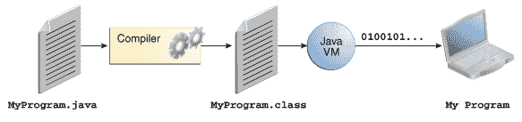
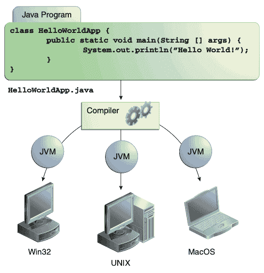
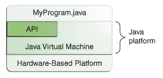

# 关于 Java 技术

> 原文：[`docs.oracle.com/javase/tutorial/getStarted/intro/definition.html`](https://docs.oracle.com/javase/tutorial/getStarted/intro/definition.html)

Java 技术既是一种编程语言，也是一个平台。

## Java 编程语言

Java 编程语言是一种高级语言，可以用以下所有流行词来描述：

|

+   简单

+   面向对象

+   分布式

+   多线程

+   动态

|

+   架构中立

+   可移植

+   高性能

+   健壮

+   安全

|

前述流行词在[《Java 语言环境》](http://www.oracle.com/technetwork/java/langenv-140151.html)一书中有详细解释，该书是由詹姆斯·高斯林和亨利·麦吉尔顿撰写的白皮书。

在 Java 编程语言中，所有源代码首先以`.java`扩展名结尾的纯文本文件中编写。然后，这些源文件由`javac`编译器编译成`.class`文件。`.class`文件不包含本机于处理器的代码；它包含*字节码* —— Java 虚拟机的机器语言^(1)（Java VM）。然后，`java`启动器工具使用 Java 虚拟机的实例运行你的应用程序。

软件开发过程概述。

由于 Java 虚拟机在许多不同操作系统上可用，同样的`.class`文件能够在 Microsoft Windows、Solaris™操作系统（Solaris OS）、Linux 或 Mac OS 上运行。一些虚拟机，如[Java SE HotSpot 概览](http://www.oracle.com/technetwork/java/javase/tech/index-jsp-136373.html)，在运行时执行额外步骤以提高应用程序性能。这包括诸如查找性能瓶颈和重新编译（为本机代码）频繁使用的代码段等任务。

通过 Java 虚拟机，同一个应用程序能够在多个平台上运行。

## Java 平台

*平台*是程序运行的硬件或软件环境。我们已经提到了一些最流行的平台，如 Microsoft Windows、Linux、Solaris OS 和 Mac OS。大多数平台可以描述为操作系统和底层硬件的组合。Java 平台与大多数其他平台不同，它是一个仅软件的平台，运行在其他基于硬件的平台之上。

Java 平台有两个组成部分：

+   *Java 虚拟机*

+   *Java 应用程序编程接口*（API）

你已经了解了 Java 虚拟机；它是 Java 平台的基础，并被移植到各种基于硬件的平台上。

API 是一个庞大的现成软件组件集合，提供许多有用的功能。它被分组为相关类和接口的库；这些库被称为*包*。下一节，Java 技术能做什么？突出了 API 提供的一些功能。

API 和 Java 虚拟机使程序与底层硬件隔离。

作为一个独立于平台的环境，Java 平台可能比本机代码慢一些。然而，编译器和虚拟机技术的进步正在使性能接近本机代码，而不会威胁可移植性。

术语"Java 虚拟机"和"JVM"指的是 Java 平台的虚拟机。
