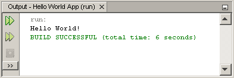

# “Hello World!” 适用于 NetBeans IDE

> 原文：[`docs.oracle.com/javase/tutorial/getStarted/cupojava/netbeans.html`](https://docs.oracle.com/javase/tutorial/getStarted/cupojava/netbeans.html)

是时候编写您的第一个应用程序了！这些详细说明适用于 NetBeans IDE 的用户。NetBeans IDE 运行在 Java 平台上，这意味着您可以在任何有 JDK 可用的操作系统上使用它。这些操作系统包括 Microsoft Windows、Solaris OS、Linux 和 Mac OS X。

+   一个清单

+   创建您的第一个应用程序

    +   创建一个 IDE 项目

    +   将 JDK 8 添加到平台列表（如果需要）

    +   向生成的源文件添加代码

    +   编译源文件

    +   运行程序

+   使用 NetBeans IDE 继续教程

* * *

## 一个清单  

要编写您的第一个程序，您需要：

1.  Java SE 开发工具包（此示例中选择了 JDK 7）

    +   对于 Microsoft Windows、Solaris OS 和 Linux：[Java SE 下载索引](http://www.oracle.com/technetwork/java/javase/downloads/index.html) 页面

    +   对于 Mac OS X：[developer.apple.com](https://developer.apple.com/)

1.  NetBeans IDE

    +   对于所有平台：[NetBeans IDE 下载索引](http://netbeans.org/downloads/index.html) 页面

* * *

## 创建您的第一个应用程序

您的第一个应用程序`HelloWorldApp`将简单地显示问候语“Hello World!” 要创建此程序，您将：

+   创建一个 IDE 项目

    创建 IDE 项目时，您创建了一个环境，用于构建和运行应用程序。使用 IDE 项目可以消除通常与在命令行上开发相关的配置问题。您可以通过在 IDE 中选择单个菜单项来构建或运行应用程序。

+   向生成的源文件添加代码

    源文件包含用 Java 编程语言编写的代码，您和其他程序员可以理解。作为创建 IDE 项目的一部分，将自动生成一个骨架源文件。然后，您将修改源文件以添加“Hello World!” 信息。

+   编译源文件为 .class 文件

    IDE 调用 Java 编程语言*编译器*（`javac`），它接受您的源文件并将其文本翻译为 Java 虚拟机可以理解的指令。该文件中包含的指令称为*字节码*。

+   运行程序

    IDE 调用 Java 应用程序*启动器工具*（`java`），该工具使用 Java 虚拟机来运行您的应用程序。

### 创建一个 IDE 项目

创建一个 IDE 项目：

1.  运行程序

    +   在 Microsoft Windows 系统上，您可以在“开始”菜单中使用 NetBeans IDE 项目。

    +   在 Solaris OS 和 Linux 系统上，您可以通过导航到 IDE 的 `bin` 目录并输入 `./netbeans` 来执行 IDE 启动脚本。

    +   在 Mac OS X 系统上，单击 NetBeans IDE 应用程序图标。

1.  在 NetBeans IDE 中，选择**文件** | **新建项目...**。

    

    NetBeans IDE，文件 | 新建项目 菜单项已选择。

1.  在**新建项目**向导中，展开**Java**类别，并选择**Java 应用程序**，如下图所示：

    

    NetBeans IDE，新项目向导，选择项目页面。

1.  在向导的**名称和位置**页面中，执行以下操作（如下图所示）：

    +   在**项目名称**字段中，输入`Hello World App`。

    +   在**创建主类**字段中，输入`helloworldapp.HelloWorldApp`。

        

    NetBeans IDE，新项目向导，名称和位置页面。

1.  单击完成。

项目已创建并在 IDE 中打开。您应该看到以下组件：

+   **项目**窗口，其中包含项目组件的树视图，包括源文件、代码依赖的库等。

+   打开 NetBeans IDE。

+   **导航器**窗口，您可以使用它快速在所选类中的元素之间导航。

    

    打开的 NetBeans IDE 与 HelloWorldApp 项目。

* * *

### 将 JDK 8 添加到平台列表（如果需要）

可能需要将 JDK 8 添加到 IDE 的可用平台列表中。要执行此操作，请选择工具 | Java 平台，如下图所示：


从工具菜单中选择 Java 平台管理器

如果在已安装平台列表中看不到 JDK 8（可能显示为 1.8 或 1.8.0），请单击**添加平台**，导航到 JDK 8 安装目录，然后单击**完成**。现在您应该看到这个新添加的平台：


Java 平台管理器

要将此 JDK 设置为所有项目的默认 JDK，您可以在命令行上使用 `--jdkhome` 开关运行 IDE，或者在 `INSTALLATION_DIRECTORY/etc/netbeans.conf` 文件的 `netbeans_j2sdkhome` 属性中输入 JDK 的路径。 

要为当前项目指定此 JDK，请在**项目**窗格中选择**Hello World App**，选择**文件** | **项目属性（Hello World App）**，单击**库**，然后在**Java 平台**下拉菜单中选择**JDK 1.8**。您应该看到类似以下内容的屏幕：


IDE 现在已配置为 JDK 8。

* * *

### 向生成的源文件添加代码

在创建此项目时，在**新建项目**向导中保留了**创建主类**复选框。因此，IDE 已为您创建了一个骨架类。您可以通过替换以下行将“Hello World!” 信息添加到骨架代码中：

```java
// TODO code application logic here

```

用以下行：

```java
System.out.println("Hello World!"); // Display the string.

```

可选地，您可以替换这四行生成的代码：

```java
/**
 *
 * @author
 */

```

用以下行：

```java
/**
 * The HelloWorldApp class implements an application that
 * simply prints "Hello World!" to standard output.
 */

```

这四行是代码注释，不会影响程序的运行。本教程的后续部分将解释代码注释的用法和格式。

**在输入时要小心**    

* * *

**注意：**确保按照所示输入所有代码、命令和文件名。编译器（`javac`）和启动器（`java`）都是*区分大小写*的，因此您必须保持一致。

`HelloWorldApp`与`helloworldapp`*不同*。

* * *

通过选择**文件** | **保存**来保存您的更改。

文件应该该看起来类似于以下内容：

```java
/*
 * To change this template, choose Tools | Templates
 * and open the template in the editor.
 */

package helloworldapp;

/**
 * The HelloWorldApp class implements an application that
 * simply prints "Hello World!" to standard output.
 */
public class HelloWorldApp {

    /**
     * @param args the command line arguments
     */
    public static void main(String[] args) {
        System.out.println("Hello World!"); // Display the string.
    }

}

```

### 编译源文件为 .class 文件

要编译您的源文件，请从 IDE 的主菜单中选择**运行** | **构建项目（Hello World App）**。

输出窗口将打开并显示类似于以下图示的输出：


输出窗口显示 HelloWorld 项目构建的结果。

如果构建输出以“构建成功”结束，则恭喜！您已成功编译了您的程序！

如果构建输出以“构建失败”结束，则您的代码中可能存在语法错误。错误将作为超链接文本显示在输出窗口中。双击此类超链接可导航到错误源。然后，您可以修复错误，再次选择**运行** | **构建项目**。

构建项目时，将生成字节码文件`HelloWorldApp.class`。您可以通过打开**文件**窗口并展开**Hello World App/build/classes/helloworldapp**节点来查看新文件生成的位置，如下图所示。


文件窗口，显示生成的`.class`文件。

现在您已经构建了项目，可以运行您的程序。

### 运行程序

从 IDE 的菜单栏中，选择**运行** | **运行主项目**。

下图显示了您现在应该看到的内容。



程序将“Hello World！”打印到输出窗口（以及构建脚本的其他输出）。

恭喜！您的程序正常运行！

## 使用 NetBeans IDE 继续教程

教程的接下来几页将解释这个简单应用程序中的代码。之后，课程将深入探讨核心语言特性，并提供更多示例。尽管教程的其余部分没有提供有关使用 NetBeans IDE 的具体说明，但您可以轻松使用 IDE 编写和运行示例代码。以下是一些关于使用 IDE 的提示以及您可能会看到的一些 IDE 行为的解释：

+   在 IDE 中创建项目后，您可以使用**新建文件**向导将文件添加到项目中。选择**文件** | **新建文件**，然后在向导中选择模板，例如空的 Java 文件模板。

+   您可以使用 IDE 的**编译文件**（F9）和**运行文件**（Shift-F6）命令编译和运行单个文件（而不是整个项目）。如果您使用**运行主项目**命令，IDE 将运行 IDE 关联为主项目的主类的文件。因此，如果您在 HelloWorldApp 项目中创建了一个额外的类，然后尝试使用**运行主项目**命令运行该文件，IDE 将运行`HelloWorldApp`文件。

+   您可能希望为包含多个源文件的示例应用程序创建单独的 IDE 项目。

+   在 IDE 中输入时，代码完成框可能会定期出现。您可以选择忽略代码完成框并继续输入，或者选择建议的表达式之一。如果您不希望代码完成框自动出现，可以关闭该功能。选择**工具** | **选项** | **编辑器**，单击**代码完成**选项卡并清除**自动弹出完成窗口**复选框。

+   如果您想要重命名**项目**窗口中源文件的节点，请从 IDE 的主菜单中选择**重构**。IDE 会提示您使用**重命名**对话框引导您完成重命名类和更新引用该类的代码的选项。进行更改并单击**重构**以应用更改。如果您的项目中只有一个类，这一系列点击可能看起来是多余的，但是在更大的项目中，当您的更改影响代码的其他部分时，这是非常有用的。

+   要了解 NetBeans IDE 功能的更详尽指南，请参阅[NetBeans 文档](https://netbeans.org/kb/)页面。
