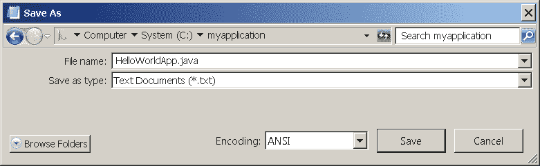
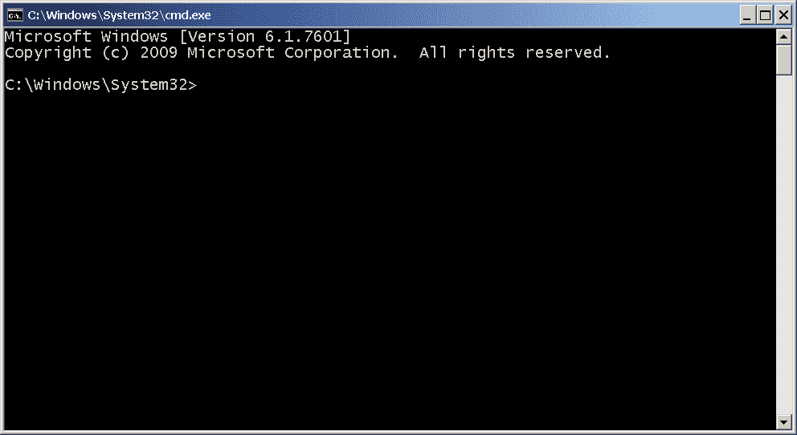

# “Hello World!” for Microsoft Windows

> 原文：[`docs.oracle.com/javase/tutorial/getStarted/cupojava/win32.html`](https://docs.oracle.com/javase/tutorial/getStarted/cupojava/win32.html)

是时候编写你的第一个应用程序了！以下说明适用于 Windows Vista、Windows 7 和 Windows 8 的用户。其他平台的说明在"Hello World!" for Solaris OS, Linux, and Mac OS X 和"Hello World!" for the NetBeans IDE 中。

如果在本页的说明中遇到问题，请参考常见问题（及其解决方案）。

+   一个清单

+   创建你的第一个应用程序

    +   创建一个源文件

    +   将源文件编译为`.class`文件

    +   运行程序

* * *

## 一个清单  

要编写你的第一个程序，你需要：

1.  Java SE 开发工具包 8（JDK 8）

    你可以[立即下载 Windows 版本](http://www.oracle.com/technetwork/java/javase/downloads/index.html)。（确保你下载的是**JDK**，*而不是*JRE。）请参考[安装说明](https://docs.oracle.com/javase/8/docs/technotes/guides/install/install_overview.html)。

1.  一个文本编辑器

    在这个例子中，我们将使用 Notepad，它是 Windows 平台上包含的一个简单编辑器。如果你使用不同的文本编辑器，你可以轻松地调整这些说明。

这两个项目是你编写第一个应用程序所需的全部内容。

* * *

## 创建你的第一个应用程序

你的第一个应用程序`HelloWorldApp`将简单地显示问候语“Hello world!”。为了创建这个程序，你将：

+   创建一个源文件

    一个源文件包含用 Java 编程语言编写的代码，你和其他程序员都可以理解。你可以使用任何文本编辑器来创建和编辑源文件。

+   编译源文件为 .class 文件

    Java 编程语言*编译器*（`javac`）接受你的源文件并将其文本翻译为 Java 虚拟机可以理解的指令。该文件中包含的指令称为*字节码*。

+   运行程序

    Java 应用程序*启动器工具*（`java`）使用 Java 虚拟机来运行你的应用程序。

### 创建一个源文件

要创建一个源文件，你有两个选项：

+   你可以在计算机上保存文件`HelloWorldApp.java`，避免大量输入。然后，你可以直接转到将源文件编译为`.class`文件。

+   或者，你可以使用以下（更长的）说明。

首先，启动你的编辑器。你可以从**开始**菜单中选择**程序 > 附件 > 记事本**来启动记事本编辑器。在一个新文档中，输入以下代码：

```java
/**
 * The HelloWorldApp class implements an application that
 * simply prints "Hello World!" to standard output.
 */
class HelloWorldApp {
    public static void main(String[] args) {
        System.out.println("Hello World!"); // Display the string.
    }
}

```

**输入时要小心**    

* * *

**注意：**请按照所示的方式输入所有代码、命令和文件名。编译器（`javac`）和启动器（`java`）都是*区分大小写*的，因此你必须保持一致。

`HelloWorldApp`与`helloworldapp`*不*相同。

* * *

将代码保存在名为`HelloWorldApp.java`的文件中。在 Notepad 中执行此操作，首先选择**文件 > 另存为...**菜单项。然后，在**另存为**对话框中：

1.  使用**保存位置**组合框，指定你将保存文件的文件夹（目录）。在这个例子中，目录是`C`驱动器上的`myapplication`。

1.  在**文件名**文本字段中，输入`"HelloWorldApp.java"`，不包括引号。

1.  从**另存为类型**组合框中选择**文本文档（*.txt）**。

1.  在**编码**组合框中，将编码保留为 ANSI。

当完成后，对话框应该看起来像这样。



在你点击**保存**之前的另存为对话框。

现在点击**保存**，然后退出 Notepad。

### 编译源文件为 .class 文件

打开一个 shell 或“命令”窗口。你可以从**开始**菜单中选择**运行...**，然后输入`cmd`来执行此操作。shell 窗口应该类似于以下图示。



一个 shell 窗口。

提示符显示你的*当前目录*。当你打开提示符时，你的当前目录通常是 Windows XP 的主目录（如前面的图所示）。

要编译你的源文件，请将当前目录更改为文件所在的目录。例如，如果你的源目录是`C`驱动器上的`myapplication`，请在提示符处输入以下命令并按**Enter**：

```java
cd C:\myapplication

```

现在提示符应该变成`C:\myapplication>`。

* * *

**注意：**

要切换到另一个驱动器上的目录，你必须输入一个额外的命令：驱动器的名称。例如，要切换到`D`驱动器上的`myapplication`目录，你必须输入`D:`，如下所示：

```java
C:\>D:

D:\>cd myapplication

D:\myapplication>
```

* * *

如果在提示符处输入`dir`，你应该看到你的源文件，如下所示：

```java
C:\>cd myapplication

C:\myapplication>dir
 Volume in drive C is System
 Volume Serial Number is F2E8-C8CC

 Directory of C:\myapplication

2014-04-24  01:34 PM    <DIR>          .
2014-04-24  01:34 PM    <DIR>          ..
2014-04-24  01:34 PM               267 HelloWorldApp.java
               1 File(s)            267 bytes
               2 Dir(s)  93,297,991,680 bytes free

C:\myapplication>
```

现在你已经准备好编译了。在提示符处，输入以下命令并按**Enter**。

```java
javac HelloWorldApp.java

```

编译器已生成一个字节码文件`HelloWorldApp.class`。在提示符处，输入`dir`以查看生成的新文件，如下所示：

```java
C:\myapplication>javac HelloWorldApp.java

C:\myapplication>dir
 Volume in drive C is System
 Volume Serial Number is F2E8-C8CC

 Directory of C:\myapplication

2014-04-24  02:07 PM    <DIR>          .
2014-04-24  02:07 PM    <DIR>          ..
2014-04-24  02:07 PM               432 HelloWorldApp.class
2014-04-24  01:34 PM               267 HelloWorldApp.java
               2 File(s)            699 bytes
               2 Dir(s)  93,298,032,640 bytes free

C:\myapplication>
```

现在你有了一个`.class`文件，你可以运行你的程序。

如果在这一步的说明中遇到问题，请参考常见问题（及其解决方案）。

### 运行程序

在同一个目录中，在提示符处输入以下命令：

```java
java -cp . HelloWorldApp

```

你应该在屏幕上看到以下内容：

```java
C:\myapplication>java -cp . HelloWorldApp
Hello World!

C:\myapplication>
```

恭喜！你的程序运行成功！

如果在这一步的说明中遇到问题，请参考常见问题（及其解决方案）。
