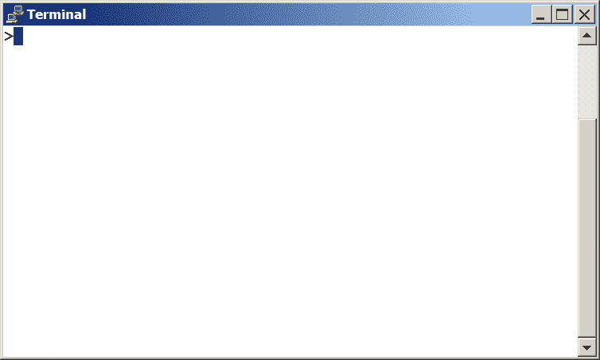
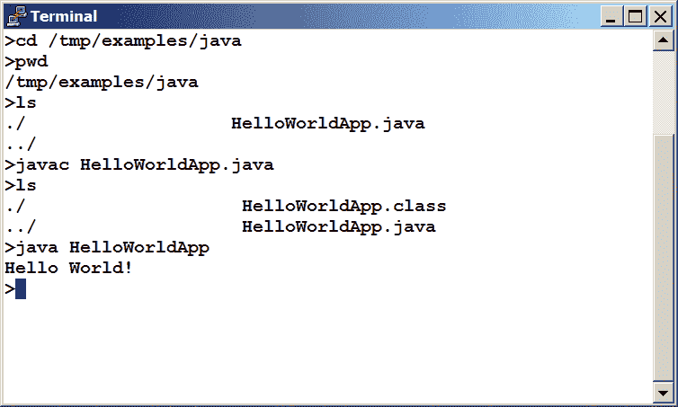

# “Hello World!”适用于 Solaris OS、Linux 和 Mac OS X

> 原文：[`docs.oracle.com/javase/tutorial/getStarted/cupojava/unix.html`](https://docs.oracle.com/javase/tutorial/getStarted/cupojava/unix.html)

是时候写你的第一个应用程序了！这些详细说明适用于 Solaris OS、Linux 和 Mac OS X 的用户。其他平台的说明在"Hello World!" for Microsoft Windows 和"Hello World!" for the NetBeans IDE 中。

如果你在本页的说明中遇到问题，请查阅常见问题（及其解决方案）。

+   一个清单

+   创建你的第一个应用程序

    +   创建一个源文件

    +   将源文件编译为`.class`文件

    +   运行程序

* * *

## 一个清单  

要编写你的第一个程序，你需要：

1.  Java SE 开发工具包 8（JDK 8）

    你可以[下载适用于 Solaris OS、Linux 或 Mac OS X 的版本](http://www.oracle.com/technetwork/java/javase/downloads/index.html)。（确保你下载的是**JDK**，*而不是*JRE。）请查阅[安装说明](https://docs.oracle.com/javase/8/docs/technotes/guides/install/install_overview.html)。

1.  一个文本编辑器

    在这个例子中，我们将使用 Pico，一个适用于许多基于 UNIX 的平台的编辑器。如果你使用不同的文本编辑器，如`vi`或`emacs`，你可以轻松地调整这些说明。

这两个项目是你写第一个应用程序所需的全部。

* * *

## 创建你的第一个应用程序

你的第一个应用程序，`HelloWorldApp`，将简单地显示问候语“Hello world!”。要创建这个程序，你需要：

+   创建一个源文件

    一个源文件包含用 Java 编程语言编写的代码，你和其他程序员都可以理解。你可以使用任何文本编辑器来创建和编辑源文件。

+   将源文件编译为.class 文件

    Java 编程语言的*编译器*(`javac`)会获取你的源文件并将其文本转换为 Java 虚拟机可以理解的指令。这个`.class`文件中包含的指令被称为*字节码*。

+   运行程序

    Java 应用程序*启动器工具*(`java`)使用 Java 虚拟机来运行你的应用程序。

### 创建一个源文件

要创建一个源文件，你有两个选项：

+   你可以将文件`HelloWorldApp.java`保存在你的计算机上，避免大量输入。然后，你可以直接转到编译源文件。

+   或者，你可以使用以下（更长的）说明。

首先，打开一个 shell 或“终端”窗口。



一个新的终端窗口。

当你首次打开提示符时，你的*当前目录*通常是你的*主目录*。你可以随时通过在提示符中输入`cd`然后按**Return**来将当前目录更改为主目录。

您创建的源文件应保存在单独的目录中。您可以使用命令`mkdir`创建目录。例如，要在`/tmp`目录中创建`examples/java`目录，请使用以下命令：

```java
cd /tmp
mkdir examples
cd examples
mkdir java

```

要将当前目录更改为此新目录，请输入：

```java
cd /tmp/examples/java

```

现在您可以开始创建源文件了。

输入`pico`并按**Return**键启动 Pico 编辑器。如果系统显示`pico: command not found`消息，则 Pico 很可能不可用。请咨询系统管理员获取更多信息，或使用其他编辑器。

启动 Pico 时，它将显示一个新的空*缓冲区*。这是您将输入代码的区域。

将以下代码输入到新缓冲区中：

```java
/**
 * The HelloWorldApp class implements an application that
 * simply prints "Hello World!" to standard output.
 */
class HelloWorldApp {
    public static void main(String[] args) {
        System.out.println("Hello World!"); // Display the string.
    }
}

```

**输入时请小心**    

* * *

**注意：**请按照所示的方式输入所有代码、命令和文件名。编译器（`javac`）和启动器（`java`）都*区分大小写*，因此您必须保持一致。

`HelloWorldApp`与`helloworldapp`*不*相同。

* * *

将代码保存到名为`HelloWorldApp.java`的文件中。在 Pico 编辑器中，通过输入**Ctrl-O**，然后在底部看到提示`File Name to write:`处，输入您希望创建文件的目录，然后输入`HelloWorldApp.java`。例如，如果您希望在目录`/tmp/examples/java`中保存`HelloWorldApp.java`，则输入`/tmp/examples/java/HelloWorldApp.java`并按**Return**键。

您可以输入**Ctrl-X**退出 Pico。

### 编译源文件为`.class`文件

打开另一个 shell 窗口。要编译源文件，请将当前目录更改为文件所在的目录。例如，如果您的源目录是`/tmp/examples/java`，请在提示符处输入以下命令并按**Return**键：

```java
cd /tmp/examples/java

```

如果在提示符处输入`pwd`，您应该看到当前目录，本示例中已更改为`/tmp/examples/java`。

如果在提示符处输入`ls`，您应该看到您的文件。


`ls`命令的结果，显示`.java`源文件。

现在可以编译源文件了。在提示符处，输入以下命令并按**Return**键。

```java
javac HelloWorldApp.java

```

编译器已生成一个字节码文件`HelloWorldApp.class`。在提示符处，输入`ls`查看生成的新文件：如下图所示。


`ls`命令的结果，显示生成的`.class`文件。

现在您有了一个`.class`文件，可以运行您的程序了。

如果您在此步骤中遇到问题，请参考常见问题（及其解决方案）。

### 运行程序

在相同的目录中，在提示符下输入：

```java
java HelloWorldApp

```

接下来的图示展示了你现在应该看到的内容。



输出将"Hello World!"打印到屏幕上。

恭喜！你的程序正常运行！

如果在这一步的说明中遇到问题，请参考常见问题（及其解决方案）。
