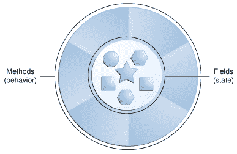
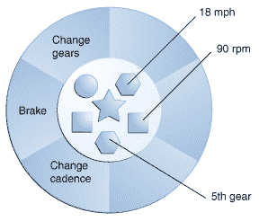

# 什么是对象？

> 原文：[`docs.oracle.com/javase/tutorial/java/concepts/object.html`](https://docs.oracle.com/javase/tutorial/java/concepts/object.html)

对象是理解*面向对象*技术的关键。现在看看周围，你会发现许多现实世界的对象：你的狗，你的桌子，你的电视机，你的自行车。

现实世界的对象共享两个特征：它们都有*状态*和*行为*。狗有状态（名字、颜色、品种、饥饿）和行为（叫、取东西、摇尾巴）。自行车也有状态（当前档位、当前踏板速度、当前速度）和行为（换档、改变踏板速度、刹车）。识别现实世界对象的状态和行为是开始以面向对象编程思考的好方法。

现在花一分钟观察你周围的现实世界对象。对于每个你看到的对象，问自己两个问题：“这个对象可能处于什么状态？”和“这个对象可能执行什么行为？”。确保写下你的观察。当你这样做时，你会注意到现实世界的对象在复杂性上有所不同；你的台灯可能只有两种可能的状态（开和关）和两种可能的行为（打开、关闭），但你的收音机可能有额外的状态（开、关、当前音量、当前频道）和行为（打开、关闭、增加音量、减小音量、搜索、扫描和调谐）。你还可能注意到一些对象反过来也会包含其他对象。这些现实世界的观察都可以转化为面向对象编程的世界。

一个软件对象。

软件对象在概念上类似于现实世界的对象：它们也由状态和相关行为组成。对象将其状态存储在*字段*（某些编程语言中的变量）中，并通过*方法*（某些编程语言中的函数）公开其行为。方法操作对象的内部状态，并作为对象间通信的主要机制。隐藏内部状态并要求所有交互通过对象的方法执行被称为*数据封装*——这是面向对象编程的基本原则。

以自行车为例：

以软件对象建模的自行车。

通过赋予状态（当前速度、当前踏板速度和当前档位）并提供改变该状态的方法，对象保持控制外部世界如何使用它。例如，如果自行车只有 6 个档位，一个改变档位的方法可以拒绝任何小于 1 或大于 6 的值。

将代码捆绑到单独的软件对象中提供了许多好处，包括：

1.  模块化：一个对象的源代码可以独立编写和维护，与其他对象的源代码无关。一旦创建，一个对象可以在系统内轻松传递。

1.  信息隐藏：通过仅与对象的方法交互，其内部实现的细节对外部世界保持隐藏。

1.  代码重用：如果一个对象已经存在（可能是由另一个软件开发人员编写），你可以在你的程序中使用该对象。这使得专家可以实现/测试/调试复杂的、任务特定的对象，然后你可以相信这些对象在你自己的代码中运行。

1.  可插拔性和调试便利性：如果一个特定对象出现问题，你可以简单地将其从应用程序中移除，并插入一个不同的对象作为替代。这类似于在现实世界中修复机械问题。如果一个螺栓断了，你只替换*它*，而不是整个机器。
