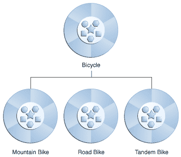

# 什么是继承？

> 原文：[`docs.oracle.com/javase/tutorial/java/concepts/inheritance.html`](https://docs.oracle.com/javase/tutorial/java/concepts/inheritance.html)

不同类型的对象通常彼此之间有一定的共同点。例如，山地自行车、公路自行车和双人自行车都共享自行车的特征（当前速度、当前踏板节奏、当前齿轮）。但每种自行车也定义了使它们不同的附加特征：双人自行车有两个座位和两套把手；公路自行车有下弯把手；一些山地自行车有额外的链环，使它们具有更低的齿轮比。

面向对象编程允许类从其他类中*继承*常用的状态和行为。在这个例子中，`Bicycle`现在成为`MountainBike`、`RoadBike`和`TandemBike`的*超类*。在 Java 编程语言中，每个类都允许有一个直接的超类，而每个超类都有无限数量的*子类*的潜力：



自行车类的层次结构。

创建子类的语法很简单。在类声明的开头，使用`extends`关键字，后面跟上要继承的类的名称：

```java
class MountainBike extends Bicycle {

    // new fields and methods defining 
    // a mountain bike would go here

}

```

这使得`MountainBike`拥有与`Bicycle`相同的所有字段和方法，但允许其代码专注于使其独特的特征。这使得子类的代码易于阅读。然而，您必须小心地记录每个超类定义的状态和行为，因为该代码不会出现在每个子类的源文件中。
