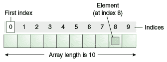

# 数组

> 原文：[`docs.oracle.com/javase/tutorial/java/nutsandbolts/arrays.html`](https://docs.oracle.com/javase/tutorial/java/nutsandbolts/arrays.html)

*数组*是一个容器对象，它保存单一类型的固定数量的值。数组的长度在创建数组时确定。创建后，其长度是固定的。你已经在"Hello World!"应用程序的`main`方法中看到了数组的一个示例。本节将更详细地讨论数组。



一个包含 10 个元素的数组。

数组中的每个项称为*元素*，每个元素通过其数字*索引*访问。如前面的插图所示，编号从 0 开始。例如，第 9 个元素将在索引 8 处访问。

下面的程序，`ArrayDemo`，创建了一个整数数组，向数组中放入一些值，并将每个值打印到标准输出。

```java

class ArrayDemo {
    public static void main(String[] args) {
        // declares an array of integers
        int[] anArray;

        // allocates memory for 10 integers
        anArray = new int[10];

        // initialize first element
        anArray[0] = 100;
        // initialize second element
        anArray[1] = 200;
        // and so forth
        anArray[2] = 300;
        anArray[3] = 400;
        anArray[4] = 500;
        anArray[5] = 600;
        anArray[6] = 700;
        anArray[7] = 800;
        anArray[8] = 900;
        anArray[9] = 1000;

        System.out.println("Element at index 0: "
                           + anArray[0]);
        System.out.println("Element at index 1: "
                           + anArray[1]);
        System.out.println("Element at index 2: "
                           + anArray[2]);
        System.out.println("Element at index 3: "
                           + anArray[3]);
        System.out.println("Element at index 4: "
                           + anArray[4]);
        System.out.println("Element at index 5: "
                           + anArray[5]);
        System.out.println("Element at index 6: "
                           + anArray[6]);
        System.out.println("Element at index 7: "
                           + anArray[7]);
        System.out.println("Element at index 8: "
                           + anArray[8]);
        System.out.println("Element at index 9: "
                           + anArray[9]);
    }
} 

```

该程序的输出是：

```java
Element at index 0: 100
Element at index 1: 200
Element at index 2: 300
Element at index 3: 400
Element at index 4: 500
Element at index 5: 600
Element at index 6: 700
Element at index 7: 800
Element at index 8: 900
Element at index 9: 1000

```

在实际的编程情况中，你可能会使用支持的*循环结构*之一来遍历数组的每个元素，而不是像前面的示例中那样逐行编写。然而，该示例清楚地说明了数组的语法。你将在 Control Flow 部分学习各种循环结构（`for`、`while`和`do-while）。

## 声明一个变量来引用一个数组

前面的程序用以下代码声明了一个数组（名为`anArray`）：

```java
// declares an array of integers
int[] anArray;

```

与其他类型的变量声明类似，数组声明有两个组成部分：数组的类型和数组的名称。数组的类型写作`*type*[]`，其中`*type*`是包含元素的数据类型；方括号是特殊符号，表示该变量保存一个数组。数组的大小不是其类型的一部分（这就是为什么方括号是空的）。数组的名称可以是任何你想要的，只要遵循之前在 naming 部分讨论的规则和约定。与其他类型的变量一样，声明并不会实际创建一个数组；它只是告诉编译器这个变量将保存指定类型的数组。

同样，你也可以声明其他类型的数组：

```java
byte[] anArrayOfBytes;
short[] anArrayOfShorts;
long[] anArrayOfLongs;
float[] anArrayOfFloats;
double[] anArrayOfDoubles;
boolean[] anArrayOfBooleans;
char[] anArrayOfChars;
String[] anArrayOfStrings;

```

你也可以将方括号放在数组名称后面：

```java
// this form is discouraged
float anArrayOfFloats[];

```

然而，约定不鼓励这种形式；方括号标识数组类型，应该与类型标识一起出现。

## 创建、初始化和访问数组

用`new`运算符创建数组的一种方法。`ArrayDemo`程序中的下一条语句分配了足够内存以容纳 10 个整数元素的数组，并将该数组分配给`anArray`变量。

```java
// create an array of integers
anArray = new int[10];

```

如果缺少这个语句，那么编译器会打印如下错误，并且编译失败：

```java
ArrayDemo.java:4: Variable anArray may not have been initialized.

```

接下来的几行为数组的每个元素赋值：

```java
anArray[0] = 100; // initialize first element
anArray[1] = 200; // initialize second element
anArray[2] = 300; // and so forth

```

每个数组元素都通过其数字索引访问：

```java
System.out.println("Element 1 at index 0: " + anArray[0]);
System.out.println("Element 2 at index 1: " + anArray[1]);
System.out.println("Element 3 at index 2: " + anArray[2]);

```

或者，您可以使用快捷语法来创建和初始化一个数组：

```java
int[] anArray = { 
    100, 200, 300,
    400, 500, 600, 
    700, 800, 900, 1000
};

```

这里数组的长度由大括号中提供的数值数量和逗号分隔确定。

您还可以通过使用两个或更多组括号（如`String[][] names`）声明一个数组的数组（也称为*多维*数组）。因此，必须通过相应数量的索引值访问每个元素。

在 Java 编程语言中，多维数组是其组件本身为数组的数组。这与 C 或 Fortran 中的数组不同。由此产生的一个结果是，行的长度允许变化，如下面的`MultiDimArrayDemo`程序所示：

```java
class MultiDimArrayDemo {
    public static void main(String[] args) {
        String[][] names = {
            {"Mr. ", "Mrs. ", "Ms. "},
            {"Smith", "Jones"}
        };
        // Mr. Smith
        System.out.println(names[0][0] + names[1][0]);
        // Ms. Jones
        System.out.println(names[0][2] + names[1][1]);
    }
}

```

此程序的输出为：

```java
Mr. Smith
Ms. Jones

```

最后，您可以使用内置的`length`属性来确定任何数组的大小。以下代码将数组的大小打印到标准输出：

```java
 System.out.println(anArray.length);

```

## 复制数组

`System`类有一个`arraycopy`方法，您可以使用它来高效地将数据从一个数组复制到另一个数组中：

```java
public static void arraycopy(Object src, int srcPos,
                             Object dest, int destPos, int length)

```

两个`Object`参数指定要从中复制的数组*源*和要复制到的数组*目标*。三个`int`参数指定源数组中的起始位置，目标数组中的起始位置，以及要复制的数组元素数量。

以下程序，`ArrayCopyDemo`，声明了一个`String`元素数组。它使用`System.arraycopy`方法将数组组件的子序列复制到第二个数组中：

```java

class ArrayCopyDemo {
    public static void main(String[] args) {
        String[] copyFrom = {
            "Affogato", "Americano", "Cappuccino", "Corretto", "Cortado",   
            "Doppio", "Espresso", "Frappucino", "Freddo", "Lungo", "Macchiato",      
            "Marocchino", "Ristretto" };

        String[] copyTo = new String[7];
        System.arraycopy(copyFrom, 2, copyTo, 0, 7);
        for (String coffee : copyTo) {
            System.out.print(coffee + " ");           
        }
    }
}
```

此程序的输出为：

```java
Cappuccino Corretto Cortado Doppio Espresso Frappucino Freddo 

```

## 数组操作

数组是编程中使用的一个强大而有用的概念。Java SE 提供了一些用于执行与数组相关的最常见操作的方法。例如，`ArrayCopyDemo`示例使用`System`类的`arraycopy`方法，而不是手动迭代源数组的元素并将每个元素放入目标数组中。这是在后台执行的，使开发人员只需使用一行代码调用该方法。

为了方便起见，Java SE 在[`java.util.Arrays`](https://docs.oracle.com/javase/8/docs/api/java/util/Arrays.html)类中提供了几种执行数组操作（如复制、排序和搜索数组等常见任务）的方法。例如，前面的示例可以修改为使用`java.util.Arrays`类的`copyOfRange`方法，如您可以在`ArrayCopyOfDemo`示例中看到的那样。不同之处在于，使用`copyOfRange`方法不需要在调用方法之前创建目标数组，因为目标数组是由该方法返回的：

```java

class ArrayCopyOfDemo {
    public static void main(String[] args) {
        String[] copyFrom = {
            "Affogato", "Americano", "Cappuccino", "Corretto", "Cortado",   
            "Doppio", "Espresso", "Frappucino", "Freddo", "Lungo", "Macchiato",      
            "Marocchino", "Ristretto" };

        String[] copyTo = java.util.Arrays.copyOfRange(copyFrom, 2, 9);        
        for (String coffee : copyTo) {
            System.out.print(coffee + " ");           
        }            
    }
}
```

如您所见，该程序的输出相同，尽管代码行数更少。请注意，`copyOfRange` 方法的第二个参数是要复制的范围的初始索引（包括），而第三个参数是要复制的范围的最终索引，*不包括*。在此示例中，要复制的范围不包括索引为 9 的数组元素（其中包含字符串`Lungo`）。

`java.util.Arrays` 类中的一些其他有用操作包括：

+   搜索数组以找到特定值的索引位置（`binarySearch` 方法）。

+   比较两个数组以确定它们是否相等（`equals` 方法）。

+   填充数组以在每个索引处放置特定值（`fill` 方法）。

+   将数组按升序排序。可以顺序执行，使用`sort` 方法，也可以并行执行，使用 Java SE 8 中引入的`parallelSort` 方法。在多处理器系统上，并行排序大型数组比顺序数组排序更快。

+   创建使用数组作为其源的流（`stream` 方法）。例如，以下语句以与前面示例相同的方式打印`copyTo`数组的内容：

    ```java
    java.util.Arrays.stream(copyTo).map(coffee -> coffee + " ").forEach(System.out::print);  

    ```

    有关流的更多信息，请参见聚合操作。

+   将数组转换为字符串。`toString` 方法将数组的每个元素转换为字符串，用逗号分隔，然后用括号括起来。例如，以下语句将`copyTo`数组转换为字符串并打印出来：

    ```java
    System.out.println(java.util.Arrays.toString(copyTo)); 

    ```

    此语句打印如下内容：

    ```java
    [Cappuccino, Corretto, Cortado, Doppio, Espresso, Frappucino, Freddo] 

    ```
