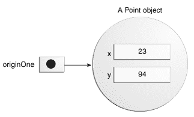
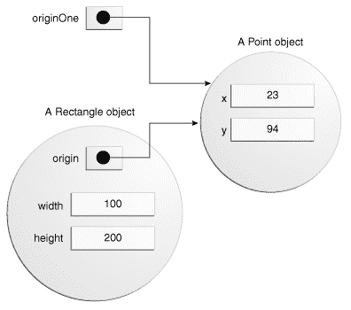

# 创建对象

> 原文：[`docs.oracle.com/javase/tutorial/java/javaOO/objectcreation.html`](https://docs.oracle.com/javase/tutorial/java/javaOO/objectcreation.html)

正如你所知，一个类提供了对象的蓝图；你从一个类创建一个对象。以下语句取自 `CreateObjectDemo` 程序，每个语句创建一个对象并将其分配给一个变量：

```java
Point originOne = new Point(23, 94);
Rectangle rectOne = new Rectangle(originOne, 100, 200);
Rectangle rectTwo = new Rectangle(50, 100);

```

第一行创建了一个 `Point` 类的对象，第二行和第三行分别创建了一个 `Rectangle` 类的对象。

这些语句中的每一个都有三个部分（下面详细讨论）：

1.  **声明**：加粗的代码都是将变量名与对象类型关联的变量声明。

1.  **实例化**：`new` 关键字是一个创建对象的 Java 操作符。

1.  **初始化**：`new` 操作符后跟一个构造函数调用，用于初始化新对象。

## 声明一个变量来引用一个对象

之前，你学到声明一个变量时，写的是：

```java
*type name*;

```

这通知编译器，你将使用 *name* 来引用类型为 *type* 的数据。对于原始变量，这个声明也为变量保留了正确数量的内存。

你也可以单独在一行上声明一个引用变量。例如：

```java
Point originOne;

```

如果你这样声明 `originOne`，它的值将在实际创建对象并分配给它之前是不确定的。仅仅声明一个引用变量并不会创建一个对象。为此，你需要使用 `new` 操作符，如下一节所述。在你的代码中使用 `originOne` 之前，你必须为其分配一个对象。否则，你将会得到一个编译器错误。

处于这种状态的变量，当前没有引用任何对象，可以用以下方式表示（变量名 `originOne`，加上指向空的引用）：


## 实例化一个类

`new` 操作符通过为新对象分配内存并返回对该内存的引用来实例化一个类。`new` 操作符还调用对象的构造函数。

* * *

**注意：**短语“实例化一个类”与“创建一个对象”意思相同。当你创建一个对象时，你正在创建一个类的“实例”，因此“实例化”一个类。

* * *

`new` 操作符需要一个后缀参数：一个构造函数调用。构造函数的名称提供了要实例化的类的名称。

`new` 操作符返回一个引用指向它创建的对象。这个引用通常赋给适当类型的变量，如：

```java
Point originOne = new Point(23, 94);

```

`new` 操作符返回的引用不一定要赋给一个变量。它也可以直接在表达式中使用。例如：

```java
int height = new Rectangle().height;

```

这个语句将在下一节讨论。

## 初始化一个对象

这是 `Point` 类的代码：

```java
public class Point {
    public int x = 0;
    public int y = 0; //constructor
    public Point(int a, int b) {
        x = a;
        y = b;
    }
}

```

这个类包含一个构造函数。你可以通过构造函数的声明使用与类相同的名称且没有返回类型来识别构造函数。`Point`类中的构造函数接受两个整数参数，如代码`(int a, int b)`所声明。下面的语句为这些参数提供了值 23 和 94：

```java
Point originOne = new Point(23, 94);

```

执行此语句的结果可以在下图中说明：



这是`Rectangle`类的代码，其中包含四个构造函数：

```java
public class Rectangle {
    public int width = 0;
    public int height = 0;
    public Point origin;

    // four constructors
    public Rectangle() {
        origin = new Point(0, 0);
    }
    public Rectangle(Point p) {
        origin = p;
    }
    public Rectangle(int w, int h) {
        origin = new Point(0, 0);
        width = w;
        height = h;
    }
    public Rectangle(Point p, int w, int h) {
        origin = p;
        width = w;
        height = h;
    }

    // a method for moving the rectangle
    public void move(int x, int y) {
        origin.x = x;
        origin.y = y;
    }

    // a method for computing the area of the rectangle
    public int getArea() {
        return width * height;
    }
}

```

每个构造函数都允许你使用基本类型和引用类型为矩形的原点、宽度和高度提供初始值。如果一个类有多个构造函数，它们必须具有不同的签名。Java 编译器根据参数的数量和类型区分构造函数。当 Java 编译器遇到下面的代码时，它知道要调用`Rectangle`类中需要一个`Point`参数后跟两个整数参数的构造函数：

```java

Rectangle rectOne = new Rectangle(originOne, 100, 200);

```

这调用了`Rectangle`的一个构造函数，将`origin`初始化为`originOne`。此外，构造函数将`width`设置为 100，`height`设置为 200。现在有两个指向同一个`Point 对象`的引用—一个对象可以有多个引用，如下图所示：



下面的代码行调用了需要两个整数参数的`Rectangle`构造函数，这些参数为`width`和`height`提供了初始值。如果你检查构造函数内的代码，你会看到它创建了一个新的`Point`对象，其`x`和`y`值被初始化为 0：

```java
Rectangle rectTwo = new Rectangle(50, 100);

```

下面语句中使用的`Rectangle`构造函数不带任何参数，因此被称为*无参数构造函数*：

```java
Rectangle rect = new Rectangle();

```

所有类至少有一个构造函数。如果一个类没有明确声明任何构造函数，Java 编译器会自动提供一个无参数构造函数，称为*默认构造函数*。这个默认构造函数调用类父类的无参数构造函数，或者如果类没有其他父类，则调用`Object`构造函数。如果父类没有构造函数（`Object`有一个），编译器会拒绝程序。
