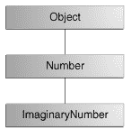

# 从方法返回一个值

> 原文：[`docs.oracle.com/javase/tutorial/java/javaOO/returnvalue.html`](https://docs.oracle.com/javase/tutorial/java/javaOO/returnvalue.html)

当方法达到`return`语句时返回到调用它的代码处

+   完成方法中的所有语句，

+   或者达到`return`语句，

+   抛出异常（稍后讨论），

先发生的那个。

在方法声明中声明方法的返回类型。在方法体内，使用`return`语句返回值。

任何声明为`void`的方法不返回值。它不需要包含`return`语句，但可以包含。在这种情况下，`return`语句可用于跳出控制流块并退出方法，简单地像这样使用：

```java
return;

```

如果尝试从声明为`void`的方法返回值，将会得到编译器错误。

任何未声明为`void`的方法必须包含一个带有相应返回值的`return`语句，就像这样：

```java
return returnValue;

```

返回值的数据类型必须与方法声明的返回类型匹配；你不能从声明为返回布尔值的方法中返回整数值。

在关于对象的部分讨论的`Rectangle` `Rectangle`类中的`getArea()`方法返回一个整数：

```java
    // a method for computing the area of the rectangle
    public int getArea() {
        return width * height;
    }

```

这个方法返回表达式`width*height`求值的整数。

`getArea`方法返回一个基本类型。一个方法也可以返回一个引用类型。例如，在一个操作`Bicycle`对象的程序中，我们可能有这样一个方法：

```java
public Bicycle seeWhosFastest(Bicycle myBike, Bicycle yourBike,
                              Environment env) {
    Bicycle fastest;
    // code to calculate which bike is 
    // faster, given each bike's gear 
    // and cadence and given the 
    // environment (terrain and wind)
    return fastest;
}

```

## 返回一个类或接口

如果这一部分让你困惑，可以跳过它，在完成关于接口和继承的课程后再回来阅读。

当一个方法使用类名作为返回类型，比如`whosFastest`这样做时，返回对象的类型的类必须是返回类型的子类，或者是返回类型的确切类。假设你有一个类层次结构，其中`ImaginaryNumber`是`java.lang.Number`的子类，而`java.lang.Number`又是`Object`的子类，如下图所示。



ImaginaryNumber 的类层次结构

现在假设你有一个声明为返回`Number`的方法：

```java
public Number returnANumber() {
    ...
}

```

`returnANumber`方法可以返回一个`ImaginaryNumber`但不能返回一个`Object`。`ImaginaryNumber`是一个`Number`，因为它是`Number`的子类。然而，一个`Object`不一定是一个`Number` — 它可能是一个`String`或其他类型。

你可以重写一个方法并定义它返回原方法的子类，就像这样：

```java
public ImaginaryNumber returnANumber() {
    ...
}

```

这种技术称为*协变返回类型*，意味着返回类型允许与子类相同方向变化。

* * *

**注意：** 你也可以使用接口名称作为返回类型。在这种情况下，返回的对象必须实现指定的接口。

* * *
