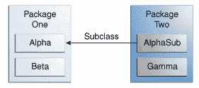

# 控制类的成员的访问

> 原文：[`docs.oracle.com/javase/tutorial/java/javaOO/accesscontrol.html`](https://docs.oracle.com/javase/tutorial/java/javaOO/accesscontrol.html)

访问级别修饰符确定其他类是否可以使用特定字段或调用特定方法。有两个访问控制级别：

+   在顶层—`public`，或*包私有*（没有显式修饰符）。

+   在成员级别—`public`，`private`，`protected`，或*包私有*（没有显式修饰符）。

一个类可以用修饰符`public`声明，这样该类对所有类都是可见的。如果一个类没有修饰符（默认情况，也称为*包私有*），它只在自己的包内可见（包是相关类的命名组 — 你将在后面的课程中了解它们。）

在成员级别，你也可以像顶级类一样使用`public`修饰符或无修饰符（*包私有*），意义相同。对于成员，还有两个额外的访问修饰符：`private`和`protected`。`private`修饰符指定该成员只能在其自己的类中访问。`protected`修饰符指定该成员只能在其自己的包内访问（与*包私有*相同），并且可以由另一个包中其类的子类访问。

以下表格显示了每个修饰符允许的成员访问。

访问级别

| 修饰符 | 类 | 包 | 子类 | 全部 |
| --- | --- | --- | --- | --- |
| `public` | Y | Y | Y | Y |
| `protected` | Y | Y | Y | N |
| 无修饰符 | Y | Y | N | N |
| `private` | Y | N | N | N |

第一列数据表示类本身是否可以访问由访问级别定义的成员。正如你所看到的，类总是可以访问自己的成员。第二列表示与该类在同一包中的类（不考虑它们的父类）是否可以访问该成员。第三列表示在声明在此包之外的类的子类是否可以访问该成员。第四列表示所有类是否可以访问该成员。

访问级别以两种方式影响你。首先，当你使用来自其他来源的类时，例如 Java 平台中的类，访问级别确定你自己的类可以使用那些类的成员。其次，当你编写一个类时，你需要决定你的类中每个成员变量和每个方法应该具有什么访问级别。

让我们看一组类，并看看访问级别如何影响可见性。以下图显示了此示例中的四个类及其关系。

用于说明访问级别的示例中的类和包

以下表格显示了可以应用于 Alpha 类的成员的每个访问修饰符的可见性。

可见性

| 修饰符 | Alpha | Beta | Alphasub | Gamma |
| --- | --- | --- | --- | --- |
| `public` | Y | Y | Y | Y |
| `protected` | Y | Y | Y | N |
| 无修饰符 | Y | Y | N | N |
| `private` | Y | N | N | N |

* * *

**选择访问级别的提示：**

如果其他程序员使用您的类，您希望确保不会发生误用导致的错误。访问级别可以帮助您做到这一点。

+   对于特定成员，使用最严格的访问级别是有意义的。除非有充分理由，否则使用`private`。

+   除了常量外，避免使用`public`字段。（教程中的许多示例使用公共字段。这可能有助于简洁地说明一些要点，但不建议在生产代码中使用。）公共字段往往会将您与特定实现联系起来，并限制您在更改代码时的灵活性。

* * *
