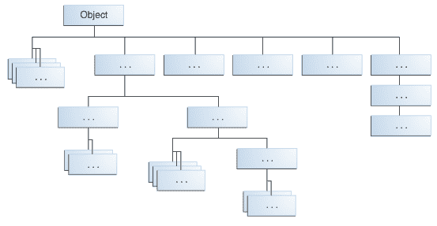

# 继承

> 原文：[`docs.oracle.com/javase/tutorial/java/IandI/subclasses.html`](https://docs.oracle.com/javase/tutorial/java/IandI/subclasses.html)

在前面的课程中，您已经多次看到*继承*的提及。在 Java 语言中，类可以从其他类*派生*，从而*继承*那些类的字段和方法。

* * *

**定义：** 从另一个类派生的类称为*子类*（也称为*派生类*、*扩展类*或*子类*）。从子类派生的类称为*超类*（也称为*基类*或*父类*）。

除了`Object`没有超类之外，每个类只有一个直接超类（单继承）。在没有其他显式超类的情况下，每个类都隐式地是`Object`的子类。

类可以从派生自其他类的类派生，而这些类又从其他类派生，依此类推，最终都是从顶级类`Object`派生而来。这样的类被称为*继承*自继承链中一直延伸到`Object`的所有类。

* * *

继承的概念简单而强大：当您想要创建一个新类，并且已经有一个包含您想要的一些代码的类时，您可以从现有类派生您的新类。通过这样做，您可以重用现有类的字段和方法，而无需自己编写（和调试！）它们。

子类从其超类继承所有*成员*（字段、方法和嵌套类）。构造函数不是成员，因此它们不会被子类继承，但是可以从子类中调用超类的构造函数。

## Java 平台类层次结构

[`Object`](https://docs.oracle.com/javase/8/docs/api/java/lang/Object.html)类，定义在`java.lang`包中，定义并实现了所有类共有的行为，包括您编写的类。在 Java 平台中，许多类直接从`Object`派生，其他类从其中一些类派生，依此类推，形成一个类的层次结构。



Java 平台中的所有类都是 Object 的子类

在层次结构的顶部，`Object`是所有类中最通用的类。层次结构底部附近的类提供更专业化的行为。

## 继承的示例

这是一个可能实现的`Bicycle`类的示例代码，该代码在类和对象课程中提供：

```java
public class Bicycle {

    // the Bicycle class has three *fields*
    public int cadence;
    public int gear;
    public int speed;

    // the Bicycle class has one *constructor*
    public Bicycle(int startCadence, int startSpeed, int startGear) {
        gear = startGear;
        cadence = startCadence;
        speed = startSpeed;
    }

    // the Bicycle class has four *methods*
    public void setCadence(int newValue) {
        cadence = newValue;
    }

    public void setGear(int newValue) {
        gear = newValue;
    }

    public void applyBrake(int decrement) {
        speed -= decrement;
    }

    public void speedUp(int increment) {
        speed += increment;
    }

}

```

一个`MountainBike`类的类声明，它是`Bicycle`的子类，可能如下所示：

```java
public class MountainBike extends Bicycle {

    // the MountainBike subclass adds one *field*
    public int seatHeight;

    // the MountainBike subclass has one *constructor*
    public MountainBike(int startHeight,
                        int startCadence,
                        int startSpeed,
                        int startGear) {
        super(startCadence, startSpeed, startGear);
        seatHeight = startHeight;
    }   

    // the MountainBike subclass adds one *method*
    public void setHeight(int newValue) {
        seatHeight = newValue;
    }   
}

```

`MountainBike`继承了`Bicycle`的所有字段和方法，并添加了字段`seatHeight`和一个设置它的方法。除了构造函数外，就好像你完全从头开始编写了一个新的`MountainBike`类，有四个字段和五个方法。但是，你不必做所有的工作。如果`Bicycle`类中的方法很复杂并且花费了大量时间来调试，这将特别有价值。

## 在子类中可以做什么

子类继承其父类的所有*public*和*protected*成员，无论子类位于何种包中。如果子类与其父类在同一包中，它还会继承父类的*package-private*成员。你可以直接使用继承的成员，替换它们，隐藏它们，或者用新成员补充它们：

+   继承的字段可以直接使用，就像任何其他字段一样。

+   你可以在子类中声明一个与超类中相同名称的字段，从而*隐藏*它（不建议）。

+   你可以在子类中声明超类中没有的新字段。

+   继承的方法可以直接使用。

+   你可以在子类中编写一个新的*实例*方法，其签名与超类中的方法相同，从而*覆盖*它。

+   你可以在子类中编写一个新的*静态*方法，其签名与超类中的方法相同，从而*隐藏*它。

+   你可以在子类中声明超类中没有的新方法。

+   你可以编写一个子类构造函数，隐式地或使用关键字`super`调用超类的构造函数。

本课程的以下部分将扩展这些主题。

## 超类中的私有成员

子类不继承其父类的`private`成员。但是，如果超类有用于访问其私有字段的公共或受保护方法，子类也可以使用这些方法。

嵌套类可以访问其封闭类的所有私有成员—包括字段和方法。因此，一个由子类继承的公共或受保护的嵌套类间接访问了超类的所有私有成员。

## 对象转型

我们已经看到，一个对象的数据类型是它实例化的类的数据类型。例如，如果我们写

```java
public MountainBike myBike = new MountainBike();

```

那么`myBike`的类型是`MountainBike`。

`MountainBike`是从`Bicycle`和`Object`继承而来的。因此，`MountainBike`是一个`Bicycle`，也是一个`Object`，可以在需要`Bicycle`或`Object`对象的任何地方使用。

反之未必成立：`Bicycle`*可能是*`MountainBike`，但不一定。同样，`Object`*可能是*`Bicycle`或`MountainBike`，但不一定。

*转型*展示了在继承和实现允许的对象之间使用一个类型的对象代替另一个类型的对象。例如，如果我们写

```java
Object obj = new MountainBike();

```

那么`obj`既是一个`Object`，也是一个`MountainBike`（直到`obj`被分配为*不是*`MountainBike`的另一个对象为止）。这被称为*隐式转换*。

另一方面，如果我们写

```java
MountainBike myBike = obj;

```

我们会得到一个编译时错误，因为编译器不知道`obj`是一个`MountainBike`。然而，我们可以*告诉*编译器，我们承诺将一个`MountainBike`分配给`obj`，通过*显式转换*：

```java
MountainBike myBike = (MountainBike)obj;

```

这个转换插入了一个运行时检查，以确保`obj`被分配为`MountainBike`，这样编译器可以安全地假定`obj`是一个`MountainBike`。如果在运行时`obj`不是`MountainBike`，则会抛出异常。

* * *

**注意：** 您可以使用`instanceof`运算符对特定对象的类型进行逻辑测试。这可以避免由于不正确的转换而导致运行时错误。例如：

```java
if (obj instanceof MountainBike) {
    MountainBike myBike = (MountainBike)obj;
}

```

这里的`instanceof`运算符验证`obj`指向一个`MountainBike`，这样我们可以进行转换，并确保不会抛出运行时异常。

* * *
