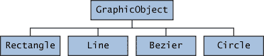

# 抽象方法和类

> 原文：[`docs.oracle.com/javase/tutorial/java/IandI/abstract.html`](https://docs.oracle.com/javase/tutorial/java/IandI/abstract.html)

*抽象类* 是一个声明为 `abstract` 的类—它可能包含或不包含抽象方法。抽象类不能被实例化，但可以被子类化。

*抽象方法* 是一种声明但没有实现的方法（没有大括号，后面跟着一个分号），如下所示：

```java
abstract void moveTo(double deltaX, double deltaY);

```

如果一个类包含抽象方法，那么这个类本身*必须*声明为 `abstract`，如下所示：

```java
public abstract class GraphicObject {
   // declare fields
   // declare nonabstract methods
   abstract void draw();
}

```

当一个抽象类被子类化时，子类通常为其父类中的所有抽象方法提供实现。但是，如果没有提供实现，则子类也必须声明为 `abstract`。 

* * *

**注意：** *接口* 中的方法（参见 接口 部分）如果没有声明为默认或静态，则*隐式*是抽象的，因此不需要使用 `abstract` 修饰符。 （可以使用，但是不必要。）

* * *

## 抽象类与接口的比较

抽象类类似于接口。你不能实例化它们，它们可能包含一些声明有或没有实现的方法。然而，使用抽象类，你可以声明非静态和非最终的字段，并定义公共、受保护和私有的具体方法。使用接口，所有字段都自动是公共的、静态的和最终的，你声明或定义的所有方法（作为默认方法）都是公共的。此外，你只能扩展一个类，无论它是否是抽象的，而你可以实现任意数量的接口。

你应该使用抽象类还是接口？

+   如果你的情况符合以下任何一种情况，请考虑使用抽象类：

    +   你想在几个密切相关的类之间共享代码。

    +   你期望扩展你的抽象类的类有许多共同的方法或字段，或者需要除了 public 之外的访问修饰符（比如 protected 和 private）。

    +   你想声明非静态或非最终字段。这使你能够定义可以访问和修改它们所属对象状态的方法。

+   如果你的情况符合以下任何一种情况，请考虑使用接口：

    +   你期望不相关的类会实现你的接口。例如，[`Comparable`](https://docs.oracle.com/javase/8/docs/api/java/lang/Comparable.html) 和 [`Cloneable`](https://docs.oracle.com/javase/8/docs/api/java/lang/Cloneable.html) 这些接口被许多不相关的类实现。

    +   你想指定特定数据类型的行为，但不关心谁实现它的行为。

    +   你想利用类型的多重继承。

JDK 中抽象类的一个示例是[`AbstractMap`](https://docs.oracle.com/javase/8/docs/api/java/util/AbstractMap.html)，它是集合框架的一部分。它的子类（包括 `HashMap`、`TreeMap` 和 `ConcurrentHashMap`）共享许多方法（包括 `get`、`put`、`isEmpty`、`containsKey` 和 `containsValue`），这些方法是由 `AbstractMap` 定义的。

JDK 中实现多个接口的一个类的示例是[`HashMap`](https://docs.oracle.com/javase/8/docs/api/java/util/HashMap.html)，它实现了接口 `Serializable`、`Cloneable` 和 `Map<K, V>`。通过阅读这些接口列表，你可以推断出 `HashMap` 的实例（无论是哪个开发者或公司实现的类）可以被克隆，是可序列化的（这意味着它可以被转换为字节流；参见可序列化对象部分），并且具有映射功能。此外，`Map<K, V>` 接口已经通过许多默认方法（如 `merge` 和 `forEach`）进行了增强，而旧类实现了该接口的类不必定义这些方法。

请注意，许多软件库同时使用抽象类和接口；`HashMap` 类实现了多个接口，并且还扩展了抽象类 `AbstractMap`。

## 抽象类示例

在面向对象的绘图应用程序中，你可以绘制圆、矩形、线条、贝塞尔曲线和许多其他图形对象。这些对象都具有某些状态（例如：位置、方向、线条颜色、填充颜色）和行为（例如：moveTo、rotate、resize、draw）是共同的。其中一些状态和行为对所有图形对象都是相同的（例如：位置、填充颜色和 moveTo）。其他需要不同实现（例如，resize 或 draw）。所有 `GraphicObject` 必须能够自行绘制或调整大小；它们只是在如何执行这些操作上有所不同。这是一个抽象超类的完美情况。你可以利用相似之处，并声明所有图形对象都继承自相同的抽象父对象（例如 `GraphicObject`），如下图所示。



类 Rectangle、Line、Bezier 和 Circle 继承自 GraphicObject

首先，声明一个抽象类 `GraphicObject`，以提供所有子类完全共享的成员变量和方法，例如当前位置和 `moveTo` 方法。`GraphicObject` 还声明了抽象方法，例如 `draw` 或 `resize`，这些方法需要所有子类实现，但必须以不同的方式实现。`GraphicObject` 类可能如下所示：

```java
abstract class GraphicObject {
    int x, y;
    ...
    void moveTo(int newX, int newY) {
        ...
    }
    abstract void draw();
    abstract void resize();
}

```

每个非抽象子类 `GraphicObject`，如 `Circle` 和 `Rectangle`，必须提供 `draw` 和 `resize` 方法的实现：

```java
class Circle extends GraphicObject {
    void draw() {
        ...
    }
    void resize() {
        ...
    }
}
class Rectangle extends GraphicObject {
    void draw() {
        ...
    }
    void resize() {
        ...
    }
}

```

## 当抽象类实现接口时

在`接口`部分中指出，实现接口的类必须实现*所有*接口的方法。然而，可以定义一个不实现所有接口方法的类，只要该类声明为`abstract`。例如，

```java
abstract class X implements Y {
  // implements all but one method of Y
}

class XX extends X {
  // implements the remaining method in Y
}

```

在这种情况下，类`X`必须是`abstract`，因为它没有完全实现`Y`，但事实上，类`XX`实现了`Y`。

## 类成员

一个抽象类可能有`static`字段和`static`方法。您可以像使用其他类一样使用这些静态成员，通过类引用（例如，`AbstractClass.staticMethod()`）。
