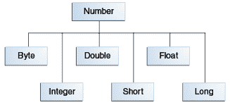

# 数字类

> 原文：[`docs.oracle.com/javase/tutorial/java/data/numberclasses.html`](https://docs.oracle.com/javase/tutorial/java/data/numberclasses.html)

在处理数字时，大多数情况下您会在代码中使用原始类型。例如：

```java
int i = 500;
float gpa = 3.65f;
byte mask = 0x7f;

```

然而，有理由使用对象代替原始类型，并且 Java 平台为每种原始数据类型提供了*包装*类。这些类将原始类型“包装”在对象中。通常，编译器会执行包装操作—如果您在期望对象的地方使用原始类型，编译器会为您将原始类型装箱到其包装类中。同样，如果您在期望原始类型的地方使用数字对象，编译器会为您拆箱对象。有关更多信息，请参阅自动装箱和拆箱

所有数字包装类都是抽象类`Number`的子类：



* * *

**注意：** 还有四个`Number`的子类没有在此处讨论。`BigDecimal`和`BigInteger`用于高精度计算。`AtomicInteger`和`AtomicLong`用于多线程应用程序。

* * *

有三个原因可能会使用`Number`对象而不是原始类型：

1.  作为期望对象的方法的参数（在操作数字集合时经常使用）。

1.  要使用类定义的常量，如`MIN_VALUE`和`MAX_VALUE`，提供数据类型的上限和下限。

1.  要使用类方法将值转换为其他原始类型，将值转换为字符串，以及在不同数字系统之间进行转换（十进制、八进制、十六进制、二进制）。

以下表格列出了所有`Number`类的子类实现的实例方法。

所有`Number`子类实现的方法

| 方法 | 描述 |
| --- | --- |

| `byte byteValue() short shortValue()

int intValue()

long longValue()

float floatValue()

double doubleValue()` | 将此`Number`对象的值转换为返回的原始数据类型。 |

| `int compareTo(Byte anotherByte) int compareTo(Double anotherDouble)

int compareTo(Float anotherFloat)

int compareTo(Integer anotherInteger)

int compareTo(Long anotherLong)

int compareTo(Short anotherShort)` | 将此`Number`对象与参数进行比较。 |

| `boolean equals(Object obj)` | 确定此数字对象是否等于参数。如果参数不为`null`且为相同类型且具有相同数值的对象，则方法返回`true`。

对于`Double`和`Float`对象，还有一些额外的要求，这些要求在 Java API 文档中有描述。 |

每个`Number`类包含其他方法，用于将数字转换为字符串，以及在不同数字系统之间进行转换。以下表格列出了`Integer`类中的这些方法。其他`Number`子类的方法类似：

转换方法，`Integer`类

| 方法 | 描述 |
| --- | --- |
| `static Integer decode(String s)` | 将字符串解码为整数。可以接受十进制、八进制或十六进制数字的字符串表示作为输入。 |
| `static int parseInt(String s)` | 返回一个整数（仅限十进制）。 |
| `static int parseInt(String s, int radix)` | 返回一个整数，给定十进制、二进制、八进制或十六进制（`radix`分别等于 10、2、8 或 16）数字的字符串表示作为输入。 |
| `String toString()` | 返回表示此`Integer`值的`String`对象。 |
| `static String toString(int i)` | 返回表示指定整数的`String`对象。 |
| `static Integer valueOf(int i)` | 返回一个包含指定原始值的`Integer`对象。 |
| `static Integer valueOf(String s)` | 返回一个`Integer`对象，其中包含指定字符串表示形式的值。 |
| `static Integer valueOf(String s, int radix)` | 返回一个`Integer`对象，其中包含指定字符串表示形式的整数值，使用基数进行解析。例如，如果`s = "333"`且`radix = 8`，则该方法返回八进制数 333 的十进制整数等价值。 |
