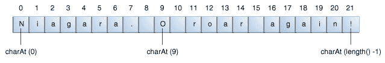
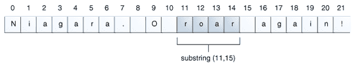
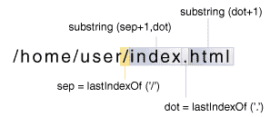

# 操作字符串中的字符

> 原文：[`docs.oracle.com/javase/tutorial/java/data/manipstrings.html`](https://docs.oracle.com/javase/tutorial/java/data/manipstrings.html)

`String`类有许多方法用于检查字符串的内容，在字符串中查找字符或子字符串，更改大小写以及其他任务。

## 通过索引获取字符和子字符串

您可以通过调用`charAt()`访问器方法在字符串中获取特定索引处的字符。第一个字符的索引为 0，而最后一个字符的索引为`length()-1`。例如，以下代码获取字符串中索引为 9 的字符：

```java
String anotherPalindrome = "Niagara. O roar again!"; 
char aChar = anotherPalindrome.charAt(9);

```

索引从 0 开始，因此索引为 9 的字符是'O'，如下图所示：



如果要从字符串中获取多个连续字符，可以使用`substring`方法。`substring`方法有两个版本，如下表所示：

`String`类中的`substring`方法

| 方法 | 描述 |
| --- | --- |
| `String substring(int beginIndex, int endIndex)` | 返回一个新的字符串，该字符串是此字符串的子字符串。子字符串从指定的`beginIndex`开始，延伸到索引`endIndex - 1`的字符。 |
| `String substring(int beginIndex)` | 返回一个新的字符串，该字符串是此字符串的子字符串。整数参数指定第一个字符的索引。在这里，返回的子字符串延伸到原始字符串的末尾。 |

以下代码从尼亚加拉回文中获取从索引 11 到索引 15 之前的子字符串，即单词"roar"：

```java
String anotherPalindrome = "Niagara. O roar again!"; 
String roar = anotherPalindrome.substring(11, 15); 

```



## 用于操作字符串的其他方法

以下是用于操作字符串的几种其他`String`方法：

`String`类中用于操作字符串的其他方法

| 方法 | 描述 |
| --- | --- |
| `String[] split(String regex)` `String[] split(String regex, int limit)` | 搜索由字符串参数指定的匹配项（其中包含正则表达式）并相应地将此字符串拆分为字符串数组。可选的整数参数指定返回数组的最大大小。正则表达式在标题为"正则表达式"的课程中介绍。 |
| `CharSequence subSequence(int beginIndex, int endIndex)` | 返回从`beginIndex`索引开始直到`endIndex - 1`的新字符序列。 |
| `String trim()` | 返回删除前导和尾随空格的此字符串的副本。 |
| `String toLowerCase() String toUpperCase()` | 返回转换为小写或大写的此字符串的副本。如果不需要转换，则这些方法返回原始字符串。 |

## 在字符串中搜索字符和子字符串

以下是一些用于在字符串中查找字符或子字符串的其他`String`方法。`String`类提供了返回特定字符或子字符串在字符串中位置的访问方法：`indexOf()`和`lastIndexOf()`。`indexOf()`方法从字符串的开头向前搜索，而`lastIndexOf()`方法从字符串的末尾向后搜索。如果未找到字符或子字符串，`indexOf()`和`lastIndexOf()`将返回-1。

`String`类还提供了一个搜索方法`contains`，如果字符串包含特定的字符序列，则返回 true。当您只需要知道字符串包含一个字符序列，但精确位置并不重要时，请使用此方法。

以下表格描述了各种字符串搜索方法。

`String`类中的搜索方法

| 方法 | 描述 |
| --- | --- |
| `int indexOf(int ch) int lastIndexOf(int ch)` | 返回指定字符的第一个（最后一个）出现的索引。 |
| `int indexOf(int ch, int fromIndex) int lastIndexOf(int ch, int fromIndex)` | 返回指定字符的第一个（最后一个）出现的索引，从指定索引向前（向后）搜索。 |
| `int indexOf(String str) int lastIndexOf(String str)` | 返回指定子字符串的第一个（最后一个）出现的索引。 |
| `int indexOf(String str, int fromIndex) int lastIndexOf(String str, int fromIndex)` | 返回指定子字符串的第一个（最后一个）出现的索引，从指定索引向前（向后）搜索。 |
| `boolean contains(CharSequence s)` | 如果字符串包含指定的字符序列，则返回 true。 |

* * *

**注意:** `CharSequence`是一个由`String`类实现的接口。因此，您可以将字符串作为`contains()`方法的参数。

* * *

## 将字符和子字符串替换为字符串

`String`类几乎没有用于在字符串中插入字符或子字符串的方法。一般情况下，这些方法是不需要的：您可以通过将您从字符串中*删除*的子字符串与您要插入的子字符串连接起来创建一个新的字符串。

`String`类确实有四种用于*替换*找到的字符或子字符串的方法。它们是：

`String`类中用于操作字符串的方法

| 方法 | 描述 |
| --- | --- |
| `String replace(char oldChar, char newChar)` | 返回一个新字符串，该字符串由将此字符串中所有旧字符的出现替换为新字符而生成。 |
| `String replace(CharSequence target, CharSequence replacement)` | 用指定的替换序列替换此字符串中与字面目标序列匹配的每个子字符串。 |
| `String replaceAll(String regex, String replacement)` | 用给定替换替换此字符串中与给定正则表达式匹配的每个子字符串。 |
| `String replaceFirst(String regex, String replacement)` | 用给定的替换字符串替换与给定正则表达式匹配的此字符串的第一个子字符串。 |

## 一个示例

以下类，`Filename`，演示了使用`lastIndexOf()`和`substring()`来分离文件名的不同部分。

* * *

**注意：**以下`Filename`类中的方法没有进行任何错误检查，并假定它们的参数包含完整的目录路径和带有扩展名的文件名。如果这些方法是生产代码，它们将验证它们的参数是否正确构造。

* * *

```java

public class Filename {
    private String fullPath;
    private char pathSeparator, 
                 extensionSeparator;

    public Filename(String str, char sep, char ext) {
        fullPath = str;
        pathSeparator = sep;
        extensionSeparator = ext;
    }

    public String extension() {
        int dot = fullPath.lastIndexOf(extensionSeparator);
        return fullPath.substring(dot + 1);
    }

    // gets filename without extension
    public String filename() {
        int dot = fullPath.lastIndexOf(extensionSeparator);
        int sep = fullPath.lastIndexOf(pathSeparator);
        return fullPath.substring(sep + 1, dot);
    }

    public String path() {
        int sep = fullPath.lastIndexOf(pathSeparator);
        return fullPath.substring(0, sep);
    }
}

```

这里有一个程序，`FilenameDemo`，它构造了一个`Filename`对象并调用了它的所有方法：

```java

public class FilenameDemo {
    public static void main(String[] args) {
        final String FPATH = "/home/user/index.html";
        Filename myHomePage = new Filename(FPATH, '/', '.');
        System.out.println("Extension = " + myHomePage.extension());
        System.out.println("Filename = " + myHomePage.filename());
        System.out.println("Path = " + myHomePage.path());
    }
}

```

以下是程序的输出：

```java
Extension = html
Filename = index
Path = /home/user

```

如下图所示，我们的`extension`方法使用`lastIndexOf`来定位文件名中句点（.）的最后一个出现位置。然后`substring`使用`lastIndexOf`的返回值来提取文件名扩展名，即从句点到字符串末尾的子字符串。此代码假定文件名中有一个句点；如果文件名中没有句点，`lastIndexOf`将返回-1，而`substring`方法将抛出`StringIndexOutOfBoundsException`。



还要注意，`extension`方法使用`dot + 1`作为`substring`的参数。如果句点字符（.）是字符串的最后一个字符，则`dot + 1`等于字符串的长度，这比字符串的最大索引大 1（因为索引从 0 开始）。这是`substring`的合法参数，因为该方法接受一个等于但不大于字符串长度的索引，并将其解释为“字符串的结尾”。
