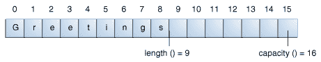

# StringBuilder 类

> 原文：[`docs.oracle.com/javase/tutorial/java/data/buffers.html`](https://docs.oracle.com/javase/tutorial/java/data/buffers.html)

[`StringBuilder`](https://docs.oracle.com/javase/8/docs/api/java/lang/StringBuilder.html) 对象类似于 [`String`](https://docs.oracle.com/javase/8/docs/api/java/lang/String.html) 对象，不同之处在于它们可以被修改。在内部，这些对象被视为包含一系列字符的可变长度数组。在任何时候，通过方法调用可以更改序列的长度和内容。

除非字符串生成器在代码更简单（请参见本节末尾的示例程序）或性能更好方面提供优势，否则应始终使用字符串。例如，如果需要连接大量字符串，则追加到`StringBuilder`对象更有效率。

## 长度和容量

`StringBuilder` 类，类似于 `String` 类，具有返回生成器中字符序列长度的 `length()` 方法。

与字符串不同，每个字符串生成器还有一个*容量*，即已分配的字符空间数。容量由 `capacity()` 方法返回，始终大于或等于长度（通常大于），并且会根据需要自动扩展以容纳对字符串生成器的添加。

`StringBuilder` 构造函数

| 构造函数 | 描述 |
| --- | --- |
| `StringBuilder()` | 创建一个容量为 16（16 个空元素）的空字符串生成器。 |
| `StringBuilder(CharSequence cs)` | 构造一个包含与指定 `CharSequence` 相同字符的字符串生成器，`CharSequence` 后面还有额外的 16 个空元素。 |
| `StringBuilder(int initCapacity)` | 创建一个具有指定初始容量的空字符串生成器。 |
| `StringBuilder(String s)` | 创建一个字符串生成器，其值由指定的字符串初始化，字符串后面还有额外的 16 个空元素。 |

例如，以下代码

```java
// creates empty builder, capacity 16
StringBuilder sb = new StringBuilder();
// adds 9 character string at beginning
sb.append("Greetings");

```

会生成一个长度为 9，容量为 16 的字符串生成器：



`StringBuilder` 类有一些与长度和容量相关的方法，而 `String` 类没有：

长度和容量方法

| 方法 | 描述 |
| --- | --- |
| `void setLength(int newLength)` | 设置字符序列的长度。如果`newLength`小于`length()`，则字符序列中的最后字符将被截断。如果`newLength`大于`length()`，则在字符序列的末尾添加空字符。 |
| `void ensureCapacity(int minCapacity)` | 确保容量至少等于指定的最小值。 |

一些操作（例如，`append()`，`insert()`或`setLength()`）可以增加字符串构建器中字符序列的长度，使得结果的`length()`大于当前的`capacity()`。当这种情况发生时，容量会自动增加。

## StringBuilder 操作

`StringBuilder`上的主要操作，这些操作在`String`中不可用，是`append()`和`insert()`方法，这些方法被重载以接受任何类型的数据。每个方法将其参数转换为字符串，然后将该字符串的字符附加或插入到字符串构建器中的字符序列中。`append`方法总是在现有字符序列的末尾添加这些字符，而`insert`方法在指定点添加字符。

这里是`StringBuilder`类的一些方法。

各种`StringBuilder`方法

| 方法 | 描述 |
| --- | --- |

| `StringBuilder append(boolean b) StringBuilder append(char c)

StringBuilder append(char[] str)

StringBuilder append(char[] str, int offset, int len)

StringBuilder append(double d)

StringBuilder append(float f)

StringBuilder append(int i)

StringBuilder append(long lng)

StringBuilder append(Object obj)

StringBuilder append(String s)` | 将参数附加到此字符串构建器。在附加操作发生之前，数据将被转换为字符串。 |

| `StringBuilder delete(int start, int end) StringBuilder deleteCharAt(int index)` | 第一个方法删除`StringBuilder`的字符序列中从`start`到`end-1`（包括`end-1`）的子序列。第二个方法删除位于`index`处的字符。 |
| --- | --- |

| `StringBuilder insert(int offset, boolean b) StringBuilder insert(int offset, char c)

StringBuilder insert(int offset, char[] str)

StringBuilder insert(int index, char[] str, int offset, int len)

StringBuilder insert(int offset, double d)

StringBuilder insert(int offset, float f)

StringBuilder insert(int offset, int i)

StringBuilder insert(int offset, long lng)

StringBuilder insert(int offset, Object obj)

StringBuilder insert(int offset, String s)` | 将第二个参数插入到字符串构建器中。第一个整数参数表示要插入数据之前的索引。在插入操作发生之前，数据将被转换为字符串。 |

| `StringBuilder replace(int start, int end, String s) void setCharAt(int index, char c)` | 替换此字符串构建器中指定的字符。 |
| --- | --- |
| `StringBuilder reverse()` | 反转此字符串构建器中的字符序列。 |
| `String toString()` | 返回一个包含构建器中字符序列的字符串。 |

* * *

**注意：** 您可以通过首先使用`StringBuilder`类的`toString()`方法将字符串构建器转换为字符串，然后使用`StringBuilder(String str)`构造函数将字符串转换回字符串构建器，从而在`StringBuilder`对象上使用任何`String`方法。

* * *

## 一个示例

在标题为“字符串”的部分列出的`StringDemo`程序是一个例子，如果使用`StringBuilder`而不是`String`会更有效率。

`StringDemo`反转了一个回文。这里再次列出它的代码：

```java

public class StringDemo {
    public static void main(String[] args) {
        String palindrome = "Dot saw I was Tod";
        int len = palindrome.length();
        char[] tempCharArray = new char[len];
        char[] charArray = new char[len];

        // put original string in an 
        // array of chars
        for (int i = 0; i < len; i++) {
            tempCharArray[i] = 
                palindrome.charAt(i);
        } 

        // reverse array of chars
        for (int j = 0; j < len; j++) {
            charArray[j] =
                tempCharArray[len - 1 - j];
        }

        String reversePalindrome =
            new String(charArray);
        System.out.println(reversePalindrome);
    }
}

```

运行程序会产生这个输出：

```java
doT saw I was toD

```

为了实现字符串反转，程序将字符串转换为字符数组（第一个`for`循环），将数组反转为第二个数组（第二个`for`循环），然后再转换回字符串。

如果你将`palindrome`字符串转换为一个字符串生成器，你可以使用`StringBuilder`类中的`reverse()`方法。这样代码会更简单，更易于阅读：

```java

public class StringBuilderDemo {
    public static void main(String[] args) {
        String palindrome = "Dot saw I was Tod";

        StringBuilder sb = new StringBuilder(palindrome);

        sb.reverse();  // reverse it

        System.out.println(sb);
    }
}

```

运行这个程序会产生相同的输出：

```java
doT saw I was toD

```

注意，`println()`打印一个字符串生成器，如下所示：

```java
System.out.println(sb);

```

因为`sb.toString()`会被隐式调用，就像在`println()`调用中对任何其他对象一样。

* * *

**注意：** 还有一个`StringBuffer`类，与`StringBuilder`类*完全*相同，唯一的区别是它的方法是同步的，因此是线程安全的。线程将在并发课程中讨论。

* * *
