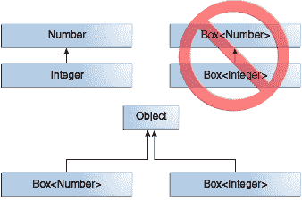
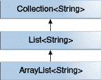
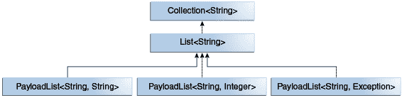

# 泛型、继承和子类型

> 译文：[`docs.oracle.com/javase/tutorial/java/generics/inheritance.html`](https://docs.oracle.com/javase/tutorial/java/generics/inheritance.html)

正如你已经知道的，可以将一个类型的对象赋给另一个类型的对象，前提是这两种类型是兼容的。例如，你可以将一个 `Integer` 赋给一个 `Object`，因为 `Object` 是 `Integer` 的超类型之一：

```java
Object someObject = new Object();
Integer someInteger = new Integer(10);
someObject = someInteger;   // OK

```

在面向对象的术语中，这被称为“是一个”关系。由于 `Integer` *是* `Object` 的一种，所以赋值是允许的。但是 `Integer` 也是 `Number` 的一种，所以下面的代码也是有效的：

```java
public void someMethod(Number n) { /* ... */ }

someMethod(new Integer(10));   // OK
someMethod(new Double(10.1));   // OK

```

泛型也是如此。你可以执行泛型类型调用，将 `Number` 作为其类型参数，并且如果参数与 `Number` 兼容，则允许任何后续的 `add` 调用：

```java
Box<Number> box = new Box<Number>();
box.add(new Integer(10));   // OK
box.add(new Double(10.1));  // OK

```

现在考虑以下方法：

```java
public void boxTest(Box<Number> n) { /* ... */ }

```

它接受什么类型的参数？通过查看其签名，你可以看到它接受一个类型为 `Box<Number>` 的单个参数。但这意味着什么？你可以传入 `Box<Integer>` 或 `Box<Double>` 吗，正如你可能期望的那样？答案是“不可以”，因为 `Box<Integer>` 和 `Box<Double>` 不是 `Box<Number>` 的子类型。

这是在使用泛型进行编程时的一个常见误解，但这是一个重要的概念需要学习。

`Box<Integer>` 不是 `Box<Number>` 的子类型，即使 `Integer` 是 `Number` 的子类型。

* * *

**注意：**给定两个具体类型 `A` 和 `B`（例如，`Number` 和 `Integer`），`MyClass<A>` 与 `MyClass<B>` 没有关系，无论 `A` 和 `B` 是否相关。`MyClass<A>` 和 `MyClass<B>` 的共同父类是 `Object`。

有关如何在类型参数相关的情况下创建两个泛型类之间类似子类型的关系的信息，请参阅通配符和子类型。

* * *

## 通用类和子类型

你可以通过扩展或实现来对泛型类或接口进行子类型化。一个类或接口的类型参数与另一个类或接口的类型参数之间的关系由 `extends` 和 `implements` 子句确定。

以 `Collections` 类为例，`ArrayList<E>` 实现了 `List<E>`，而 `List<E>` 扩展了 `Collection<E>`。因此，`ArrayList<String>` 是 `List<String>` 的子类型，`List<String>` 是 `Collection<String>` 的子类型。只要不改变类型参数，类型之间的子类型关系就会保持不变。

一个示例 `Collections` 层次结构

现在想象一下，我们想要定义自己的列表接口，`PayloadList`，它将泛型类型`P`的可选值与每个元素关联起来。它的声明可能如下所示：

```java
interface PayloadList<E,P> extends List<E> {
  void setPayload(int index, P val);
  ...
}

```

以下对`PayloadList`的参数化是`List<String>`的子类型：

+   `PayloadList<String,String>`

+   `PayloadList<String,Integer>`

+   `PayloadList<String,Exception>`

一个`PayloadList`层次结构示例
