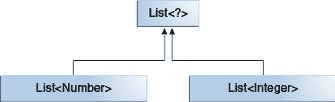

# 通配符和子类型

> 原文：[`docs.oracle.com/javase/tutorial/java/generics/subtyping.html`](https://docs.oracle.com/javase/tutorial/java/generics/subtyping.html)

如泛型、继承和子类型中所述，泛型类或接口之间并不仅仅因为它们的类型之间存在关系而相关。但是，您可以使用通配符来创建泛型类或接口之间的关系。

给定以下两个常规（非泛型）类：

```java
class A { /* ... */ }
class B extends A { /* ... */ }

```

编写以下代码是合理的：

```java
B b = new B();
A a = b;

```

此示例显示了常规类的继承遵循子类型规则：如果`B`扩展`A`，则类`B`是类`A`的子类型。这个规则不适用于泛型类型：

```java
List<B> lb = new ArrayList<>();
List<A> la = lb;   // compile-time error

```

鉴于`Integer`是`Number`的子类型，那么`List<Integer>`和`List<Number>`之间的关系是什么？

共同父类是`List<?>`。

尽管`Integer`是`Number`的子类型，但`List<Integer>`不是`List<Number>`的子类型，实际上，这两种类型没有关系。`List<Number>`和`List<Integer>`的共同父类是`List<?>`。

为了创建这些类之间的关系，以便代码可以通过`List<Integer>`的元素访问`Number`的方法，请使用上界通配符：

```java
List<? extends Integer> intList = new ArrayList<>();
List<? extends Number>  numList = intList;  // OK. List<? extends Integer> is a subtype of List<? extends Number>

```

因为`Integer`是`Number`的子类型，而`numList`是`Number`对象的列表，现在`intList`（`Integer`对象的列表）和`numList`之间存在关系。以下图表显示了使用上下界通配符声明的几个`List`类之间的关系。

几个泛型`List`类声明的层次结构。

通配符使用指南部分有关于使用上下界通配符的更多信息。
