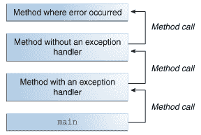
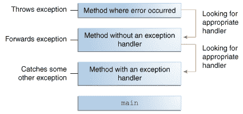

# 什么是异常？

> 原文：[`docs.oracle.com/javase/tutorial/essential/exceptions/definition.html`](https://docs.oracle.com/javase/tutorial/essential/exceptions/definition.html)

术语*异常*是“异常事件”的简称。

* * *

**定义：** *异常*是程序执行过程中发生的事件，打断了程序正常指令流程。

* * *

当方法内部发生错误时，方法会创建一个对象并将其交给运行时系统。这个对象称为*异常对象*，包含有关错误的信息，包括错误发生时的类型和程序状态。创建异常对象并将其交给运行时系统称为*抛出异常*。

方法抛出异常后，运行时系统会尝试寻找处理异常的方法。可以处理异常的一系列可能的“方法”是调用到发生错误的方法的有序方法列表。这些方法的列表称为*调用堆栈*（见下图）。

调用堆栈。

运行时系统在调用堆栈中搜索包含可以处理异常的代码块的方法。这个代码块称为*异常处理程序*。搜索从发生错误的方法开始，并按照调用方法的相反顺序在调用堆栈中进行。当找到适当的处理程序时，运行时系统将异常传递给处理程序。如果抛出的异常对象的类型与处理程序可以处理的类型匹配，则认为异常处理程序是适当的。

选择的异常处理程序被称为*捕获异常*。如果运行时系统在调用堆栈上详尽搜索而找不到适当的异常处理程序，如下图所示，运行时系统（以及因此程序）将终止。

在调用堆栈中搜索异常处理程序。

使用异常来管理错误相比传统的错误管理技术有一些优势。您可以在异常的优势部分了解更多信息。
