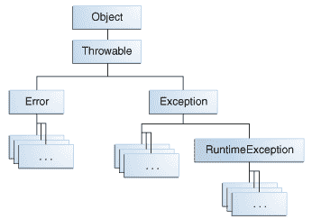

# 如何抛出异常

> 原文：[`docs.oracle.com/javase/tutorial/essential/exceptions/throwing.html`](https://docs.oracle.com/javase/tutorial/essential/exceptions/throwing.html)

在捕获异常之前，某个地方的代码必须抛出异常。任何代码都可以抛出异常：您的代码、其他人编写的包中的代码（例如 Java 平台提供的包）或 Java 运行时环境。无论是什么引发了异常，它总是使用 `throw` 语句抛出。

正如您可能已经注意到的，Java 平台提供了许多异常类。所有这些类都是 [`Throwable`](https://docs.oracle.com/javase/8/docs/api/java/lang/Throwable.html) 类的后代，所有这些类都允许程序在程序执行期间区分各种可能发生的异常类型。

您还可以创建自己的异常类来表示您编写的类中可能发生的问题。实际上，如果您是一个包开发者，您可能需要创建自己的一组异常类，以允许用户区分在您的包中可能发生的错误与在 Java 平台或其他包中发生的错误。

您还可以创建*链接*异常。有关更多信息，请参阅链接异常部分。

## 抛出语句

所有方法都使用 `throw` 语句来抛出异常。`throw` 语句需要一个参数：一个可抛出对象。可抛出对象是 `Throwable` 类的任何子类的实例。这里是一个 `throw` 语句的示例。

```java
throw *someThrowableObject*;

```

让我们看看 `throw` 语句的上下文。以下 `pop` 方法取自实现常见堆栈对象的类。该方法从堆栈中移除顶部元素并返回该对象。

```java
public Object pop() {
    Object obj;

    if (size == 0) {
        throw new EmptyStackException();
    }

    obj = objectAt(size - 1);
    setObjectAt(size - 1, null);
    size--;
    return obj;
}

```

`pop` 方法检查堆栈上是否有任何元素。如果堆栈为空（其大小等于 `0`），`pop` 实例化一个新的 `EmptyStackException` 对象（`java.util` 的成员）并将其抛出。本章的创建异常类部分解释了如何创建自己的异常类。现在，您只需要记住您只能抛出继承自 `java.lang.Throwable` 类的对象。

注意，`pop` 方法的声明中不包含 `throws` 子句。`EmptyStackException` 不是一个受检异常，因此 `pop` 不需要声明它可能发生。

## Throwable 类及其子类

继承自`Throwable`类的对象包括直接后代（直接从`Throwable`类继承的对象）和间接后代（从`Throwable`类的子类或孙子类继承的对象）。下图说明了`Throwable`类及其最重要的子类的类层次结构。正如你所看到的，`Throwable`有两个直接后代：[`Error`](https://docs.oracle.com/javase/8/docs/api/java/lang/Error.html)和[`Exception`](https://docs.oracle.com/javase/8/docs/api/java/lang/Exception.html)。



Throwable 类。

## 错误类

当 Java 虚拟机发生动态链接失败或其他严重故障时，虚拟机会抛出一个`Error`。简单的程序通常不会捕获或抛出`Error`。

## 异常类

大多数程序会抛出和捕获从`Exception`类派生的对象。`Exception`表示发生了问题，但不是严重的系统问题。你编写的大多数程序会抛出和捕获`Exception`，而不是`Error`。

Java 平台定义了`Exception`类的许多后代。这些后代表示可能发生的各种异常类型。例如，`IllegalAccessException`表示找不到特定方法，而`NegativeArraySizeException`表示程序尝试创建一个负大小的数组。

一个`Exception`子类，`RuntimeException`，用于指示 API 的不正确使用的异常。一个运行时异常的例子是`NullPointerException`，当一个方法尝试通过`null`引用访问对象的成员时会发生。本节未经检查的异常 — 争议讨论了为什么大多数应用程序不应该抛出运行时异常或子类化`RuntimeException`。
