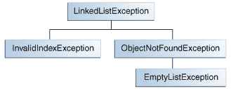

# 创建异常类

> 原文：[`docs.oracle.com/javase/tutorial/essential/exceptions/creating.html`](https://docs.oracle.com/javase/tutorial/essential/exceptions/creating.html)

在选择要抛出的异常类型时，你可以使用其他人编写的异常 — Java 平台提供了许多可以使用的异常类 — 或者你可以编写自己的异常。如果对以下任何问题回答是肯定的，那么你应该编写自己的异常类；否则，你可能可以使用别人的。

+   是否需要一个 Java 平台中没有的异常类型？

+   如果用户能够区分你的异常和其他供应商编写的异常，这是否有助于用户？

+   你的代码是否抛出了多个相关的异常？

+   如果使用别人的异常，用户是否能够访问这些异常？一个类似的问题是，你的包是否独立且自包含？

## 一个示例

假设你正在编写一个链表类。该类支持以下方法，以及其他方法：

+   **`objectAt(int n)`** — 返回列表中第`n`个位置的对象。如果参数小于 0 或大于当前列表中对象的数量，则抛出异常。

+   **`firstObject()`** — 返回列表中的第一个对象。如果列表不包含对象，则抛出异常。

+   **`indexOf(Object o)`** — 搜索列表中指定的`Object`并返回其在列表中的位置。如果传入方法的对象不在列表中，则抛出异常。

链表类可以抛出多个异常，能够使用一个异常处理程序捕获链表抛出的所有异常将会很方便。此外，如果计划在一个包中分发你的链表，所有相关代码应该打包在一起。因此，链表应该提供自己的一组异常类。

下图展示了链表抛出的异常可能的类层次结构。

示例异常类层次结构。

## 选择一个超类

任何`Exception`子类都可以用作`LinkedListException`的父类。然而，快速浏览这些子类显示它们不合适，因为它们要么过于专业化，要么与`LinkedListException`完全无关。因此，`LinkedListException`的父类应该是`Exception`。

你编写的大多数小程序和应用程序将抛出`Exception`对象。`Error`通常用于系统中的严重、严重错误，例如阻止 JVM 运行的错误。

* * *

**注意：** 为了编写可读性强的代码，将`Exception`字符串附加到所有直接或间接继承自`Exception`类的类名后是一个好习惯。

* * *
