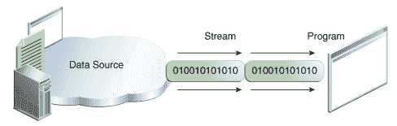
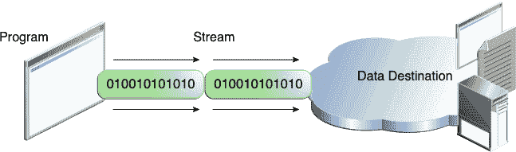

# I/O 流

> 原文：[`docs.oracle.com/javase/tutorial/essential/io/streams.html`](https://docs.oracle.com/javase/tutorial/essential/io/streams.html)

*I/O 流*表示输入源或输出目的地。流可以表示许多不同类型的源和目的地，包括磁盘文件、设备、其他程序和内存数组。

流支持许多不同类型的数据，包括简单的字节、基本数据类型、本地化字符和对象。一些流只是传递数据；另一些以有用的方式操作和转换数据。

无论它们内部如何工作，所有流对使用它们的程序呈现相同简单的模型：流是一系列数据。程序使用*输入流*从源读取数据，一次读取一个项目：



将信息读入程序。

程序使用*输出流*向目的地写入数据，一次写入一个项目：



将信息从程序写入。

在本课程中，我们将看到可以处理从基本值到高级对象的各种数据的流。

上图中的数据源和数据目的地可以是任何保存、生成或消耗数据的东西。显然，这包括磁盘文件，但源或目的地也可以是另一个程序、外围设备、网络套接字或数组。

在下一节中，我们将使用最基本的流类型，字节流，来演示流 I/O 的常见操作。作为示例输入，我们将使用示例文件`xanadu.txt`，其中包含以下诗句：

```java
In Xanadu did Kubla Khan
A stately pleasure-dome decree:
Where Alph, the sacred river, ran
Through caverns measureless to man
Down to a sunless sea.

```
