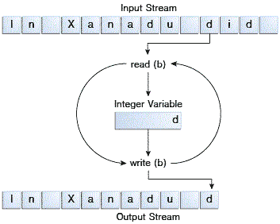

# 字节流

> 原文：[`docs.oracle.com/javase/tutorial/essential/io/bytestreams.html`](https://docs.oracle.com/javase/tutorial/essential/io/bytestreams.html)

程序使用*字节流*来执行 8 位字节的输入和输出。所有字节流类都是从[`InputStream`](https://docs.oracle.com/javase/8/docs/api/java/io/InputStream.html)和[`OutputStream`](https://docs.oracle.com/javase/8/docs/api/java/io/OutputStream.html)继承而来。

有许多字节流类。为了演示字节流的工作原理，我们将重点放在文件 I/O 字节流[`FileInputStream`](https://docs.oracle.com/javase/8/docs/api/java/io/FileInputStream.html)和[`FileOutputStream`](https://docs.oracle.com/javase/8/docs/api/java/io/FileOutputStream.html)上。其他类型的字节流使用方式基本相同；它们主要在构造方式上有所不同。

## 使用字节流

我们将通过检查一个名为`CopyBytes`的示例程序来探讨`FileInputStream`和`FileOutputStream`，该程序使用字节流逐字节复制`xanadu.txt`。

```java
import java.io.FileInputStream;
import java.io.FileOutputStream;
import java.io.IOException;

public class CopyBytes {
    public static void main(String[] args) throws IOException {

        FileInputStream in = null;
        FileOutputStream out = null;

        try {
            in = new FileInputStream("xanadu.txt");
            out = new FileOutputStream("outagain.txt");
            int c;

            while ((c = in.read()) != -1) {
                out.write(c);
            }
        } finally {
            if (in != null) {
                in.close();
            }
            if (out != null) {
                out.close();
            }
        }
    }
}

```

`CopyBytes` 在一个简单的循环中花费大部分时间，逐字节读取输入流并写入输出流，如下图所示。



简单的字节流输入和输出。

## 总是关闭流

当不再需要流时关闭流非常重要—非常重要，以至于`CopyBytes` 使用`finally`块来确保即使发生错误，两个流也将被关闭。这种做法有助于避免严重的资源泄漏。

一个可能的错误是`CopyBytes` 无法打开一个或两个文件。当发生这种情况时，对应于文件的流变量从未从其初始的`null`值更改。这就是为什么`CopyBytes` 确保每个流变量在调用`close`之前包含一个对象引用。

## 何时不使用字节流

`CopyBytes` 看起来像一个普通程序，但实际上代表了一种应该避免的低级 I/O。由于`xanadu.txt`包含字符数据，最好的方法是使用字符流，如下一节所讨论的。还有用于更复杂数据类型的流。字节流应该仅用于最基本的 I/O。

那么为什么要谈论字节流呢？因为所有其他流类型都是建立在字节流之上的。
