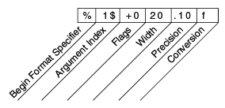

# 格式化

> 原文：[`docs.oracle.com/javase/tutorial/essential/io/formatting.html`](https://docs.oracle.com/javase/tutorial/essential/io/formatting.html)

实现格式化的流对象是[`PrintWriter`](https://docs.oracle.com/javase/8/docs/api/java/io/PrintWriter.html)（字符流类）或[`PrintStream`](https://docs.oracle.com/javase/8/docs/api/java/io/PrintStream.html)（字节流类）的实例。

* * *

**注意：**你可能需要的唯一`PrintStream`对象是[`System.out`](https://docs.oracle.com/javase/8/docs/api/java/lang/System.html#out)和[`System.err`](https://docs.oracle.com/javase/8/docs/api/java/lang/System.html#err)。（有关这些对象的更多信息，请参阅从命令行进行 I/O。）当您需要创建格式化输出流时，请实例化`PrintWriter`，而不是`PrintStream`。

* * *

像所有字节和字符流对象一样，`PrintStream`和`PrintWriter`的实例实现了一组用于简单字节和字符输出的标准`write`方法。此外，`PrintStream`和`PrintWriter`都实现了相同的一组方法，用于将内部数据转换为格式化输出。提供了两个级别的格式化：

+   `print`和`println`以标准方式格式化单个值。

+   `format`根据格式字符串几乎可以格式化任意数量的值，具有许多精确格式化选项。

## `print`和`println`方法

调用`print`或`println`在使用适当的`toString`方法转换值后输出单个值。我们可以在`Root`示例中看到这一点：

```java
public class Root {
    public static void main(String[] args) {
        int i = 2;
        double r = Math.sqrt(i);

        System.out.print("The square root of ");
        System.out.print(i);
        System.out.print(" is ");
        System.out.print(r);
        System.out.println(".");

        i = 5;
        r = Math.sqrt(i);
        System.out.println("The square root of " + i + " is " + r + ".");
    }
}

```

这是`Root`的输出：

```java
The square root of 2 is 1.4142135623730951.
The square root of 5 is 2.23606797749979.

```

`i`和`r`变量被格式化两次：第一次使用`print`重载中的代码，第二次是由 Java 编译器自动生成的转换代码，也利用了`toString`。您可以以这种方式格式化任何值，但对结果的控制不多。

## `format`方法

`format`方法根据*格式字符串*格式化多个参数。格式字符串由静态文本与*格式说明符*嵌入在一起组成；除了格式说明符外，格式字符串不会改变输出。

格式字符串支持许多功能。在本教程中，我们只涵盖了一些基础知识。有关完整描述，请参阅 API 规范中的[`格式字符串语法`](https://docs.oracle.com/javase/8/docs/api/java/util/Formatter.html#syntax)。

`Root2`示例使用单个`format`调用格式化两个值：

```java
public class Root2 {
    public static void main(String[] args) {
        int i = 2;
        double r = Math.sqrt(i);

        System.out.format("The square root of %d is %f.%n", i, r);
    }
}

```

这里是输出：

```java
The square root of 2 is 1.414214.

```

像这个示例中使用的三个一样，所有格式说明符都以`%`开头，并以指定正在生成的格式化输出类型的 1 个或 2 个字符*转换*结尾。这里使用的三个转换是：

+   `d`将整数值格式化为十进制值。

+   `f`将浮点值格式化为十进制值。

+   `n`输出特定于平台的换行符。

这里有一些其他转换：

+   `x`将整数格式化为十六进制值。

+   `s` 将任何值格式化为字符串。

+   `tB` 格式化一个整数为本地特定的月份名称。

还有许多其他转换。

* * *

**注意：**

除了 `%%` 和 `%n` 之外，所有格式说明符都必须匹配一个参数。如果不匹配，就会抛出异常。

在 Java 编程语言中，`\n` 转义始终生成换行符（`\u000A`）。除非特别需要换行符，否则不要使用 `\n`。要获取本地平台的正确换行符，请使用 `%n`。

* * *

除了转换之外，格式说明符还可以包含几个额外元素，进一步定制格式化输出。这里是一个示例，`Format`，使用了每种可能的元素类型。

```java
public class Format {
    public static void main(String[] args) {
        System.out.format("%f, %1$+020.10f %n", Math.PI);
    }
}

```

这是输出结果：

```java
3.141593, +00000003.1415926536

```

所有附加元素都是可选的。下图显示了更长格式说明符如何分解为元素。



格式说明符的元素。

元素必须按照所示顺序出现。从右边开始，可选元素包括：

+   **精度**。对于浮点值，这是格式化值的数学精度。对于 `s` 和其他一般转换，这是格式化值的最大宽度；如果需要，值将被右截断。

+   **宽度**。格式化值的最小宽度；如果需要，将填充值。默认情况下，值左侧用空格填充。

+   **标志** 指定额外的格式选项。在 `Format` 示例中，`+` 标志指定数字应始终带有符号格式，`0` 标志指定 `0` 为填充字符。其他标志包括 `-`（右侧填充）和 `,`（使用本地特定的千位分隔符格式化数字）。请注意，某些标志不能与其他标志或某些转换一起使用。

+   **参数索引** 允许您显式匹配指定的参数。您还可以指定 `<` 来匹配与上一个格式说明符相同的参数。因此，示例可以这样说：`System.out.format("%f, %<+020.10f %n", Math.PI);`
