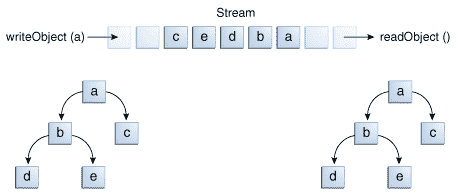

# 对象流

> 原文：[`docs.oracle.com/javase/tutorial/essential/io/objectstreams.html`](https://docs.oracle.com/javase/tutorial/essential/io/objectstreams.html)

就像数据流支持原始数据类型的 I/O 一样，对象流支持对象的 I/O。大多数标准类支持其对象的序列化，但并非所有类都支持。那些实现了标记接口[`Serializable`](https://docs.oracle.com/javase/8/docs/api/java/io/Serializable.html)的类支持序列化。

对象流类是[`ObjectInputStream`](https://docs.oracle.com/javase/8/docs/api/java/io/ObjectInputStream.html)和[`ObjectOutputStream`](https://docs.oracle.com/javase/8/docs/api/java/io/ObjectOutputStream.html)。这些类实现了[`ObjectInput`](https://docs.oracle.com/javase/8/docs/api/java/io/ObjectInput.html)和[`ObjectOutput`](https://docs.oracle.com/javase/8/docs/api/java/io/ObjectOutput.html)，它们是`DataInput`和`DataOutput`的子接口。这意味着在对象流中也实现了数据流中涵盖的所有原始数据 I/O 方法。因此，对象流可以包含原始值和对象值的混合。`ObjectStreams`示例说明了这一点。`ObjectStreams`创建了与`DataStreams`相同的应用程序，但有一些变化。首先，价格现在是[`BigDecimal`](https://docs.oracle.com/javase/8/docs/api/java/math/BigDecimal.html)对象，以更好地表示分数值。其次，一个[`Calendar`](https://docs.oracle.com/javase/8/docs/api/java/util/Calendar.html)对象被写入数据文件，表示发票日期。

如果`readObject()`没有返回预期的对象类型，尝试将其强制转换为正确类型可能会抛出[`ClassNotFoundException`](https://docs.oracle.com/javase/8/docs/api/java/lang/ClassNotFoundException.html)。在这个简单的例子中，这种情况不会发生，所以我们不尝试捕获异常。相反，我们通过将`ClassNotFoundException`添加到`main`方法的`throws`子句中来通知编译器，我们已经意识到了这个问题。

## 复杂对象的输出和输入

`writeObject`和`readObject`方法使用起来很简单，但它们包含一些非常复杂的对象管理逻辑。对于像日历这样只封装原始值的类来说，这并不重要。但是许多对象包含对其他对象的引用。如果`readObject`要从流中重建一个对象，它必须能够重建原始对象引用的所有对象。这些额外的对象可能有它们自己的引用，依此类推。在这种情况下，`writeObject`遍历整个对象引用网络，并将该网络中的所有对象写入流中。因此，一次`writeObject`调用可能导致大量对象被写入流中。

这在下图中有所展示，其中调用`writeObject`来写入一个名为**a**的单一对象。这个对象包含对对象**b**和**c**的引用，而**b**包含对**d**和**e**的引用。调用`writeobject(a)`不仅写入**a**，还写入了重建**a**所需的所有对象，因此这个网络中的其他四个对象也被写入了。当**a**被`readObject`读回时，其他四个对象也被读回，并且所有原始对象引用都被保留。



多个被引用对象的 I/O

你可能会想知道，如果同一流上的两个对象都包含对同一对象的引用会发生什么。当它们被读回时，它们会都指向同一个对象吗？答案是"是"。一个流只能包含一个对象的副本，尽管它可以包含任意数量的引用。因此，如果你明确地将一个对象两次写入流中，实际上只是写入了引用两次。例如，如果以下代码将对象`ob`两次写入流中：

```java
Object ob = new Object();
out.writeObject(ob);
out.writeObject(ob);

```

每个`writeObject`都必须与一个`readObject`匹配，因此读取流的代码看起来会像这样：

```java
Object ob1 = in.readObject();
Object ob2 = in.readObject();

```

这导致了两个变量，`ob1`和`ob2`，它们都是指向同一个对象的引用。

然而，如果一个单一对象被写入两个不同的流，它实际上会被复制 — 一个程序读取这两个流将看到两个不同的对象。
