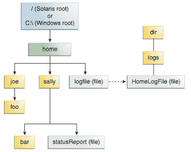

# 什么是路径？（以及其他文件系统事实）

> 原文：[`docs.oracle.com/javase/tutorial/essential/io/path.html`](https://docs.oracle.com/javase/tutorial/essential/io/path.html)

文件系统在某种介质上存储和组织文件，通常是一个或多个硬盘，以便可以轻松检索文件。今天大多数使用的文件系统将文件存储在树（或*分层*）结构中。树的顶部是一个（或多个）根节点。在根节点下面，有文件和目录（在 Microsoft Windows 中称为*文件夹*）。每个目录可以包含文件和子目录，子目录又可以包含文件和子目录，依此类推，可能深入到几乎无限的深度。

本节涵盖以下内容：

+   什么是路径？

+   相对还是绝对？

+   符号链接

## 什么是路径？

以下图显示了包含单个根节点的示例目录树。Microsoft Windows 支持多个根节点。每个根节点映射到一个卷，例如`C:\`或`D:\`。Solaris OS 支持单个根节点，用斜杠字符`/`表示。

示例目录结构

文件通过其在文件系统中的路径来标识，从根节点开始。例如，在前面的图中，Solaris OS 中的`statusReport`文件由以下表示：

```java
/home/sally/statusReport

```

在 Microsoft Windows 中，`statusReport`由以下表示：

```java
C:\home\sally\statusReport

```

用于分隔目录名称的字符（也称为*分隔符*）特定于文件系统：Solaris OS 使用正斜杠（`/`），而 Microsoft Windows 使用反斜杠（`\`）。

## 相对还是绝对？

路径可以是*相对*的或*绝对*的。绝对路径始终包含根元素和完整的目录列表，以定位文件。例如，`/home/sally/statusReport`是一个绝对路径。定位文件所需的所有信息都包含在路径字符串中。

相对路径需要与另一个路径结合才能访问文件。例如，`joe/foo`是一个相对路径。没有更多信息，程序无法可靠地定位文件系统中的`joe/foo`目录。

## 符号链接

文件系统对象通常是目录或文件。每个人都熟悉这些对象。但是一些文件系统也支持符号链接的概念。符号链接也称为*symlink*或*soft link*。

*符号链接*是一个特殊文件，用作指向另一个文件的引用。在大多数情况下，符号链接对应用程序是透明的，对符号链接的操作会自动重定向到链接的目标。（被指向的文件或目录称为链接的*目标*。）例外情况是当符号链接被删除或重命名时，链接本身被删除或重命名，而不是链接的目标。

在下图中，对用户来说，`logFile`看起来像是一个常规文件，但实际上它是指向`dir/logs/HomeLogFile`的符号链接。`HomeLogFile`是链接的目标。

符号链接示例。

对用户来说，符号链接通常是透明的。读取或写入符号链接与读取或写入任何其他文件或目录相同。

*解析链接*这个短语意味着用文件系统中的实际位置替换符号链接。在这个例子中，解析`logFile`会得到`dir/logs/HomeLogFile`。

在现实场景中，大多数文件系统广泛使用符号链接。偶尔，粗心创建的符号链接可能会导致循环引用。循环引用发生在链接的目标指向原始链接的情况下。循环引用可能是间接的：目录`a`指向目录`b`，后者指向目录`c`，后者包含一个子目录指向目录`a`。当程序递归遍历目录结构时，循环引用可能会造成混乱。然而，这种情况已经考虑到，不会导致程序无限循环。

下一页将讨论 Java 编程语言中文件 I/O 支持的核心，即`Path`类。
