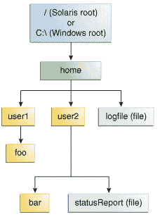

# Path 操作

> 原文：[`docs.oracle.com/javase/tutorial/essential/io/pathOps.html`](https://docs.oracle.com/javase/tutorial/essential/io/pathOps.html)

[`Path`](https://docs.oracle.com/javase/8/docs/api/java/nio/file/Path.html)类包括各种方法，可用于获取有关路径的信息，访问路径的元素，将路径转换为其他形式或提取路径的部分。还有用于匹配路径字符串的方法以及用于删除路径中冗余的方法。本课程介绍了这些`Path`方法，有时称为*语法*操作，因为它们作用于路径本身，而不访问文件系统。

本节涵盖以下内容：

+   创建一个 Path

+   检索有关 Path 的信息

+   从 Path 中删除冗余

+   转换 Path

+   连接两个路径

+   在两个路径之间创建路径

+   比较两个路径

## 创建一个 Path

一个`Path`实例包含用于指定文件或目录位置的信息。在定义时，`Path`会提供一系列一个或多个名称。可能包括根元素或文件名，但都不是必需的。`Path`可能仅包含单个目录或文件名。

您可以通过使用[`Paths`](https://docs.oracle.com/javase/8/docs/api/java/nio/file/Paths.html)（注意复数形式）辅助类中的以下`get`方法之一轻松创建`Path`对象：

```java
Path p1 = Paths.get("/tmp/foo");
Path p2 = Paths.get(args[0]);
Path p3 = Paths.get(URI.create("file:///Users/joe/FileTest.java"));

```

`Paths.get`方法是以下代码的简写：

```java
Path p4 = FileSystems.getDefault().getPath("/users/sally");

```

以下示例假定您的主目录是`/u/joe`，则创建`/u/joe/logs/foo.log`，或者如果您在 Windows 上，则为`C:\joe\logs\foo.log`。

```java
Path p5 = Paths.get(System.getProperty("user.home"),"logs", "foo.log");

```

## 检索有关路径的信息

你可以将`Path`看作将这些名称元素存储为序列。目录结构中最高的元素位于索引 0。目录结构中最低的元素位于索引`[n-1]`，其中`n`是`Path`中名称元素的数量。可用于使用这些索引检索单个元素或`Path`的子序列的方法。

本课程中的示例使用以下目录结构。

示例目录结构

以下代码片段定义了一个`Path`实例，然后调用了几种方法以获取有关路径的信息：

```java
// None of these methods requires that the file corresponding
// to the Path exists.
// Microsoft Windows syntax
Path path = Paths.get("C:\\home\\joe\\foo");

// Solaris syntax
Path path = Paths.get("/home/joe/foo");

System.out.format("toString: %s%n", path.toString());
System.out.format("getFileName: %s%n", path.getFileName());
System.out.format("getName(0): %s%n", path.getName(0));
System.out.format("getNameCount: %d%n", path.getNameCount());
System.out.format("subpath(0,2): %s%n", path.subpath(0,2));
System.out.format("getParent: %s%n", path.getParent());
System.out.format("getRoot: %s%n", path.getRoot());

```

这是 Windows 和 Solaris OS 的输出：

| 调用的方法 | Solaris OS 中的返回 | Microsoft Windows 中的返回 | 注释 |
| --- | --- | --- | --- |
| `toString` | `/home/joe/foo` | `C:\home\joe\foo` | 返回`Path`的字符串表示。如果路径是使用`Filesystems.getDefault().getPath(String)`或`Paths.get`（后者是`getPath`的便利方法）创建的，则该方法会执行轻微的语法清理。例如，在 UNIX 操作系统中，它将修正输入字符串`//home/joe/foo`为`/home/joe/foo`。 |
| `getFileName` | `foo` | `foo` | 返回文件名或名称元素序列的最后一个元素。 |
| `getName(0)` | `home` | `home` | 返回与指定索引对应的路径元素。第 0 个元素是最靠近根的路径元素。 |
| `getNameCount` | `3` | `3` | 返回路径中的元素数量。 |
| `subpath(0,2)` | `home/joe` | `home\joe` | 返回`Path`的子序列（不包括根元素），由开始和结束索引指定。 |
| `getParent` | `/home/joe` | `\home\joe` | 返回父目录的路径。 |
| `getRoot` | `/` | `C:\` | 返回路径的根。 |

前面的示例显示了绝对路径的输出。在以下示例中，指定了相对路径：

```java
// Solaris syntax
Path path = Paths.get("sally/bar");
or
// Microsoft Windows syntax
Path path = Paths.get("sally\\bar");

```

以下是 Windows 和 Solaris OS 的输出：

| 调用的方法 | Solaris OS 中返回 | Microsoft Windows 中返回 |
| --- | --- | --- |
| `toString` | `sally/bar` | `sally\bar` |
| `getFileName` | `bar` | `bar` |
| `getName(0)` | `sally` | `sally` |
| `getNameCount` | `2` | `2` |
| `subpath(0,1)` | `sally` | `sally` |
| `getParent` | `sally` | `sally` |
| `getRoot` | `null` | `null` |

## 从路径中删除冗余

许多文件系统使用“.”符号表示当前目录，“..”表示父目录。您可能会遇到路径包含冗余目录信息的情况。也许服务器配置为将其日志文件保存在“`/dir/logs/.`”目录中，您希望从路径中删除末尾的“/.`”符号。

以下示例都包含冗余：

```java
/home/./joe/foo
/home/sally/../joe/foo

```

`normalize`方法会删除任何冗余元素，包括任何“.`”或“`*directory*/..`”出现。前面两个示例都会规范化为`/home/joe/foo`。

值得注意的是，`normalize`在清理路径时不会检查文件系统。这是一个纯语法操作。在第二个示例中，如果`sally`是一个符号链接，删除`sally/..`可能导致`Path`不再定位到预期的文件。

为了清理路径并确保结果定位到正确的文件，您可以使用`toRealPath`方法。该方法在下一节转换路径中描述。

## 转换路径

您可以使用三种方法来转换`Path`。如果需要将路径转换为可以从浏览器打开的字符串，可以使用[`toUri`](https://docs.oracle.com/javase/8/docs/api/java/nio/file/Path.html#toUri--)。例如：

```java
Path p1 = Paths.get("/home/logfile");
// Result is file:///home/logfile
System.out.format("%s%n", p1.toUri());

```

[`toAbsolutePath`](https://docs.oracle.com/javase/8/docs/api/java/nio/file/Path.html#toAbsolutePath--)方法将路径转换为绝对路径。如果传入的路径已经是绝对路径，则返回相同的`Path`对象。在处理用户输入的文件名时，`toAbsolutePath`方法非常有帮助。例如：

```java
public class FileTest {
    public static void main(String[] args) {

        if (args.length < 1) {
            System.out.println("usage: FileTest file");
            System.exit(-1);
        }

        // Converts the input string to a Path object.
        Path inputPath = Paths.get(args[0]);

        // Converts the input Path
        // to an absolute path.
        // Generally, this means prepending
        // the current working
        // directory.  If this example
        // were called like this:
        //     java FileTest foo
        // the getRoot and getParent methods
        // would return null
        // on the original "inputPath"
        // instance.  Invoking getRoot and
        // getParent on the "fullPath"
        // instance returns expected values.
        Path fullPath = inputPath.toAbsolutePath();
    }
}

```

`toAbsolutePath`方法转换用户输入并返回一个`Path`，在查询时返回有用的值。此方法不需要文件存在即可工作。

[`toRealPath`](https://docs.oracle.com/javase/8/docs/api/java/nio/file/Path.html#toRealPath-java.nio.file.LinkOption...-)方法返回现有文件的*真实*路径。该方法一次执行多个操作：

+   如果向该方法传递`true`，并且文件系统支持符号链接，则该方法会解析路径中的任何符号链接。

+   如果`Path`是相对路径，则返回绝对路径。

+   如果`Path`包含任何多余的元素，则返回一个删除了这些元素的路径。

如果文件不存在或无法访问，则此方法会抛出异常。您可以在需要处理这些情况时捕获异常。例如：

```java
try {
    Path fp = path.toRealPath();
} catch (NoSuchFileException x) {
    System.err.format("%s: no such" + " file or directory%n", path);
    // Logic for case when file doesn't exist.
} catch (IOException x) {
    System.err.format("%s%n", x);
    // Logic for other sort of file error.
}

```

## 连接两个路径

您可以使用`resolve`方法组合路径。您传入一个*部分路径*，即不包括根元素的路径，并将该部分路径附加到原始路径。

例如，考虑以下代码片段：

```java
// Solaris
Path p1 = Paths.get("/home/joe/foo");
// Result is /home/joe/foo/bar
System.out.format("%s%n", p1.resolve("bar"));

or

// Microsoft Windows
Path p1 = Paths.get("C:\\home\\joe\\foo");
// Result is C:\home\joe\foo\bar
System.out.format("%s%n", p1.resolve("bar"));

```

将绝对路径传递给`resolve`方法会返回传入的路径：

```java
// Result is /home/joe
Paths.get("foo").resolve("/home/joe");

```

## 创建两个路径之间的路径

在编写文件 I/O 代码时，通常需要能够构造从文件系统中的一个位置到另一个位置的路径。您可以使用`relativize`方法来实现这一点。该方法构造一个源自原始路径并以传入路径指定的位置结束的路径。新路径是*相对*于原始路径的。

例如，考虑两个定义为`joe`和`sally`的相对路径：

```java
Path p1 = Paths.get("joe");
Path p2 = Paths.get("sally");

```

在没有其他信息的情况下，假定`joe`和`sally`是兄弟姐妹，即在树结构中处于同一级别的节点。要从`joe`导航到`sally`，你需要先向上导航一级到父节点，然后再向下导航到`sally`：

```java
// Result is ../sally
Path p1_to_p2 = p1.relativize(p2);
// Result is ../joe
Path p2_to_p1 = p2.relativize(p1);

```

考虑一个稍微复杂的例子：

```java
Path p1 = Paths.get("home");
Path p3 = Paths.get("home/sally/bar");
// Result is sally/bar
Path p1_to_p3 = p1.relativize(p3);
// Result is ../..
Path p3_to_p1 = p3.relativize(p1);

```

在这个例子中，这两个路径共享相同的节点`home`。要从`home`导航到`bar`，你首先向下导航一级到`sally`，然后再向下导航一级到`bar`。从`bar`到`home`的导航需要向上移动两级。

如果只有一个路径包含根元素，则无法构造相对路径。如果两个路径都包含根元素，则构造相对路径的能力取决于系统。

递归`Copy`示例使用`relativize`和`resolve`方法。

## 比较两个路径

`Path`类支持[`equals`](https://docs.oracle.com/javase/8/docs/api/java/nio/file/Path.html#equals-java.lang.Object-)，使您能够测试两个路径是否相等。[`startsWith`](https://docs.oracle.com/javase/8/docs/api/java/nio/file/Path.html#startsWith-java.nio.file.Path-)和[`endsWith`](https://docs.oracle.com/javase/8/docs/api/java/nio/file/Path.html#endsWith-java.nio.file.Path-)方法使您能够测试路径是否以特定字符串开头或结尾。这些方法易于使用。例如：

```java
Path path = ...;
Path otherPath = ...;
Path beginning = Paths.get("/home");
Path ending = Paths.get("foo");

if (path.equals(otherPath)) {
    // *equality logic here*
} else if (path.startsWith(beginning)) {
    // *path begins with "/home"*
} else if (path.endsWith(ending)) {
    // *path ends with "foo"*
}

```

`Path`类实现了[`Iterable`](https://docs.oracle.com/javase/8/docs/api/java/lang/Iterable.html)接口。[`iterator`](https://docs.oracle.com/javase/8/docs/api/java/nio/file/Path.html#iterator--)方法返回一个对象，使你能够遍历路径中的名称元素。返回的第一个元素是在目录树中最接近根的元素。以下代码片段遍历一个路径，打印每个名称元素：

```java
Path path = ...;
for (Path name: path) {
    System.out.println(name);
}

```

`Path`类还实现了[`Comparable`](https://docs.oracle.com/javase/8/docs/api/java/lang/Comparable.html)接口。你可以使用`compareTo`比较`Path`对象，这对于排序很有用。

你也可以将`Path`对象放入`Collection`中。查看 Collections trail，了解更多关于这一强大功能的信息。

当你想要验证两个`Path`对象是否定位到同一文件时，可以使用`isSameFile`方法，如 Checking Whether Two Paths Locate the Same File 中所述。
