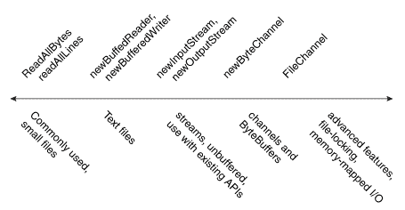

# 读取、写入和创建文件

> 原文：[`docs.oracle.com/javase/tutorial/essential/io/file.html`](https://docs.oracle.com/javase/tutorial/essential/io/file.html)

本页讨论了读取、写入、创建和打开文件的详细信息。有各种文件 I/O 方法可供选择。为了帮助理解 API，以下图表按复杂性排列了文件 I/O 方法。

从简单到复杂排列的文件 I/O 方法

在图表的最左侧是实用方法`readAllBytes`、`readAllLines`和`write`方法，设计用于简单、常见情况。在这些方法的右侧是用于迭代流或文本行的方法，如`newBufferedReader`、`newBufferedWriter`，然后是`newInputStream`和`newOutputStream`。这些方法与`java.io`包兼容。在这些方法的右侧是处理`ByteChannels`、`SeekableByteChannels`和`ByteBuffers`的方法，如`newByteChannel`方法。最后，在最右侧是使用`FileChannel`进行文件锁定或内存映射 I/O 的高级应用的方法。

* * *

**注意：** 创建新文件的方法使您能够为文件指定一组可选的初始属性。例如，在支持 POSIX 标准集（如 UNIX）的文件系统上，您可以在创建文件时指定文件所有者、组所有者或文件权限。管理元数据页面解释了文件属性，以及如何访问和设置它们。

* * *

本页包含以下主题：

+   打开选项

+   小文件常用方法

+   文本文件的缓冲 I/O 方法

+   无缓冲流和与`java.io` API 兼容的方法

+   通道和`ByteBuffers`的方法

+   创建常规和临时文件的方法

* * *

## 打开选项

本节中的几种方法采用可选的`OpenOptions`参数。此参数是可选的，API 会告诉您当未指定时方法的默认行为是什么。

支持以下`StandardOpenOptions`枚举：

+   `WRITE` – 打开文件以进行写访问。

+   `APPEND` – 将新数据追加到文件末尾。此选项与`WRITE`或`CREATE`选项一起使用。

+   `TRUNCATE_EXISTING` – 将文件截断为零字节。此选项与`WRITE`选项一起使用。

+   `CREATE_NEW` – 创建新文件，并在文件已存在时抛出异常。

+   `CREATE` – 如果文件存在则打开文件，如果不存在则创建新文件。

+   `DELETE_ON_CLOSE` – 在流关闭时删除文件。此选项对临时文件很有用。

+   `SPARSE` – 暗示新创建的文件将是稀疏的。这个高级选项在一些文件系统上得到支持，比如 NTFS，在这些文件系统中，具有数据“间隙”的大文件可以以更有效的方式存储，其中这些空白间隙不会占用磁盘空间。

+   `SYNC` – 保持文件（内容和元数据）与底层存储设备同步。

+   `DSYNC` – 保持文件内容与底层存储设备同步。

* * *

## 小文件常用方法

### 从文件中读取所有字节或行

如果您有一个相对较小的文件，并且希望一次读取其全部内容，您可以使用[`readAllBytes(Path)`](https://docs.oracle.com/javase/8/docs/api/java/nio/file/Files.html#readAllBytes-java.nio.file.Path-)或[`readAllLines(Path, Charset)`](https://docs.oracle.com/javase/8/docs/api/java/nio/file/Files.html#readAllLines-java.nio.file.Path-java.nio.charset.Charset-)方法。这些方法会为您处理大部分工作，比如打开和关闭流，但不适用于处理大文件。以下代码展示了如何使用`readAllBytes`方法：

```java
Path file = ...;
byte[] fileArray;
fileArray = Files.readAllBytes(file);

```

### 将所有字节或行写入文件

您可以使用其中一种写入方法将字节或行写入文件。

+   [`write(Path, byte[], OpenOption...)`](https://docs.oracle.com/javase/8/docs/api/java/nio/file/Files.html#write-java.nio.file.Path-byte:A-java.nio.file.OpenOption...-)

+   [`write(Path, Iterable< extends CharSequence>, Charset, OpenOption...)`](https://docs.oracle.com/javase/8/docs/api/java/nio/file/Files.html#write-java.nio.file.Path-java.lang.Iterable-java.nio.charset.Charset-java.nio.file.OpenOption...-)

以下代码片段展示了如何使用`write`方法。

```java
Path file = ...;
byte[] buf = ...;
Files.write(file, buf);

```

* * *

## 用于文本文件的缓冲 I/O 方法

`java.nio.file`包支持通道 I/O，它通过缓冲区传输数据，绕过了一些可能成为流 I/O 瓶颈的层。

### 使用缓冲流 I/O 读取文件

[`newBufferedReader(Path, Charset)`](https://docs.oracle.com/javase/8/docs/api/java/nio/file/Files.html#newBufferedReader-java.nio.file.Path-java.nio.charset.Charset-)方法打开一个文件进行读取，返回一个`BufferedReader`，可用于以高效的方式从文件中读取文本。

以下代码片段展示了如何使用`newBufferedReader`方法从文件中读取内容。该文件以"US-ASCII"编码。

```java
Charset charset = Charset.forName("US-ASCII");
try (BufferedReader reader = Files.newBufferedReader(file, charset)) {
    String line = null;
    while ((line = reader.readLine()) != null) {
        System.out.println(line);
    }
} catch (IOException x) {
    System.err.format("IOException: %s%n", x);
}

```

### 使用缓冲流 I/O 写入文件

您可以使用[`newBufferedWriter(Path, Charset, OpenOption...)`](https://docs.oracle.com/javase/8/docs/api/java/nio/file/Files.html#newBufferedWriter-java.nio.file.Path-java.nio.charset.Charset-java.nio.file.OpenOption...-)方法使用`BufferedWriter`写入文件。

以下代码片段展示了如何使用这种方法创建一个以"US-ASCII"编码的文件：

```java
Charset charset = Charset.forName("US-ASCII");
String s = ...;
try (BufferedWriter writer = Files.newBufferedWriter(file, charset)) {
    writer.write(s, 0, s.length());
} catch (IOException x) {
    System.err.format("IOException: %s%n", x);
}

```

* * *

## 用于非缓冲流和与`java.io`API 互操作的方法

### 使用流 I/O 读取文件

要打开文件进行读取，您可以使用[`newInputStream(Path, OpenOption...)`](https://docs.oracle.com/javase/8/docs/api/java/nio/file/Files.html#newInputStream-java.nio.file.Path-java.nio.file.OpenOption...-)方法。该方法返回一个用于从文件中读取字节的无缓冲输入流。

```java
Path file = ...;
try (InputStream in = Files.newInputStream(file);
    BufferedReader reader =
      new BufferedReader(new InputStreamReader(in))) {
    String line = null;
    while ((line = reader.readLine()) != null) {
        System.out.println(line);
    }
} catch (IOException x) {
    System.err.println(x);
}

```

### 通过流 I/O 创建和写入文件

您可以通过使用[`newOutputStream(Path, OpenOption...)`](https://docs.oracle.com/javase/8/docs/api/java/nio/file/Files.html#newOutputStream-java.nio.file.Path-java.nio.file.OpenOption...-)方法创建文件，追加到文件或向文件写入内容。该方法打开或创建一个文件以写入字节，并返回一个无缓冲的输出流。

该方法接受一个可选的`OpenOption`参数。如果未指定任何打开选项，并且文件不存在，则会创建一个新文件。如果文件存在，则会被截断。此选项等同于使用`CREATE`和`TRUNCATE_EXISTING`选项调用该方法。

以下示例打开一个日志文件。如果文件不存在，则会创建该文件。如果文件存在，则会以追加方式打开。

```java
import static java.nio.file.StandardOpenOption.*;
import java.nio.file.*;
import java.io.*;

public class LogFileTest {

  public static void main(String[] args) {

    // Convert the string to a
    // byte array.
    String s = "Hello World! ";
    byte data[] = s.getBytes();
    Path p = Paths.get("./logfile.txt");

    try (OutputStream out = new BufferedOutputStream(
      Files.newOutputStream(p, CREATE, APPEND))) {
      out.write(data, 0, data.length);
    } catch (IOException x) {
      System.err.println(x);
    }
  }
}

```

* * *

## 通道和`ByteBuffers`的方法

### 通过使用通道 I/O 读取和写入文件

流 I/O 每次读取一个字符，而通道 I/O 每次读取一个缓冲区。[`ByteChannel`](https://docs.oracle.com/javase/8/docs/api/java/nio/channels/ByteChannel.html)接口提供基本的`read`和`write`功能。[`SeekableByteChannel`](https://docs.oracle.com/javase/8/docs/api/java/nio/channels/SeekableByteChannel.html)是一个具有在通道中保持位置并更改该位置能力的`ByteChannel`。`SeekableByteChannel`还支持截断与通道关联的文件并查询文件的大小。

在文件中移动到不同位置然后从该位置读取或写入使得文件的随机访问成为可能。查看随机访问文件获取更多信息。

有两种读取和写入通道 I/O 的方法。

+   [`newByteChannel(Path, OpenOption...)`](https://docs.oracle.com/javase/8/docs/api/java/nio/file/Files.html#newByteChannel-java.nio.file.Path-java.nio.file.OpenOption...-)

+   [`newByteChannel(Path, Set<? extends OpenOption>, FileAttribute<?>...)`](https://docs.oracle.com/javase/8/docs/api/java/nio/file/Files.html#newByteChannel-java.nio.file.Path-java.util.Set-java.nio.file.attribute.FileAttribute...-)

* * *

**注意：** `newByteChannel`方法返回一个`SeekableByteChannel`的实例。对于默认文件系统，您可以将此可寻址字节通道转换为[`FileChannel`](https://docs.oracle.com/javase/8/docs/api/java/nio/channels/FileChannel.html)，从而提供对更高级功能的访问，例如将文件的某个区域直接映射到内存以实现更快的访问，锁定文件的某个区域以防其他进程访问，或者从绝对位置读取和写入字节而不影响通道的当前位置。

* * *

两个`newByteChannel`方法都允许你指定一系列`OpenOption`选项。除了支持`newOutputStream`方法使用的相同打开选项外，还支持一个额外的选项：`READ`是必需的，因为`SeekableByteChannel`支持读取和写入。

指定`READ`打开通道以进行读取。指定`WRITE`或`APPEND`打开通道以进行写入。如果没有指定这些选项中的任何一个，则通道将被打开以进行读取。

下面的代码片段读取一个文件并将其打印到标准输出：

```java
public static void readFile(Path path) throws IOException {

    // Files.newByteChannel() defaults to StandardOpenOption.READ
    try (SeekableByteChannel sbc = Files.newByteChannel(path)) {
        final int BUFFER_CAPACITY = 10;
        ByteBuffer buf = ByteBuffer.allocate(BUFFER_CAPACITY);

        // Read the bytes with the proper encoding for this platform. If
        // you skip this step, you might see foreign or illegible
        // characters.
        String encoding = System.getProperty("file.encoding");
        while (sbc.read(buf) > 0) {
            buf.flip();
            System.out.print(Charset.forName(encoding).decode(buf));
            buf.clear();
        }
    }    
}

```

下面的示例是为 UNIX 和其他 POSIX 文件系统编写的，它创建了一个具有特定文件权限集的日志文件。这段代码将创建一个日志文件，如果该文件已经存在，则追加到日志文件中。该日志文件为所有者提供读写权限，为组提供只读权限。

```java
import static java.nio.file.StandardOpenOption.*;
import java.nio.*;
import java.nio.channels.*;
import java.nio.file.*;
import java.nio.file.attribute.*;
import java.io.*;
import java.util.*;

public class LogFilePermissionsTest {

  public static void main(String[] args) {

    // Create the set of options for appending to the file.
    Set<OpenOption> options = new HashSet<OpenOption>();
    options.add(APPEND);
    options.add(CREATE);

    // Create the custom permissions attribute.
    Set<PosixFilePermission> perms =
      PosixFilePermissions.fromString("rw-r-----");
    FileAttribute<Set<PosixFilePermission>> attr =
      PosixFilePermissions.asFileAttribute(perms);

    // Convert the string to a ByteBuffer.
    String s = "Hello World! ";
    byte data[] = s.getBytes();
    ByteBuffer bb = ByteBuffer.wrap(data);

    Path file = Paths.get("./permissions.log");

    try (SeekableByteChannel sbc =
      Files.newByteChannel(file, options, attr)) {
      sbc.write(bb);
    } catch (IOException x) {
      System.out.println("Exception thrown: " + x);
    }
  }
}

```

* * *

## 创建常规和临时文件的方法

### 创建文件

你可以使用[`createFile(Path, FileAttribute<?>)`](https://docs.oracle.com/javase/8/docs/api/java/nio/file/Files.html#createFile-java.nio.file.Path-java.nio.file.attribute.FileAttribute...-)方法创建一个具有初始属性集的空文件。例如，如果在创建时你想要文件具有特定的文件权限集，可以使用`createFile`方法来实现。如果你没有指定任何属性，文件将使用默认属性创建。如果文件已经存在，`createFile`会抛出异常。

在单个原子操作中，`createFile`方法检查文件是否存在，并使用指定的属性创建该文件，这使得该过程更加安全，防止恶意代码。

下面的代码片段创建一个具有默认属性的文件：

```java
Path file = ...;
try {
    // Create the empty file with default permissions, etc.
    Files.createFile(file);
} catch (FileAlreadyExistsException x) {
    System.err.format("file named %s" +
        " already exists%n", file);
} catch (IOException x) {
    // Some other sort of failure, such as permissions.
    System.err.format("createFile error: %s%n", x);
}

```

POSIX 文件权限有一个示例，使用`createFile(Path, FileAttribute<?>)`创建一个具有预设权限的文件。

你也可以使用`newOutputStream`方法创建一个新文件，如使用流 I/O 创建和写入文件中所述。如果你打开一个新的输出流并立即关闭它，将会创建一个空文件。

### 创建临时文件

你可以使用以下`createTempFile`方法之一创建一个临时文件：

+   [`createTempFile(Path, String, String, FileAttribute<?>)`](https://docs.oracle.com/javase/8/docs/api/java/nio/file/Files.html#createTempFile-java.nio.file.Path-java.lang.String-java.lang.String-java.nio.file.attribute.FileAttribute...-)

+   [`createTempFile(String, String, FileAttribute<?>)`](https://docs.oracle.com/javase/8/docs/api/java/nio/file/Files.html#createTempFile-java.lang.String-java.lang.String-java.nio.file.attribute.FileAttribute...-)

第一种方法允许代码指定一个临时文件的目录，而第二种方法则在默认临时文件目录中创建一个新文件。这两种方法都允许你为文件名指定后缀，而第一种方法还允许你指定前缀。以下代码片段给出了第二种方法的示例：

```java
try {
    Path tempFile = Files.createTempFile(null, ".myapp");
    System.out.format("The temporary file" +
        " has been created: %s%n", tempFile)
;
} catch (IOException x) {
    System.err.format("IOException: %s%n", x);
}

```

运行此文件的结果将类似于以下内容：

```java
The temporary file has been created: /tmp/509668702974537184.myapp

```

临时文件名的具体格式取决于平台。
