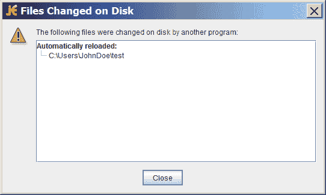

# 监视目录更改

> 原文：[`docs.oracle.com/javase/tutorial/essential/io/notification.html`](https://docs.oracle.com/javase/tutorial/essential/io/notification.html)

你是否曾经发现自己正在编辑一个文件，使用 IDE 或另一个编辑器，并且出现一个对话框通知您文件系统中的一个打开文件已更改并需要重新加载？或者，就像 NetBeans IDE 一样，应用程序悄悄地更新文件而不通知您。以下示例对话框显示了使用免费编辑器[jEdit](http://sourceforge.net/projects/jedit/)时的通知外观：

jEdit 对话框显示检测到修改的文件

要实现此功能，称为*文件更改通知*，程序必须能够检测到文件系统上相关目录发生的变化。一种方法是轮询文件系统以查找更改，但这种方法效率低下。它不适用于具有数百个打开文件或目录需要监视的应用程序。

`java.nio.file`包提供了一个文件更改通知 API，称为 Watch Service API。此 API 使您能够向观察服务注册目录（或目录）。在注册时，您告诉服务您感兴趣的事件类型：文件创建、文件删除或文件修改。当服务检测到感兴趣的事件时，它会转发给注册的进程。注册的进程有一个专用于监视其注册事件的线程（或线程池）。当事件发生时，根据需要进行处理。

本节涵盖以下内容：

+   观察服务概述

+   试一试

+   创建 Watch Service 并注册事件

+   处理事件

+   获取文件名

+   何时使用和不使用此 API

## 观察服务概述

`WatchService` API 相当低级，允许您自定义它。您可以直接使用它，或者您可以选择在此机制之上创建一个高级 API，以使其适合您的特定需求。

下面是实现观察服务所需的基本步骤：

+   为文件系统创建一个`WatchService`“观察者”。

+   对于要监视的每个目录，请将其注册到观察者中。在注册目录时，指定要接收通知的事件类型。您为每个注册的目录收到一个`WatchKey`实例。

+   实现一个无限循环以等待传入事件。当事件发生时，键被标记并放入观察者队列中。

+   从观察者队列中检索键。您可以从键中获取文件名。

+   检索键的每个待处理事件（可能有多个事件）并根据需要处理。

+   重置键，并恢复等待事件。

+   关闭服务：当线程退出或调用其`closed`方法关闭服务时，监视服务将退出。

`WatchKeys`是线程安全的，可以与`java.nio.concurrent`包一起使用。您可以为此目的专门分配一个线程池。

## 试一试

由于此 API 更为高级，请在继续之前先尝试一下。将``WatchDir``示例保存到您的计算机上，并对其进行编译。创建一个将传递给示例的`test`目录。`WatchDir`使用单个线程处理所有事件，因此在等待事件时会阻止键盘输入。要么在单独的窗口中运行程序，要么在后台运行，如下所示：

```java
java WatchDir test &

```

在`test`目录中创建、删除和编辑文件。当发生任何这些事件时，将在控制台上打印消息。完成后，删除`test`目录，`WatchDir`退出。或者，如果您愿意，也可以手动终止进程。

您还可以通过指定`-r`选项来监视整个文件树。当您指定`-r`时，`WatchDir`遍历文件树，将每个目录注册到监视服务中。

## 创建监视服务并注册事件

第一步是通过`FileSystem`类中的`newWatchService`方法创建一个新的[`WatchService`](https://docs.oracle.com/javase/8/docs/api/java/nio/file/WatchService.html)，如下所示：

```java
WatchService watcher = FileSystems.getDefault().newWatchService();

```

接下来，向监视服务注册一个或多个对象。任何实现了[`Watchable`](https://docs.oracle.com/javase/8/docs/api/java/nio/file/Watchable.html)接口的对象都可以注册。`Path`类实现了`Watchable`接口，因此要监视的每个目录都被注册为一个`Path`对象。

与任何`Watchable`一样，`Path`类实现了两个`register`方法。本页使用了两个参数版本的[`register(WatchService, WatchEvent.Kind<?>...)`](https://docs.oracle.com/javase/8/docs/api/java/nio/file/Path.html#register-java.nio.file.WatchService-java.nio.file.WatchEvent.Kind...-)。（三个参数版本接受一个`WatchEvent.Modifier`，目前尚未实现。）

在向监视服务注册对象时，您需要指定要监视的事件类型。支持的[`StandardWatchEventKinds`](https://docs.oracle.com/javase/8/docs/api/java/nio/file/StandardWatchEventKinds.html)事件类型如下：

+   `ENTRY_CREATE` – 创建目录条目。

+   `ENTRY_DELETE` – 删除目录条目。

+   `ENTRY_MODIFY` – 修改目录条目。

+   `OVERFLOW` – 表示事件可能已丢失或被丢弃。您无需注册`OVERFLOW`事件即可接收它。

以下代码片段显示了如何为所有三种事件类型注册`Path`实例：

```java
import static java.nio.file.StandardWatchEventKinds.*;

Path dir = ...;
try {
    WatchKey key = dir.register(watcher,
                           ENTRY_CREATE,
                           ENTRY_DELETE,
                           ENTRY_MODIFY);
} catch (IOException x) {
    System.err.println(x);
}

```

## 处理事件

事件处理循环中事件的顺序如下：

1.  获取一个监视键。提供了三种方法：

    +   [`poll`](https://docs.oracle.com/javase/8/docs/api/java/nio/file/WatchService.html#poll--) – 如果可用，则返回一个排队的键。如果不可用，则立即返回`null`值。

    +   [`poll(long, TimeUnit)`](https://docs.oracle.com/javase/8/docs/api/java/nio/file/WatchService.html#poll-long-java.util.concurrent.TimeUnit-) – 如果有排队的键可用，则返回一个。如果没有立即可用的排队键，则程序将等待指定的时间。`TimeUnit`参数确定指定的时间是纳秒、毫秒还是其他时间单位。

    +   [`take`](https://docs.oracle.com/javase/8/docs/api/java/nio/file/WatchService.html#take--) – 返回一个排队的键。如果没有可用的排队键，此方法将等待。

1.  处理键的待处理事件。您从[`pollEvents`](https://docs.oracle.com/javase/8/docs/api/java/nio/file/WatchKey.html#pollEvents--)方法中获取[`WatchEvents`](https://docs.oracle.com/javase/8/docs/api/java/nio/file/WatchEvent.html)的`List`。

1.  使用[`kind`](https://docs.oracle.com/javase/8/docs/api/java/nio/file/WatchEvent.html#kind--)方法检索事件的类型。无论键注册了什么事件，都有可能收到`OVERFLOW`事件。您可以选择处理溢出或忽略它，但应该对其进行测试。

1.  检索与事件关联的文件名。文件名存储为事件的上下文，因此使用[`context`](https://docs.oracle.com/javase/8/docs/api/java/nio/file/WatchEvent.html#context--)方法来检索它。

1.  处理键的事件后，需要通过调用[`reset`](https://docs.oracle.com/javase/8/docs/api/java/nio/file/WatchEvent.html#reset--)将键放回`ready`状态。如果此方法返回`false`，则键不再有效，循环可以退出。这一步非常**重要**。如果未调用`reset`，则此键将不会接收到进一步的事件。

观察键具有状态。在任何给定时间，其状态可能是以下之一：

+   `Ready`表示键已准备好接受事件。创建时，键处于准备状态。

+   `Signaled`表示有一个或多个事件排队。一旦键被标记，它就不再处于准备状态，直到调用[`reset`](https://docs.oracle.com/javase/8/docs/api/java/nio/file/WatchKey.html#reset--)方法。

+   `Invalid`表示键不再活动。当发生以下事件之一时，会出现此状态：

    +   进程通过使用[`cancel`](https://docs.oracle.com/javase/8/docs/api/java/nio/file/WatchKey.html#cancel--)方法显式取消键。

    +   目录变得无法访问。

    +   观察服务已经被[关闭](https://docs.oracle.com/javase/8/docs/api/java/nio/file/WatchService.html#close--)。

这里是一个事件处理循环的示例。它取自于 ``Email`` 示例，该示例监视一个目录，等待新文件出现。当新文件可用时，通过使用 [`probeContentType(Path)`](https://docs.oracle.com/javase/8/docs/api/java/nio/file/Files.html#probeContentType-java.nio.file.Path-) 方法来检查它是否是一个 `text/plain` 文件。意图是将 `text/plain` 文件发送到一个别名，但具体实现细节留给读者。

Watch service API 特定的方法用粗体显示：

```java
for (;;) {

    // wait for key to be signaled
    WatchKey key;
    try {
        key = watcher.take();
    } catch (InterruptedException x) {
        return;
    }

    for (WatchEvent<?> event: key.pollEvents()) {
        WatchEvent.Kind<?> kind = event.kind();

        // This key is registered only
        // for ENTRY_CREATE events,
        // but an OVERFLOW event can
        // occur regardless if events
        // are lost or discarded.
        if (kind == OVERFLOW) {
            continue;
        }

        // The filename is the
        // context of the event.
        WatchEvent<Path> ev = (WatchEvent<Path>)event;
        Path filename = ev.context();

        // Verify that the new
        //  file is a text file.
        try {
            // Resolve the filename against the directory.
            // If the filename is "test" and the directory is "foo",
            // the resolved name is "test/foo".
            Path child = dir.resolve(filename);
            if (!Files.probeContentType(child).equals("text/plain")) {
                System.err.format("New file '%s'" +
                    " is not a plain text file.%n", filename);
                continue;
            }
        } catch (IOException x) {
            System.err.println(x);
            continue;
        }

        // Email the file to the
        //  specified email alias.
        System.out.format("Emailing file %s%n", filename);
        //Details left to reader....
    }

    // Reset the key -- this step is critical if you want to
    // receive further watch events.  If the key is no longer valid,
    // the directory is inaccessible so exit the loop.
    boolean valid = key.reset();
    if (!valid) {
        break;
    }
}

```

## 检索文件名

文件名是从事件上下文中检索的。``Email`` 示例使用以下代码检索文件名：

```java
WatchEvent<Path> ev = (WatchEvent<Path>)event;
Path filename = ev.context();

```

当你编译 `Email` 示例时，会生成以下错误：

```java
Note: Email.java uses unchecked or unsafe operations.
Note: Recompile with -Xlint:unchecked for details.

```

这个错误是由将 `WatchEvent<T>` 强制转换为 `WatchEvent<Path>` 的代码行引起的。``WatchDir`` 示例通过创建一个抑制未经检查警告的实用 `cast` 方法来避免这个错误，如下所示：

```java
@SuppressWarnings("unchecked")
static <T> WatchEvent<T> cast(WatchEvent<?> event) {
    return (WatchEvent<Path>)event;
}

```

如果你对 `@SuppressWarnings` 语法不熟悉，请参见 Annotations。

## 何时使用和不使用这个 API

Watch Service API 适用于需要通知文件更改事件的应用程序。它非常适合任何可能有许多打开文件并需要确保文件与文件系统同步的应用程序，比如编辑器或 IDE。它也非常适合监视目录的应用服务器，也许等待 `.jsp` 或 `.jar` 文件的出现，以便部署它们。

这个 API *不* 是为了索引硬盘而设计的。大多数文件系统实现都原生支持文件更改通知。Watch Service API 利用了这种支持（如果可用）。然而，当文件系统不支持这种机制时，Watch Service 将轮询文件系统，等待事件发生。
