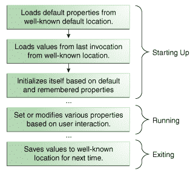

# 属性

> 原文：[`docs.oracle.com/javase/tutorial/essential/environment/properties.html`](https://docs.oracle.com/javase/tutorial/essential/environment/properties.html)

*属性*是作为*键/值对*管理的配置值。在每对中，键和值都是[`String`](https://docs.oracle.com/javase/8/docs/api/java/lang/String.html)值。键标识并用于检索值，就像使用变量名检索变量的值一样。例如，一个能够下载文件的应用程序可能使用名为“download.lastDirectory”的属性来跟踪用于最后下载的目录。

要管理属性，请创建[`java.util.Properties`](https://docs.oracle.com/javase/8/docs/api/java/util/Properties.html)的实例。此类提供以下方法：

+   从流中加载键/值对到`Properties`对象中，

+   通过其键检索值，

+   列出键及其值，

+   枚举键，

+   将属性保存到流中。

有关流的介绍，请参阅输入/输出流中的基本 I/O 课程。

`Properties`扩展了[`java.util.Hashtable`](https://docs.oracle.com/javase/8/docs/api/java/util/Hashtable.html)。从`Hashtable`继承的一些方法支持以下操作：

+   测试特定键或值是否在`Properties`对象中，

+   获取当前键/值对的数量，

+   删除键及其值，

+   向`Properties`列表添加键/值对，

+   枚举值或键，

+   通过键检索值，

+   查看`Properties`对象是否为空。

* * *

**安全注意事项：** 访问属性需经当前安全管理器批准。本节中的示例代码段假定为独立应用程序，这些应用程序默认没有安全管理器。同样的代码在 applet 中可能无法正常工作，具体取决于运行的浏览器。请参阅 Applet 的功能和限制中的 Java Applets 课程，了解 applet 的安全限制信息。

* * *

`System`类维护一个定义当前工作环境配置的`Properties`对象。有关这些属性的更多信息，请参阅系统属性。本节的其余部分将解释如何使用属性来管理应用程序配置。

## 应用程序生命周期中的属性

以下图示说明了典型应用程序如何在执行过程中使用`Properties`对象管理其配置数据。



+   `启动中`

    第一个三个框中给出的操作发生在应用程序启动时。首先，应用程序将默认属性从一个众所周知的位置加载到`Properties`对象中。通常，默认属性存储在磁盘上的文件中，与应用程序的`.class`和其他资源文件一起。

    接下来，应用程序创建另一个`Properties`对象，并加载上次运行应用程序时保存的属性。许多应用程序按用户为单位存储属性，因此此步骤中加载的属性通常位于应用程序在用户主目录中维护的特定目录中的特定文件中。最后，应用程序使用默认和记忆的属性来初始化自身。

    关键在于一致性。应用程序必须始终将属性加载和保存到相同位置，以便下次执行时能够找到它们。

+   `运行中`

    在应用程序执行期间，用户可能会更改一些设置，也许在首选项窗口中，并且`Properties`对象将更新以反映这些更改。如果要记住用户更改以供将来的会话使用，则必须保存这些更改。

+   `退出`

    退出时，应用程序将属性保存到其众所周知的位置，以便在下次启动应用程序时再次加载。

## 设置`Properties`对象

以下 Java 代码执行了前一节描述的前两个步骤：加载默认属性和加载记住的属性：

```java
. . .
// create and load default properties
Properties defaultProps = new Properties();
FileInputStream in = new FileInputStream("defaultProperties");
defaultProps.load(in);
in.close();

// create application properties with default
Properties applicationProps = new Properties(defaultProps);

// now load properties 
// from last invocation
in = new FileInputStream("appProperties");
applicationProps.load(in);
in.close();
. . .

```

首先，应用程序设置一个默认的`Properties`对象。该对象包含一组属性，如果在其他地方没有明确设置值，则使用这些属性。然后，load 方法从名为`defaultProperties`的磁盘上的文件中读取默认值。

接下来，应用程序使用不同的构造函数创建第二个`Properties`对象`applicationProps`，其默认值包含在`defaultProps`中。当检索属性时，默认值起作用。如果在`applicationProps`中找不到属性，则会搜索其默认列表。

最后，代码从名为`appProperties`的文件中将一组属性加载到`applicationProps`中。该文件中的属性是上次调用应用程序时保存的属性，如下一节所述。

## 保存属性

以下示例使用`Properties.store`从前一个示例中写出应用程序属性。默认属性不需要每次保存，因为它们永远不会更改。

```java
FileOutputStream out = new FileOutputStream("appProperties");
applicationProps.store(out, "---No Comment---");
out.close();

```

`store`方法需要一个要写入的流，以及一个字符串，该字符串用作输出顶部的注释。

## 获取属性信息

一旦应用程序设置了其`Properties`对象，应用程序可以查询该对象以获取有关其包含的各种键和值的信息。应用程序在启动后从`Properties`对象获取信息，以便根据用户的选择初始化自身。`Properties`类有几种获取属性信息的方法：

+   `contains(Object value)`和`containsKey(Object key)`

    如果值或键在`Properties`对象中，则返回`true`。`Properties`从`Hashtable`继承这些方法。因此，它们接受`Object`参数，但只应使用`String`值。

+   `getProperty(String key)`和`getProperty(String key, String default)`

    返回指定属性的值。第二个版本提供默认值。如果找不到键，则返回默认值。

+   `list(PrintStream s)`和`list(PrintWriter w)`

    将所有属性写入指定的流或写入器。这对于调试很有用。

+   `elements()`，`keys()`和`propertyNames()`

    返回一个包含`Properties`对象中包含的键或值（如方法名所示）的枚举。`keys`方法仅返回对象本身的键；`propertyNames`方法还返回默认属性的键。

+   `stringPropertyNames()`

    类似于`propertyNames`，但返回一个`Set<String>`，并且仅返回键和值都是字符串的属性名称。请注意，`Set`对象不由`Properties`对象支持，因此对其中一个对象的更改不会影响另一个对象。

+   `size()`

    返回当前键/值对的数量。

## 设置属性

用户在应用程序执行期间与应用程序的交互可能会影响属性设置。这些更改应该反映在`Properties`对象中，以便在应用程序退出时（并调用`store`方法时）保存这些更改。以下方法更改`Properties`对象中的属性：

+   `setProperty(String key, String value)`

    将键/值对放入`Properties`对象中。

+   `remove(Object key)`

    删除与键关联的键/值对。

* * *

**注意：** 上述描述的一些方法在`Hashtable`中定义，因此接受除`String`之外的键和值参数类型。始终使用`String`作为键和值，即使该方法允许其他类型。同时不要在`Properties`对象上调用`Hashtable.set`或`Hastable.setAll`；始终使用`Properties.setProperty`。

* * *
