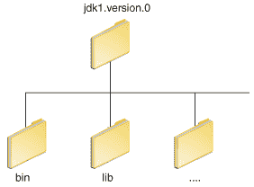

# PATH 和 CLASSPATH

> 原文：[`docs.oracle.com/javase/tutorial/essential/environment/paths.html`](https://docs.oracle.com/javase/tutorial/essential/environment/paths.html)

本节解释了如何在 Microsoft Windows、Solaris 和 Linux 上使用`PATH`和`CLASSPATH`环境变量。请查阅随 Java 开发工具包（JDK）软件包安装包含的安装说明以获取最新信息。

安装软件后，JDK 目录将具有如下结构。



`bin`目录包含编译器和启动器。

## 更新 PATH 环境变量（Microsoft Windows）

没有设置`PATH`环境变量也可以正常运行 Java 应用程序。或者，您可以选择性地设置它以方便使用。

如果要方便地从任何目录运行可执行文件（`javac.exe`、`java.exe`、`javadoc.exe`等），而不必键入命令的完整路径，则设置`PATH`环境变量。如果不设置`PATH`变量，每次运行时都需要指定可执行文件的完整路径，例如：

```java
C:\Java\jdk1.7.0\bin\javac MyClass.java

```

`PATH`环境变量是一系列由分号（`;`）分隔的目录。Microsoft Windows 按照从左到右的顺序在`PATH`目录中查找程序。每次只能在路径中有一个 JDK 的`bin`目录（第一个之后的将被忽略），因此如果已经存在一个，可以更新该特定条目。

以下是一个`PATH`环境变量的示例：

```java
C:\Java\jdk1.7.0\bin;C:\Windows\System32\;C:\Windows\;C:\Windows\System32\Wbem

```

将`PATH`环境变量永久设置是有用的，这样在重新启动后它将保留。要对`PATH`变量进行永久更改，请使用控制面板中的**系统**图标。具体的操作步骤因 Windows 版本而异：

**Windows XP**

1.  选择**开始**，选择**控制面板**。双击**系统**，选择**高级**选项卡。

1.  点击**环境变量**。在**系统变量**部分，找到`PATH`环境变量并选择它。点击**编辑**。如果`PATH`环境变量不存在，点击`新建`。

1.  在**编辑系统变量**（或**新建系统变量**）窗口中，指定`PATH`环境变量的值。点击**确定**。通过点击**确定**关闭所有剩余窗口。

**Windows Vista:**

1.  从桌面上右键单击**我的电脑**图标。

1.  从上下文菜单中选择**属性**。

1.  点击**高级**选项卡（在 Vista 中点击**高级系统设置**链接）。

1.  点击**环境变量**。在**系统变量**部分，找到`PATH`环境变量并选择它。点击**编辑**。如果`PATH`环境变量不存在，点击`新建`。

1.  在**编辑系统变量**（或**新建系统变量**）窗口中，指定`PATH`环境变量的值。点击**确定**。通过点击**确定**关闭所有剩余窗口。

**Windows 7:**

1.  从桌面上右键单击**计算机**图标。

1.  从上下文菜单中选择**属性**。

1.  点击**高级系统设置**链接。

1.  点击**环境变量**。在**系统变量**部分，找到`PATH`环境变量并选择它。点击**编辑**。如果`PATH`环境变量不存在，点击`新建`。

1.  在**编辑系统变量**（或**新建系统变量**）窗口中，指定`PATH`环境变量的值。点击**确定**。通过点击**确定**关闭所有剩余窗口。

* * *

**注意：**在从控制面板编辑`PATH`环境变量时，可能会看到类似以下内容的环境变量：

```java
%JAVA_HOME%\bin;%SystemRoot%\system32;%SystemRoot%;%SystemRoot%\System32\Wbem

```

用百分号（`%`）括起来的变量是现有的环境变量。如果这些变量中的一个在控制面板的**环境变量**窗口中列出（如`JAVA_HOME`），则可以编辑其值。如果未显示，则是操作系统定义的特殊环境变量。例如，`SystemRoot`是 Microsoft Windows 系统文件夹的位置。要获取环境变量的值，请在命令提示符下输入以下内容。（此示例获取`SystemRoot`环境变量的值）：

```java
echo %SystemRoot%

```

* * *

## 更新 PATH 变量（Solaris 和 Linux）

您可以很好地运行 JDK 而不设置`PATH`变量，或者可以选择设置它作为便利。但是，如果要能够从任何目录运行可执行文件（`javac`、`java`、`javadoc`等），而不必键入命令的完整路径，则应该设置路径变量。如果不设置`PATH`变量，每次运行时都需要指定可执行文件的完整路径，例如：

```java
% /usr/local/jdk1.7.0/bin/javac MyClass.java

```

要查看路径是否正确设置，请执行：

```java
% java -version

```

如果可以找到，这将打印`java`工具的版本。如果版本过旧或者出现错误**java: Command not found**，则路径未正确设置。

要永久设置路径，请在启动文件中设置路径。

对于 C shell（`csh`），编辑启动文件（`~/.cshrc`）：

```java
set path=(/usr/local/jdk1.7.0/bin $path)

```

对于`bash`，编辑启动文件（`~/.bashrc`）：

```java
PATH=/usr/local/jdk1.7.0/bin:$PATH
export PATH

```

对于`ksh`，启动文件由环境变量`ENV`命名。要设置路径：

```java
PATH=/usr/local/jdk1.7.0/bin:$PATH
export PATH

```

对于`sh`，编辑配置文件（`~/.profile`）：

```java
PATH=/usr/local/jdk1.7.0/bin:$PATH
export PATH

```

然后加载启动文件，并通过重复`java`命令验证路径是否设置：

对于 C shell（`csh`）：

```java
% source ~/.cshrc
% java -version

```

对于`ksh`、`bash`或`sh`：

```java
% . /.profile
% java -version

```

## 检查 CLASSPATH 变量（所有平台）

`CLASSPATH`变量是告诉应用程序，包括 JDK 工具，在哪里查找用户类的一种方式。（作为 JRE、JDK 平台和扩展的一部分的类应该通过其他方式定义，比如引导类路径或扩展目录。）

指定类路径的首选方式是使用`-cp`命令行开关。这允许为每个应用程序单独设置`CLASSPATH`，而不影响其他应用程序。*设置`CLASSPATH`可能有些棘手，应谨慎执行。*

类路径的默认值为“.”，意味着只搜索当前目录。指定`CLASSPATH`变量或`-cp`命令行开关会覆盖此值。

要检查在 Microsoft Windows NT/2000/XP 上是否设置了`CLASSPATH`，执行以下操作：

```java
C:> echo %CLASSPATH%

```

在 Solaris 或 Linux 上，执行以下操作：

```java
% echo $CLASSPATH

```

如果未设置`CLASSPATH`，将会出现**CLASSPATH: Undefined variable**错误（Solaris 或 Linux）或者简单显示**%CLASSPATH%**（Microsoft Windows NT/2000/XP）。

要修改`CLASSPATH`，使用与修改`PATH`变量相同的过程。

类路径通配符允许您在类路径中包含整个目录的`.jar`文件，而无需逐个命名它们。有关更多信息，包括类路径通配符的解释以及如何清理`CLASSPATH`环境变量的详细说明，请参阅[设置类路径](https://docs.oracle.com/javase/8/docs/technotes/tools/windows/classpath.html)技术说明。
