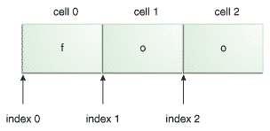

# 字符串字面值

> 原文：[`docs.oracle.com/javase/tutorial/essential/regex/literals.html`](https://docs.oracle.com/javase/tutorial/essential/regex/literals.html)

此 API 支持的最基本的模式匹配形式是字符串字面值的匹配。例如，如果正则表达式是`foo`，输入字符串是`foo`，则匹配将成功，因为字符串是相同的。使用测试工具尝试一下：

```java

Enter your regex: foo
Enter input string to search: foo
I found the text foo starting at index 0 and ending at index 3.

```

这次匹配成功了。请注意，虽然输入字符串长度为 3 个字符，但开始索引为 0，结束索引为 3。按照惯例，范围包括开始索引但不包括结束索引，如下图所示：



字符串字面值 foo，带有编号的单元格和索引值。

字符串中的每个字符都位于自己的*单元格*中，索引位置指向每个单元格之间。字符串“foo”从索引 0 开始，到索引 3 结束，即使字符本身只占据单元格 0、1 和 2。

在后续匹配中，您会注意到一些重叠；下一个匹配的开始索引与上一个匹配的结束索引相同：

```java

Enter your regex: foo
Enter input string to search: foofoofoo
I found the text foo starting at index 0 and ending at index 3.
I found the text foo starting at index 3 and ending at index 6.
I found the text foo starting at index 6 and ending at index 9.

```

## 元字符

此 API 还支持许多特殊字符，这些字符会影响模式匹配的方式。将正则表达式更改为`cat.`，将输入字符串更改为`cats`。输出将如下所示：

```java
Enter your regex: cat.
Enter input string to search: cats
I found the text cats starting at index 0 and ending at index 4.

```

即使输入字符串中没有点“`.`”，匹配仍然成功。这是因为点是一个*元字符* — 由匹配器解释的具有特殊含义的字符。元字符`.`表示“任何字符”，这就是为什么在这个例子中匹配成功。

此 API 支持的元字符为：`<([{\^-=$!|]})?*+.>`

* * *

**注意：** 在某些情况下，上面列出的特殊字符 *不* 会被视为元字符。随着您对正则表达式构造方式的了解越来越多，您会遇到这种情况。但是，您可以使用此列表来检查特定字符是否会被视为元字符。例如，字符`@`和`#`从不具有特殊含义。

* * *

有两种方法可以强制将元字符视为普通字符：

+   在元字符之前加上反斜杠，或

+   将其放在`\Q`（开始引用）和`\E`（结束引用）之间。

在使用这种技术时，`\Q`和`\E`可以放置在表达式的任何位置，只要`\Q`先出现。
