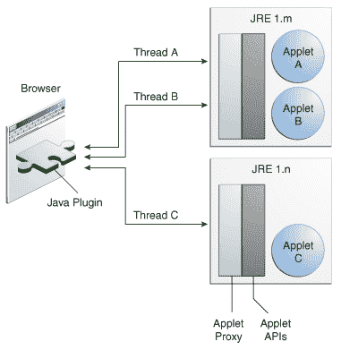

# Applet 的执行环境

> 原文：[`docs.oracle.com/javase/tutorial/deployment/applet/appletExecutionEnv.html`](https://docs.oracle.com/javase/tutorial/deployment/applet/appletExecutionEnv.html)

Java applet 在浏览器的上下文中运行。浏览器中的 Java 插件软件控制 Java applet 的启动和执行。浏览器还有一个 JavaScript 解释器，用于运行网页上的 JavaScript 代码。本主题描述了 Java 平台标准版 6 更新 10 中发布的 Java 插件软件的行为。

## Java 插件

Java 插件软件为每个 Java applet 创建一个工作线程。它在 Java Runtime Environment (JRE)软件的一个实例中启动 applet。通常，所有 applet 在同一个 JRE 实例中运行。Java 插件软件在以下情况下启动新的 JRE 实例：

+   当 applet 请求在特定版本的 JRE 中执行时。

+   当 applet 指定自己的 JRE 启动参数时，例如堆大小。如果新 applet 的要求是现有 JRE 的子集，则新 applet 使用现有 JRE，否则启动新的 JRE 实例。

如果满足以下条件，applet 将在现有 JRE 中运行：

+   applet 所需的 JRE 版本与现有的 JRE 匹配。

+   JRE 的启动参数满足 applet 的要求。

以下图表显示了 applet 在 JRE 中的执行方式。

## Java 插件和 JavaScript 解释器的交互

Java applet 可以调用网页中存在的 JavaScript 函数。JavaScript 函数也允许调用同一网页上嵌入的 applet 的方法。Java 插件软件和 JavaScript 解释器协调 Java 代码到 JavaScript 代码的调用以及 JavaScript 代码到 Java 代码的调用。

Java 插件软件是多线程的，而 JavaScript 解释器在单个线程上运行。因此，为了避免线程相关问题，特别是当多个 applet 同时运行时，请保持 Java 代码和 JavaScript 代码之间的调用简短，并尽量避免往返。查看以下主题以了解 Java 代码和 JavaScript 代码之间的交互更多信息：

+   从 Applet 调用 JavaScript 代码

+   从 JavaScript 代码调用 Applet 方法
