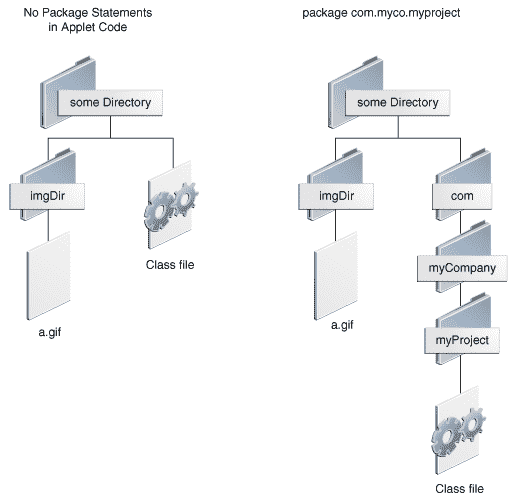

# 查找和加载数据文件

> 原文：[`docs.oracle.com/javase/tutorial/deployment/applet/data.html`](https://docs.oracle.com/javase/tutorial/deployment/applet/data.html)

每当 Java applet 需要从指定了相对 URL 的文件加载数据（指定了文件位置但不完全指定的 URL），applet 通常使用代码库或文档库来形成完整的 URL。

由 `JApplet` 的 `getCodeBase` 方法返回的代码库是一个 URL，指定了 applet 的类加载的目录。对于本地部署的 applet，`getCodeBase` 方法返回 null。

由 `JApplet` 的 `getDocumentBase` 方法返回的文档库指定包含 applet 的 HTML 页面的目录。对于本地部署的 applet，`getDocumentBase` 方法返回 null。

除非 `<applet>` 标签指定了代码库，否则代码库和文档库都指向同一服务器上的同一目录。

applet 可能需要的数据，或者需要依赖的备份数据，通常相对于代码库指定。通常由 applet 开发人员指定的数据，通常通过使用参数指定，通常相对于文档库指定。

* * *

**注意：**出于安全原因，浏览器限制了不受信任的 applet 可以读取的 URL。例如，大多数浏览器不允许不受信任的 applet 使用 ".." 访问代码库或文档库上面的目录。此外，由于不受信任的 applet 不能读取除了位于 applet 源主机上的文件之外的文件，因此如果文档和不受信任的 applet 位于不同的服务器上，则文档库通常是无用的。

* * *

`JApplet` 类定义了方便的图像加载和声音加载方法，使您能够相对于基本 URL 指定图像和声音。例如，假设 applet 设置为以下图中显示的其中一个目录结构。



要创建一个使用 `imgDir` 下的 `a.gif` 图像文件的 `Image` 对象，applet 可以使用以下代码：

```java
Image image = getImage(getCodeBase(), "imgDir/a.gif");

```
