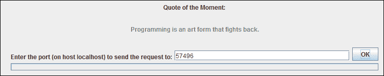

# 网络客户端小程序示例

> 原文：[`docs.oracle.com/javase/tutorial/deployment/applet/clientExample.html`](https://docs.oracle.com/javase/tutorial/deployment/applet/clientExample.html)

`QuoteClientApplet`类允许您从与此小程序运行在同一主机上的服务器端应用程序中获取引语。该类还显示从服务器收到的引语。

`QuoteServer.java`和`QuoteServerThread.java`类构成返回引语的服务器端应用程序。这里有一个文本文件(`one-liners.txt`)，其中包含许多引语。

执行以下步骤来测试`QuoteClientApplet`。

1.  下载并保存以下文件到您的本地计算机。

    +   `QuoteClientApplet`

    +   `QuoteServer.java`

    +   `QuoteServerThread.java`

    +   `one-liners.txt`

    +   `quoteApplet.html`

1.  在网页中包含以下 HTML 代码以部署`QuoteClientApplet`。

    ```java
    <script src=
      "https://www.java.com/js/deployJava.js"></script>
    <script> 
        var attributes =
          { code:'QuoteClientApplet.class',  width:500, height:100} ; 
        var parameters =
          { codebase_lookup:'true', permissions:'sandbox' };
        deployJava.runApplet(attributes, parameters, '1.6'); 
    </script>

    ```

    或者，您可以使用已包含此 HTML 代码的`quoteApplet.html`页面。

1.  编译`QuoteClientApplet.java`类。将生成的类文件复制到保存网页的相同目录中。

1.  编译服务器端应用程序的类，`QuoteServer.java`和`QuoteServerThread.java`。

1.  将文件`one-liners.txt`复制到具有服务器端应用程序类文件（在上一步生成）的目录中。

1.  启动服务器端应用程序。

    ```java
    java QuoteServer

    ```

    您应该看到一个带有端口号的消息，如下例所示。请注意端口号。

    ```java
    QuoteServer listening on port:3862

    ```

1.  在浏览器中打开包含小程序的网页，输入网页的 URL。URL 中的主机名应与运行服务器端应用程序的主机名相同。

    例如，如果服务器端应用程序在名为`JohnDoeMachine`的计算机上运行，则应输入类似的 URL。确切的端口号和路径将根据您的 Web 服务器设置而变化。

    ```java
    http://JohnDoeMachine:8080/quoteApplet/quoteApplet.html

    ```

    `QuoteClientApplet`将显示在网页上。

1.  在小程序的文本字段中输入服务器端应用程序的端口号，然后单击“确定”。将显示一个引语。

这是小程序运行时的屏幕截图。

**`QuoteServer`示例输出**
