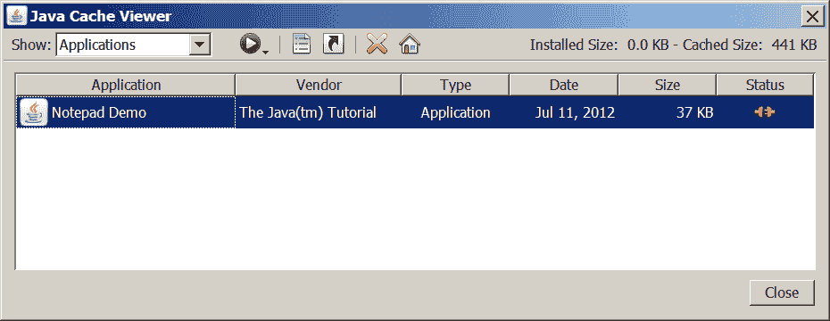

# 运行 Java Web Start 应用程序

> 原文：[`docs.oracle.com/javase/tutorial/deployment/webstart/running.html`](https://docs.oracle.com/javase/tutorial/deployment/webstart/running.html)

用户可以通过以下方式运行 Java Web Start 应用程序：

+   从浏览器中运行 Java Web Start 应用程序

+   从 Java 缓存查看器中运行 Java Web Start 应用程序

+   从桌面中运行 Java Web Start 应用程序

* * *

**注意：** 要运行使用 Java Web Start 技术部署的应用程序，您必须具有兼容版本的 Java 运行时环境（JRE）软件。不需要完整的 Java 开发工具包（JDK）。

* * *

## 从浏览器中运行 Java Web Start 应用程序

您可以通过点击应用程序的 JNLP 文件的链接来从浏览器中运行 Java Web Start 应用程序。以下文本是指向 JNLP 文件的链接的示例。

```java
<a href="/some/path/Notepad.jnlp">Launch Notepad Application</a>

```

Java Web Start 软件根据 JNLP 文件中的指令加载和运行应用程序。

立即尝试：[运行记事本](https://docs.oracle.com/javase/tutorialJWS/samples/deployment/NotepadJWSProject/Notepad.jnlp)

## 从 Java 缓存查看器中运行 Java Web Start 应用程序

如果您至少使用的是 Java 平台标准版 6 或更高版本，则可以通过 Java 缓存查看器运行 Java Web Start 应用程序。

当 Java Web Start 软件首次加载应用程序时，应用程序的 JNLP 文件中的信息将存储在本地 Java 缓存查看器中。要再次启动应用程序，您无需返回首次启动它的网页；您可以从 Java 缓存查看器中启动它。

要打开 Java 缓存查看器：

1.  打开控制面板。

1.  双击 Java 图标。Java 控制面板将打开。

1.  选择“常规”选项卡。

1.  点击“查看”。Java 缓存查看器将打开。

应用程序将列在 Java 缓存查看器屏幕上。

**Java 缓存查看器应用程序**

要运行应用程序，请选择它并单击“运行”按钮，，或双击应用程序。应用程序将像从网页中启动一样启动。

## 从桌面中运行 Java Web Start 应用程序

您可以为 Java Web Start 应用程序添加桌面快捷方式。在 Java 缓存查看器中选择应用程序。右键单击并选择“安装快捷方式”或单击“安装”按钮，。

桌面上添加了一个快捷方式。


然后，您可以像启动任何本地应用程序一样启动 Java Web Start 应用程序。
