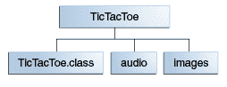

# 创建 JAR 文件

> 原文：[`docs.oracle.com/javase/tutorial/deployment/jar/build.html`](https://docs.oracle.com/javase/tutorial/deployment/jar/build.html)

创建 JAR 文件的基本命令格式为：

```java
jar cf *jar-file input-file(s)*

```

此命令中使用的选项和参数为：

+   `c`选项表示您要*创建*一个 JAR 文件。

+   `f`选项表示您希望输出到一个*文件*而不是到`stdout`。

+   `jar-file`是您希望生成的 JAR 文件的名称。您可以为 JAR 文件使用任何文件名。按照惯例，JAR 文件名应该使用`.jar`扩展名，尽管这不是必需的。

+   `input-file(s)`参数是一个以空格分隔的一个或多个要包含在 JAR 文件中的文件列表。`input-file(s)`参数可以包含通配符`*`符号。如果任何"input-files"是目录，则这些目录的内容将递归添加到 JAR 存档中。

`c`和`f`选项可以以任意顺序出现，但它们之间不能有任何空格。

此命令将生成一个压缩的 JAR 文件并将其放置在当前目录中。该命令还将为 JAR 存档生成一个默认清单文件。

* * *

**注意：**

JAR 文件中的元数据，如条目名称、注释和清单内容，必须以 UTF8 编码。

* * *

您可以将任何这些附加选项添加到基本命令的`cf`选项中：

**jar 命令选项**

| 选项 | 描述 |
| --- | --- |
| `v` | 在构建 JAR 文件时在`stdout`上产生*详细*输出。详细输出会告诉您每个文件被添加到 JAR 文件时的名称。 |
| `0` (zero) | 表示您不希望压缩 JAR 文件。 |
| `M` | 表示不应生成默认清单文件。 |

| `m` | 用于从现有清单文件中包含清单信息。使用此选项的格式为：

```java
jar cmf *jar-file* *existing-manifest* *input-file(s)*

```

有关此选项的更多信息，请参阅修改清单文件。

* * *

**警告：** 清单必须以新行或回车符结束。如果最后一行没有以新行或回车符结束，则最后一行将无法正确解析。

* * *

|

| `-C` | 在执行命令期间更改目录。请参见下面的示例。 |
| --- | --- |

* * *

**注意：**

当您创建一个 JAR 文件时，创建时间将被存储在 JAR 文件中。因此，即使 JAR 文件的内容没有更改，当您多次创建 JAR 文件时，生成的文件也不完全相同。在构建环境中使用 JAR 文件时，您应该注意这一点。建议您在清单文件中使用版本信息来控制 JAR 文件的版本，而不是使用创建时间。请参阅设置包版本信息部分。

* * *

## 一个示例

让我们看一个例子。一个简单的 `TicTacToe` 小程序。你可以通过从[Java SE Downloads](http://www.oracle.com/technetwork/java/javase/downloads/index.html)下载 JDK Demos and Samples 包来查看这个小程序的源代码。这个演示包含有这种结构的类文件、音频文件和图像文件：

**TicTacToe 文件夹层次结构**

`audio` 和 `images` 子目录包含小程序使用的声音文件和 GIF 图像。

当你在线下载整个教程时，你可以从 *jar/examples* 目录获取所有这些文件。要将这个演示打包成一个名为 `TicTacToe.jar` 的单个 JAR 文件，你可以在 `TicTacToe` 目录内运行以下命令：

```java
jar cvf TicTacToe.jar TicTacToe.class audio images

```

`audio` 和 `images` 参数表示目录，因此 Jar 工具将递归地将它们及其内容放入 JAR 文件中。生成的 JAR 文件 `TicTacToe.jar` 将放置在当前目录中。因为命令使用了 `v` 选项进行详细输出，当你运行命令时，你会看到类似于以下输出：

```java
adding: TicTacToe.class (in=3825) (out=2222) (deflated 41%)
adding: audio/ (in=0) (out=0) (stored 0%)
adding: audio/beep.au (in=4032) (out=3572) (deflated 11%)
adding: audio/ding.au (in=2566) (out=2055) (deflated 19%)
adding: audio/return.au (in=6558) (out=4401) (deflated 32%)
adding: audio/yahoo1.au (in=7834) (out=6985) (deflated 10%)
adding: audio/yahoo2.au (in=7463) (out=4607) (deflated 38%)
adding: images/ (in=0) (out=0) (stored 0%)
adding: images/cross.gif (in=157) (out=160) (deflated -1%)
adding: images/not.gif (in=158) (out=161) (deflated -1%)

```

从这个输出中可以看出，JAR 文件 `TicTacToe.jar` 已经被压缩。Jar 工具默认会压缩文件。你可以通过使用 `0`（零）选项关闭压缩功能，使得命令看起来像这样：

```java
jar cvf0 TicTacToe.jar TicTacToe.class audio images

```

你可能希望避免压缩，例如，为了增加浏览器加载 JAR 文件的速度。未压缩的 JAR 文件通常比压缩文件加载更快，因为加载过程中无需解压文件。然而，存在一个权衡，即较大的未压缩文件可能在网络下载时需要更长的时间。

Jar 工具将接受使用通配符 `*` 符号的参数。只要在 `TicTacToe` 目录中没有不需要的文件，你可以使用以下替代命令来构建 JAR 文件：

```java
jar cvf TicTacToe.jar *

```

尽管详细输出没有显示，Jar 工具会自动向 JAR 存档中添加一个路径名为 `META-INF/MANIFEST.MF` 的清单文件。有关清单文件的信息，请参阅使用清单文件：基础知识部分。

在上面的例子中，存档中的文件保留了它们的相对路径名和目录结构。Jar 工具提供了 `-C` 选项，你可以使用它来创建一个 JAR 文件，其中存档文件的相对路径不会被保留。它是模仿 TAR 的 `-C` 选项。

举个例子，假设你想将 TicTacToe 演示中使用的音频文件和 gif 图像放入一个 JAR 文件中，并且你希望所有文件都位于顶层，没有目录结构。你可以通过在 `images` 和 `audio` 目录的父目录中执行以下命令来实现：

```java
jar cf ImageAudio.jar -C images . -C audio .

```

这个命令中的`-C images`部分指示 Jar 工具进入`images`目录，而跟在`-C images`后面的`.`则指示 Jar 工具归档该目录的所有内容。命令中的`-C audio .`部分则对`audio`目录执行相同操作。生成的 JAR 文件将具有以下目录结构：

```java
META-INF/MANIFEST.MF
cross.gif
not.gif
beep.au
ding.au
return.au
yahoo1.au
yahoo2.au

```

相比之下，假设您使用了一个不使用`-C`选项的命令：

```java
jar cf ImageAudio.jar images audio

```

生成的 JAR 文件将具有以下目录结构：

```java
META-INF/MANIFEST.MF
images/cross.gif
images/not.gif
audio/beep.au
audio/ding.au
audio/return.au
audio/yahoo1.au
audio/yahoo2.au

```
