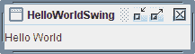

# 编译和运行 Swing 程序

> 原文：[`docs.oracle.com/javase/tutorial/uiswing/start/compile.html`](https://docs.oracle.com/javase/tutorial/uiswing/start/compile.html)

本节介绍如何从命令行编译和运行一个 Swing 应用程序。有关使用 NetBeans IDE 编译和运行 Swing 应用程序的信息，请参阅在 NetBeans IDE 中运行教程示例。编译说明适用于所有 Swing 程序 — 包括小程序和应用程序。以下是你需要遵循的步骤：

+   如果你还没有安装最新版本的 Java SE 平台，那么现在就安装吧。

+   创建一个使用 Swing 组件的程序。

+   编译程序。

+   运行程序。

## 安装最新版本的 Java SE 平台

你可以免费从[`www.oracle.com/technetwork/java/javase/downloads/index.html`](http://www.oracle.com/technetwork/java/javase/downloads/index.html)下载 JDK 的最新版本。

## 创建一个使用 Swing 组件的程序

你可以使用我们提供的一个简单程序，名为 HelloWorldSwing，它会显示如下图所示的 GUI。该程序在一个单独的文件中，`HelloWorldSwing.java`。当你保存这个文件时，你必须确保其名称的拼写和大小写完全匹配。

`HelloWorldSwing.java`示例，就像我们所有的 Swing 教程示例一样，都是在一个包内创建的。如果你查看源代码，你会在文件开头看到以下行：

```java
package start;

```

这意味着你必须将`HelloWorldSwing.java`文件放在`start`目录内。你需要从`start`目录的上一级目录编译和运行示例。*使用 Swing 组件*课程中的教程示例位于`components`包内，*编写事件监听器*课程中的示例位于`events`包内，依此类推。更多信息，你可能想看看`Packages`课程。



## 编译程序

你的下一步是编译程序。要编译示例，从`HelloWorldSwing.java`文件的上一级目录开始：

```java
javac start/HelloWorldSwing.java

```

如果你愿意，你可以在`start`目录中编译示例：

```java
javac HelloWorldSwing.java

```

但是你必须记住离开`start`目录才能执行程序。

如果你无法编译，请确保你正在使用 Java 平台的最新版本中的编译器。你可以使用以下命令验证你的编译器或 Java 运行环境（JRE）的版本。

```java
javac -version
java -version

```

更新了 JDK 后，你应该可以在不进行任何更改的情况下使用本教程中的程序。另一个常见错误是安装了 JRE 而不是编译这些程序所需的完整 Java 开发工具包（JDK）。请参考入门指南来帮助你解决遇到的任何编译问题。另一个资源是[Java™ SE 6 桌面技术故障排除指南](http://www.oracle.com/technetwork/java/javase/index-142560.html)。

## 运行程序

编译程序成功后，你可以运行它。从`start`目录的上一级目录开始：

```java
java start.HelloWorldSwing

```
