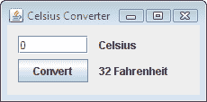

# 课程：使用 NetBeans IDE 学习 Swing

> 原文：[`docs.oracle.com/javase/tutorial/uiswing/learn/index.html`](https://docs.oracle.com/javase/tutorial/uiswing/learn/index.html)

示例索引

本课程介绍了使用 Swing 和 NetBeans IDE 进行图形用户界面（GUI）编程。正如您在"Hello World!"课程中学到的，NetBeans IDE 是一个免费的、开源的、跨平台的集成开发环境，内置支持 Java 编程语言。与使用文本编辑器编码相比，它提供了许多优势；我们建议尽可能使用它。如果您还没有阅读上述课程，请立即花点时间阅读。它提供了有关下载和安装 JDK 和 NetBeans IDE 的宝贵信息。

本课程的目标是通过设计一个简单的应用程序，将温度从摄氏度转换为华氏度来介绍 Swing API。其 GUI 将是基本的，只关注可用的 Swing 组件的子集。我们将使用 NetBeans IDE GUI 构建器，它使用户界面的创建变得简单易行，只需拖放即可。其自动生成代码功能简化了 GUI 开发过程，让您可以专注于应用程序逻辑，而不是底层基础设施。

因为这节课是一个逐步检查特定操作的清单，我们建议您运行 NetBeans IDE，并在阅读过程中执行每个步骤。这将是开始使用 Swing 进行编程的最快最简单的方法。如果您无法这样做，仅仅阅读也应该是有用的，因为每个步骤都有截图说明。

如果您更喜欢传统的手动编程每个组件的方法（不使用 IDE 的帮助），请将这节课视为进入已经在教程其他地方提供的低级讨论的入口点。每个讨论中的超链接将带您前往相关课程，如果您希望学习这些低级细节。

该应用程序的完成 GUI 将如下所示：

CelsiusConverter 应用程序。

单击“启动”按钮以使用[Java™ Web Start](http://www.oracle.com/technetwork/java/javase/javawebstart/index.html)运行 CelsiusConverter（[下载 JDK 7 或更高版本](http://www.oracle.com/technetwork/java/javase/downloads/index.html)）。或者，要自行编译和运行示例，请参考示例索引。

从最终用户的角度来看，使用方法很简单：在文本框中输入温度（摄氏度），点击“转换”按钮，然后观看转换后的温度（华氏度）显示在屏幕上。最小化、最大化和关闭按钮将按预期运行，并且应用程序还将在窗口顶部显示一个标题。

从程序员的角度来看，我们将应用程序分为两个主要阶段。首先，我们将用各种 Swing 组件填充 GUI 并按照上面显示的方式排列它们。然后，我们将添加应用程序逻辑，以便当用户按下“转换”按钮时，程序实际执行转换操作。

如果你有兴趣使用 JavaFX 来创建你的 GUI，请查看[JavaFX 文档](https://docs.oracle.com/javase/8/javase-clienttechnologies.htm)和[JavaFX - NetBeans Wiki](http://wiki.netbeans.org/JavaFX)。
