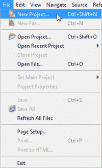

# 设置 CelsiusConverter 项目

> 原文：[`docs.oracle.com/javase/tutorial/uiswing/learn/settingup.html`](https://docs.oracle.com/javase/tutorial/uiswing/learn/settingup.html)

如果您以前使用过 NetBeans IDE，那么本节的大部分内容看起来会很熟悉，因为最初的步骤对大多数项目都是相似的。不过，接下来的步骤描述了特定于此应用程序的设置，因此请务必仔细遵循。

## 步骤 1：创建一个新项目

要创建一个新项目，请启动 NetBeans IDE 并从“文件”菜单中选择“新项目”： 

创建一个新项目

每个命令的键盘快捷键显示在每个菜单项的最右侧。NetBeans IDE 的外观和感觉可能在不同平台上有所不同，但功能将保持不变。

## 步骤 2：选择 General -> Java Application

接下来，从类别列中选择“General”，从项目列中选择“Java Application”：

*此图已经缩小以适应页面。

点击图像以查看其自然大小。*

您可能会在描述窗格中看到“J2SE”的提及；那是现在被称为“Java SE”平台的旧名称。按下标有“下一步”的按钮继续。

## 步骤 3：设置项目名称

现在将“CelsiusConverterProject”输入为项目名称。您可以将项目位置和项目文件夹字段保留为默认值，或者单击“浏览”按钮选择系统上的其他位置。

*此图已经缩小以适应页面。

点击图像以查看其自然大小。*

确保取消选中“创建主类”复选框；保留此选项会生成一个新类作为应用程序的主入口点，但我们的主 GUI 窗口（在下一步中创建）将担任此职责，因此不需要选中此框。完成后点击“完成”按钮。

*此图已经缩小以适应页面。

点击图像以查看其自然大小。*

当 IDE 完成加载时，您将看到类似上述的屏幕。所有窗格都将为空，除了左上角的项目窗格，显示了新创建的项目。

## 步骤 4：添加一个 JFrame 表单

*此图已经缩小以适应页面。

点击图像以查看其自然大小。*

现在右键点击`CelsiusConverterProject`名称，选择 New -> JFrame Form（`JFrame`是负责应用程序主窗体的 Swing 类）。你将在本课程后面学习如何将这个类指定为应用程序的入口点。

## 步骤 5：命名 GUI 类

接下来，将`CelsiusConverterGUI`作为类名，`learn`作为包名。实际上，你可以将这个包命名为任何你想要的名称，但在这里我们遵循教程的惯例，将包命名为所在课程的名称。

*此图已经缩小以适应页面。

点击图片查看其原始大小。*

其余字段应自动填写，如上所示。完成后点击 Finish 按钮。

*此图已经缩小以适应页面。

点击图片查看其原始大小。*

当 IDE 加载完成时，右侧窗格将显示`CelsiusConverterGUI`的设计时、图形化视图。在这个屏幕上，你将可以直观地拖放和操作各种 Swing 组件。
