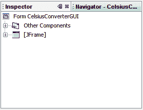

# NetBeans IDE 基础知识

> 原文：[`docs.oracle.com/javase/tutorial/uiswing/learn/netbeansbasics.html`](https://docs.oracle.com/javase/tutorial/uiswing/learn/netbeansbasics.html)

在探索 NetBeans IDE 的 GUI 创建功能之前，不需要学习其每个功能。实际上，您真正需要理解的只有*调色板*、*设计区域*、*属性编辑器*和*检查器*。我们将在下面讨论这些功能。

## 调色板

调色板包含 Swing API 提供的所有组件。即使这是您第一次使用它们（`JLabel` 是文本标签，`JList` 是下拉列表等），您也可能已经猜到许多这些组件的用途。

*此图已经缩小以适应页面。

单击图像以查看其自然大小。*

从此列表中，我们的应用程序仅使用`JLabel`（基本文本标签）、`JTextField`（用户输入温度）和`JButton`（将温度从摄氏度转换为华氏度）。

## 设计区域

设计区域是您将视觉构建 GUI 的地方。它有两个视图：*源视图*和*设计视图*。设计视图是默认视图，如下所示。您可以随时通过单击它们各自的选项卡切换视图。

*此图已经缩小以适应页面。

单击图像以查看其自然大小。*

上图显示了一个`JFrame`对象，由带有蓝色边框的大阴影矩形表示。IDE 自动生成常见的预期行为（例如在用户单击“关闭”按钮时退出）并显示在源代码视图中，位于称为*受保护块*的不可编辑蓝色代码块之间。

*此图已经缩小以适应页面。

单击图像以查看其自然大小。*

从源代码视图快速查看可以发现，IDE 创建了一个名为`initComponents`的私有方法，用于初始化 GUI 的各个组件。它还告诉应用程序在关闭时“退出”，执行一些特定于布局的任务，然后将（即将添加的）组件打包在屏幕上。

不必详细了解此代码；我们在这里提到它只是为了探索源选项卡。有关这些组件的更多信息，请参见：

如何创建框架（主窗口） 和 在容器内布局组件。

## 属性编辑器

属性编辑器的功能如其名称所示：它允许您编辑每个组件的属性。属性编辑器易于使用；您将看到一系列行 - 每个属性一行 - 您可以单击并编辑，而无需直接输入源代码。以下图显示了新添加的`JFrame`对象的属性编辑器：

*此图已缩小以适应页面。

单击图像以查看其自然大小。

上面的截图显示了此对象的各种属性，如背景颜色、前景颜色、字体和光标。

## 检查器

在本课程中我们将使用 NetBeans IDE 的最后一个组件是检查器：

检查器

检查器提供了应用程序组件的图形表示。我们只会使用检查器一次，将一些变量名称更改为非默认名称。
