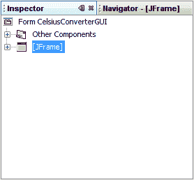
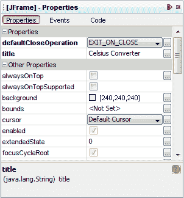
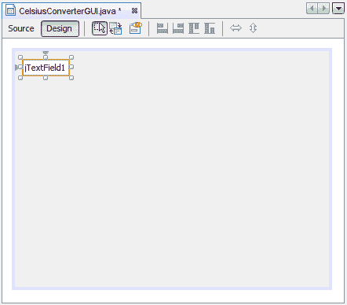
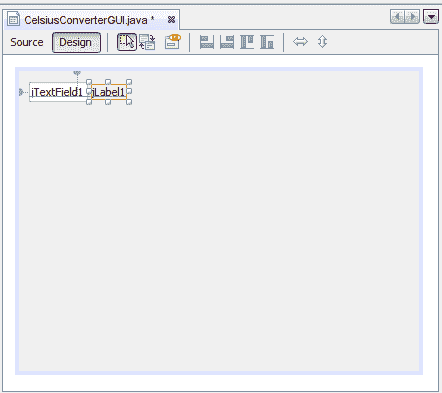
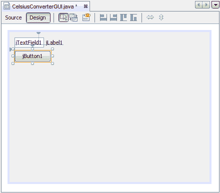
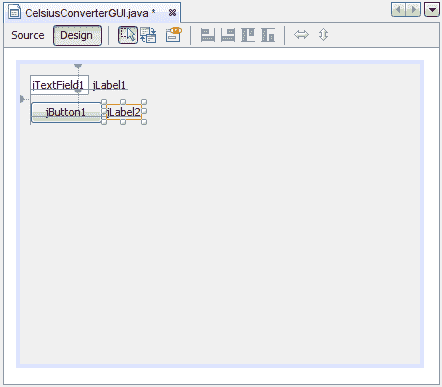

# 创建 CelsiusConverter GUI

> 原文：[`docs.oracle.com/javase/tutorial/uiswing/learn/creatinggui.html`](https://docs.oracle.com/javase/tutorial/uiswing/learn/creatinggui.html)

本节介绍如何使用 NetBeans IDE 创建应用程序的 GUI。当您将每个组件从工具栏拖动到设计区域时，IDE 会自动生成适当的源代码。

## 步骤 1：设置标题

首先，通过在检查器中单击`JFrame`来将应用程序的`JFrame`的标题设置为“摄氏度转换器”：

选择 JFrame

然后，使用属性编辑器设置其标题：

设置标题

您可以通过双击标题属性并直接输入新文本，或单击按钮并在提供的字段中输入标题来设置标题。或者，作为快捷方式，您可以单击检查器中的`JFrame`并直接输入其新文本，而无需使用属性编辑器。

## 步骤 2：添加一个 JTextField

接下来，从工具栏拖动一个`JTextField`到设计区域的左上角。当接近左上角时，GUI 构建器会提供视觉线索（虚线），提示适当的间距。根据这些线索指导，将`JTextField`放置在窗口的左上角，如下所示：

添加一个 JTextField

您可能会想要删除默认文本“JTextField1”，但现在就让它保持原样。稍后在本课程中，随着对每个组件的最终调整，我们将替换它。有关此组件的更多信息，请参见如何使用文本字段。

## 步骤 3：添加一个 JLabel

接下来，在设计区域拖动一个`JLabel`。将其放置在`JTextField`的右侧，再次注意视觉线索，以确定适当的间距。确保此组件的文本基线与`JTextField`的文本基线对齐。IDE 提供的视觉线索应该很容易确定。

添加一个 JLabel

有关此组件的更多信息，请参见如何使用标签。

## 步骤 4：添加一个 JButton

接下来，从工具栏拖动一个`JButton`并将其放置在`JTextField`的左侧和下方。再次，视觉线索有助于将其放置在正确的位置。

添加一个 JButton

你可能会想要手动调整`JButton`和`JTextField`的宽度，但现在就让它们保持原样。稍后在本课程中，您将学习如何正确调整这些组件。有关此组件的更多信息，请参见如何使用按钮。

## 步骤 5：添加第二个 JLabel

添加第二个 JLabel

最后，添加第二个`JLabel`，重复第 2 步中的过程。将这第二个标签放置在`JButton`的右侧，如上所示。
