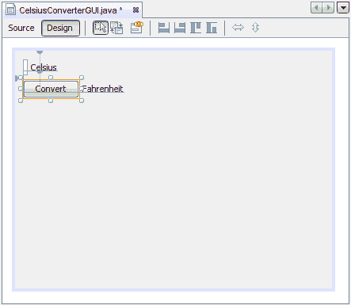
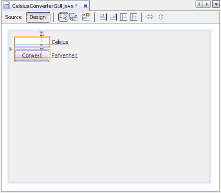
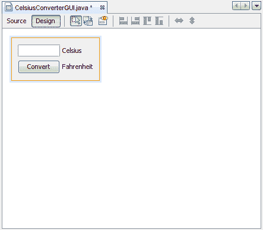

# 调整 CelsiusConverter GUI

> 原文：[`docs.oracle.com/javase/tutorial/uiswing/learn/adjustinggui.html`](https://docs.oracle.com/javase/tutorial/uiswing/learn/adjustinggui.html)

现在，GUI 组件已经就位，是时候进行最后的调整了。有几种不同的方法可以做到这一点；这里建议的顺序只是一种可能的方法。

## 步骤 1：设置组件文本

首先，双击`JTextField`和`JButton`以更改 IDE 插入的默认文本。当你从`JTextField`中擦除文本时，它会如下所示地缩小。将`JButton`的文本从“JButton1”更改为“Convert”。还将顶部`JLabel`的文本更改为“Celsius”，底部更改为“Fahrenheit”。

设置组件文本

## 步骤 2：设置组件大小

接下来，按住`JTextField`和`JButton`组件并进行 shift 点击。这将突出显示它们各自被选中。右键点击（Mac 用户为 control 点击）选择“相同大小” -> “相同宽度”。现在，这些组件的宽度将相同，如下所示。在执行此步骤时，请确保`JFrame`本身没有被选中。如果选中了，相同大小菜单将不可用。

设置 JTextField 和 JButton 大小

## 步骤 3：移除额外空间

最后，拖动`JFrame`的右下角并调整其大小以消除任何额外的空白。请注意，如果消除了所有额外的空间（如下所示），标题（仅在运行时显示）可能不会完全显示。最终用户可以根据需要调整应用程序的大小，但你可能希望在右侧留一些额外的空间，以确保一切都正确地适合。尝试一下，并使用完成 GUI 的截图作为指南。

完成的 GUI

此应用程序的 GUI 部分现在已经完成！如果 NetBeans IDE 完成了它的工作，你应该觉得创建这个 GUI 是一个简单的，甚至是微不足道的任务。但是花点时间点击源选项卡；你可能会对生成的代码量感到惊讶。

*此图已经缩小以适应页面。

点击图像以查看其自然大小。*

要查看完整的代码，请根据需要在 IDE 中上下滚动。你可以通过点击源编辑器左侧的 + 或 - 符号来展开或折叠某些代码块（如方法体）。
