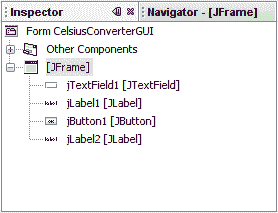
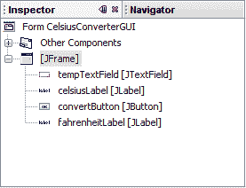

# 添加应用程序逻辑

> 原文：[`docs.oracle.com/javase/tutorial/uiswing/learn/logic.html`](https://docs.oracle.com/javase/tutorial/uiswing/learn/logic.html)

现在是时候添加应用程序逻辑了。

## 步骤 1：更改默认变量名称

下图显示了当前在检查器中显示的默认变量名称。对于每个组件，变量名称首先出现，然后是方括号中的对象类型。例如，`jTextField1 [JTextField]`表示“jTextField1”是变量名称，“JTextField”是其类型。



默认变量名称

在此应用程序的上下文中，默认名称并不是非常相关，因此将它们从默认值更改为更有意义的内容是有意义的。右键单击每个变量名称，选择“更改变量名称”。完成后，变量名称应如下所示：



新的变量名称

新的变量名称是“tempTextField”、“celsiusLabel”、“convertButton”和“fahrenheitLabel”。您在检查器中进行的每个更改都将自动传播回源代码中。您可以放心，编译不会因手动编辑时常见的拼写错误或类似错误而失败。

## 步骤 2：注册事件监听器

当最终用户与 Swing GUI 组件交互（例如单击“Convert”按钮）时，该组件将生成一种特殊类型的对象 —— 称为*事件对象* —— 然后将其广播到先前注册为该事件的*监听器*的任何其他对象。NetBeans IDE 使事件监听器注册变得非常简单：


*此图已经缩小以适应页面。

单击图像以查看其自然大小。*

在设计区域中，单击“Convert”按钮以选择它。确保*只有*“Convert”按钮被选中（如果 JFrame 本身也被选中，则此步骤将无效）。右键单击“Convert”按钮，选择事件 -> 动作 -> actionPerformed。这将生成所需的事件处理代码，使您可以在其中添加自己的功能的空方法体：


*此图已经缩小以适应页面。

单击图像以查看其自然大小。*

有许多不同类型的事件，代表着用户可以执行的各种操作（点击鼠标会触发一种类型的事件，键盘输入会触发另一种，移动鼠标则会触发另一种，依此类推）。我们的应用程序只关注**ActionEvent**；有关事件处理的更多信息，请参阅编写事件监听器。

## 步骤 3：添加温度转换代码

最后一步只需将温度转换代码粘贴到空方法体中。以下代码是将温度从摄氏度转换为华氏度所需的全部内容：

* * *

**注意：**

此示例不可本地化，因为`parseDouble`方法不可本地化。此代码片段仅用于说明目的。更健壮的实现将使用[Scanner](https://docs.oracle.com/javase/8/docs/api/java/util/Scanner.html)类来解析用户输入。

* * *

```java
    //Parse degrees Celsius as a double and convert to Fahrenheit.
    int tempFahr = (int)((Double.parseDouble(tempTextField.getText()))
            * 1.8 + 32);
    fahrenheitLabel.setText(tempFahr + " Fahrenheit");

```

只需复制此代码并将其粘贴到下面所示的`convertButtonActionPerformed`方法中：


*此图已经缩小以适应页面。

点击图像以查看其自然大小。*

完成温度转换代码后，应用程序现在已经完成。

## 步骤 4：运行应用程序

运行应用程序只是在 NetBeans IDE 中选择运行 -> 运行主项目的简单事情。第一次运行此应用程序时，会提示您设置`CelsiusConverterGUI`为此项目的主类。点击“确定”按钮，当程序编译完成后，您应该会看到应用程序在自己的窗口中运行。

恭喜！您已经完成了您的第一个 Swing 应用程序！
