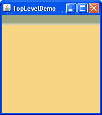
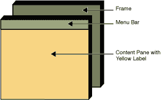
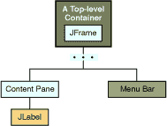
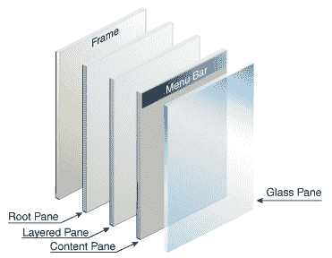

# 使用顶级容器

> 原文：[`docs.oracle.com/javase/tutorial/uiswing/components/toplevel.html`](https://docs.oracle.com/javase/tutorial/uiswing/components/toplevel.html)

正如我们之前提到的，Swing 提供了三个通常有用的顶级容器类：`JFrame`、`JDialog`和`JApplet`。在使用这些类时，您应该记住以下事实：

+   要在屏幕上显示，每个 GUI 组件必须是*包含层次结构*的一部分。包含层次结构是一个组件树，其根是一个顶级容器。我们稍后会展示给你。

+   每个 GUI 组件只能被包含一次。如果一个组件已经在一个容器中，并且您尝试将其添加到另一个容器中，该组件将从第一个容器中移除，然后添加到第二个容器中。

+   每个顶级容器都有一个内容窗格，一般来说，内容窗格包含（直接或间接地）该顶级容器 GUI 中可见的组件。

+   您可以选择向顶级容器添加一个菜单栏。按照惯例，菜单栏位于顶级容器内部，但在内容窗格之外。一些外观和感觉，如 Mac OS 外观和感觉，可以让您选择将菜单栏放在更适合外观和感觉的其他位置，例如屏幕顶部。

* * *

**注意：**虽然`JInternalFrame`模仿`JFrame`，但内部框架实际上不是顶级容器。

* * *

这是一个应用程序创建的框架的图片。框架包含一个绿色的菜单栏（没有菜单），在框架的内容窗格中有一个大的空白黄色标签。

|  |  |
| --- | --- |

您可以在`TopLevelDemo.java`中找到此示例的完整源代码。虽然示例在独立应用程序中使用了`JFrame`，但相同的概念也适用于`JApplet`和`JDialog`。

这是此示例 GUI 的包含层次结构：



如椭圆形所示，我们在这个图表中略去了一些细节。我们稍后会透露这些缺失的细节。这部分讨论以下主题：

+   顶级容器和包含层次结构

+   向内容窗格添加组件

+   添加菜单栏

+   根窗格（又名缺失的细节）

## 顶级容器和包含层次结构

使用 Swing 组件的每个程序至少有一个顶级容器。这个顶级容器是包含层次结构的根 - 包含所有出现在顶级容器内部的 Swing 组件的层次结构。

通常情况下，具有基于 Swing 的 GUI 的独立应用程序至少有一个以 `JFrame` 为根的包含层次结构。例如，如果一个应用程序有一个主窗口和两个对话框，则该应用程序有三个包含层次结构，因此有三个顶级容器。一个包含层次结构以 `JFrame` 为根，另外两个分别以 `JDialog` 对象为根。

一个基于 Swing 的小程序至少有一个包含层次结构，其中有一个由 `JApplet` 对象作为根。例如，弹出对话框的小程序有两个包含层次结构。浏览器窗口中的组件位于由 `JApplet` 对象作为根的包含层次结构中。对话框有一个由 `JDialog` 对象作为根的包含层次结构。

## 向内容窗格添加组件

以下是前面示例中使用的代码，用于获取框架的内容窗格并将黄色标签添加到其中：

```java
frame.getContentPane().add(yellowLabel, BorderLayout.CENTER);

```

如代码所示，您可以通过调用 `getContentPane` 方法找到顶级容器的内容窗格。默认内容窗格是一个简单的中间容器，继承自 `JComponent`，并使用 `BorderLayout` 作为其布局管理器。

定制内容窗格很容易—例如设置布局管理器或添加边框。但是，有一个小问题。`getContentPane` 方法返回的是一个 `Container` 对象，而不是 `JComponent` 对象。这意味着如果您想利用内容窗格的 `JComponent` 功能，您需要要么对返回值进行类型转换，要么创建自己的组件作为内容窗格。我们的示例通常采用第二种方法，因为这样更清晰。我们有时采用的另一种方法是简单地向内容窗格添加一个定制组件，完全覆盖内容窗格。

请注意，`JPanel` 的默认布局管理器是 `FlowLayout`；您可能需要更改它。

要将组件设置为内容窗格，请使用顶级容器的 `setContentPane` 方法。例如：

```java
//Create a panel and add components to it.
JPanel contentPane = new JPanel(new BorderLayout());
contentPane.setBorder(*someBorder*);
contentPane.add(*someComponent*, BorderLayout.CENTER);
contentPane.add(*anotherComponent*, BorderLayout.PAGE_END);

*topLevelContainer*.setContentPane(contentPane);

```

* * *

**注意：**

为方便起见，`add` 方法及其变体，`remove` 和 `setLayout` 已被重写以根据需要转发到 `contentPane`。这意味着您可以编写

```java
frame.add(child);

```

并且子组件将被添加到 `contentPane`。

请注意，只有这三种方法可以实现这一点。这意味着 `getLayout()` 不会返回使用 `setLayout()` 设置的布局。

* * *

## 添加菜单栏

理论上，所有顶级容器都可以容纳菜单栏。然而，在实践中，菜单栏通常只出现在框架和小程序中。要向顶级容器添加菜单栏，请创建一个 `JMenuBar` 对象，填充它的菜单，然后调用 `setJMenuBar`。`TopLevelDemo` 使用以下代码向其框架添加菜单栏：

```java
frame.setJMenuBar(greenMenuBar);

```

欲了解更多关于实现菜单和菜单栏的信息，请参阅如何使用菜单。

## 根窗格

每个顶层容器依赖于一个名为*根窗格*的隐秘中间容器。根窗格管理内容窗格和菜单栏，以及其他几个容器。通常情况下，你不需要了解根窗格来使用 Swing 组件。然而，如果你需要拦截鼠标点击或在多个组件上绘制，你应该熟悉根窗格。

这里是根窗格为框架（以及每个其他顶层容器）提供的组件列表：



我们已经告诉过你关于内容窗格和可选菜单栏。根窗格添加的另外两个组件是分层窗格和玻璃窗格。分层窗格包含菜单栏和内容窗格，并且可以对其他组件进行 Z 轴排序。玻璃窗格通常用于拦截发生在顶层容器上的输入事件，并且还可以用于在多个组件上绘制。

更多详情，请参见如何使用根窗格。
