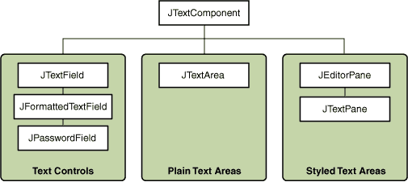
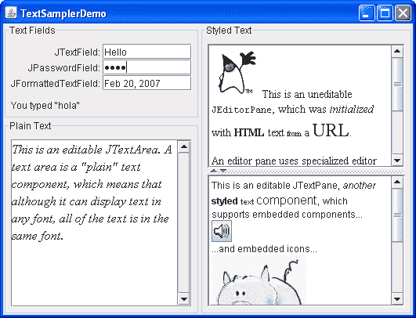

# 使用文本组件

> 原文：[`docs.oracle.com/javase/tutorial/uiswing/components/text.html`](https://docs.oracle.com/javase/tutorial/uiswing/components/text.html)

本节提供了在使用 Swing 文本组件时可能需要的背景信息。如果你打算使用未经样式化的文本组件 — 一个文本字段、密码字段、格式化文本字段或文本区域 — 请转到其操作页面，仅在必要时返回此处。如果你打算使用样式化文本组件，请参阅如何使用编辑窗格和文本窗格，并阅读本节。如果你不知道需要哪种组件，请继续阅读。

Swing 文本组件显示文本，并可选择允许用户编辑文本。程序需要文本组件来执行从简单任务（输入一个单词并按 Enter 键）到复杂任务（在亚洲语言中显示和编辑带有嵌入图像的样式文本）的各种任务。

Swing 提供了六个文本组件，以及支持各种复杂文本需求的支持类和接口。尽管它们用途和功能不同，但所有 Swing 文本组件都继承自相同的超类[`JTextComponent`](https://docs.oracle.com/javase/8/docs/api/javax/swing/text/JTextComponent.html)，为文本操作提供了高度可配置和强大的基础。

以下图显示了`JTextComponent`的层次结构。

以下图片显示了一个名为`TextSamplerDemo`的应用程序，该应用程序使用了每个 Swing 文本组件。

* * *

**试一试：**

1.  点击“启动”按钮以使用[Java™ Web Start](http://www.oracle.com/technetwork/java/javase/javawebstart/index.html)运行 TextSamplerDemo（[下载 JDK 7 或更高版本](http://www.oracle.com/technetwork/java/javase/downloads/index.html)）。或者，要自行编译和运行示例，请参考示例索引。

1.  在文本字段中输入一些文本，然后按 Enter 键。在密码字段中也做同样操作。当你按 Enter 键时，字段下方的标签会更新。

1.  尝试在格式化文本字段中输入有效和无效日期。请注意，只有日期有效时，当你按 Enter 键时，字段下方的标签才会更新。

1.  在文本区域和文本窗格中选择和编辑文本。使用键盘绑定，Ctrl-X、Ctrl-C 和 Ctrl-V，分别进行剪切、复制和粘贴文本。

1.  尝试编辑已通过`setEditable`调用而变为不可编辑的编辑窗格中的文本。

1.  在文本窗格中查找一个嵌入组件和一个嵌入图标的示例。

* * *

`TextSamplerDemo`示例以非常基本的方式使用文本组件。以下表格告诉您可以使用每种文本组件做什么。

| 组 | 描述 | Swing 类 |
| --- | --- | --- |
| 文本控件 | 也简称为文本字段，文本控件只能显示一行可编辑文本。像按钮一样，它们会生成动作事件。使用它们从用户那里获取少量文本信息，并在文本输入完成后执行操作。 | [`JTextField`](https://docs.oracle.com/javase/8/docs/api/javax/swing/JTextField.html) 及其子类 [`JPasswordField`](https://docs.oracle.com/javase/8/docs/api/javax/swing/JPasswordField.html) 和 [`JFormattedTextField`](https://docs.oracle.com/javase/8/docs/api/javax/swing/JFormattedTextField.html) |
| 普通文本区域 | `JTextArea`可以显示多行可编辑文本。虽然文本区域可以显示任何字体的文本，但所有文本都是相同字体。使用文本区域允许用户输入任意长度的未格式化文本或显示未格式化的帮助信息。 | [`JTextArea`](https://docs.oracle.com/javase/8/docs/api/javax/swing/JTextArea.html) |

| 样式文本区域 | 样式文本组件可以使用多种字体显示可编辑文本。一些样式文本组件允许嵌入图像甚至嵌入组件。样式文本组件是功能强大且多面向的组件，适用于高端需求，并提供比其他文本组件更多的自定义途径。由于它们如此强大和灵活，样式文本组件通常需要更多的初始编程来设置和使用。一个例外是编辑器窗格可以轻松地从 URL 加载格式化文本，这使它们非常适用于显示不可编辑的帮助信息。 | [`JEditorPane`](https://docs.oracle.com/javase/8/docs/api/javax/swing/JEditorPane.html) 及其子类

[`JTextPane`](https://docs.oracle.com/javase/8/docs/api/javax/swing/JTextPane.html) |

本教程提供了关于`JTextComponent`类奠定的基础的信息，并告诉您如何完成一些常见的与文本相关的任务。

要了解更多关于 JavaFX 中文本组件的信息，请参阅[在 JavaFX 中使用文本和文本效果](https://docs.oracle.com/javase/8/javafx/user-interface-tutorial/text.htm)和[使用 JavaFX UI 控件：文本字段](https://docs.oracle.com/javase/8/javafx/user-interface-tutorial/text-field.htm)教程。
