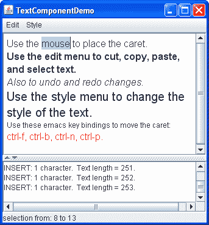
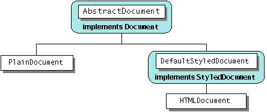

# 文本组件功能

> 原文：[`docs.oracle.com/javase/tutorial/uiswing/components/generaltext.html`](https://docs.oracle.com/javase/tutorial/uiswing/components/generaltext.html)

[`JTextComponent`](https://docs.oracle.com/javase/8/docs/api/javax/swing/text/JTextComponent.html)类是 Swing 文本组件的基础。该类为其所有后代提供以下可定制功能：

+   一个称为*文档*的模型，用于管理组件的内容。

+   一个视图，用于在屏幕上显示组件。

+   一个称为*编辑器工具包*的控制器，用于读取和写入文本，并使用操作实现编辑功能。

+   支持无限的撤销和重做。

+   可插拔的插入符和支持插入符更改侦听器和导航过滤器。

查看名为`TextComponentDemo`的示例以探索这些功能。尽管`TextComponentDemo`示例包含一个自定义的`JTextPane`实例，但本节讨论的功能被所有`JTextComponent`子类继承。



上方文本组件是自定义文本窗格。下方文本组件是`JTextArea`的一个实例，用作报告对文本窗格内容所做的所有更改的日志。窗口底部的状态行报告选择的位置或插入符的位置，具体取决于是否选择了文本。

* * *

**试试这个：**

1.  单击“启动”按钮以使用[Java™ Web Start](http://www.oracle.com/technetwork/java/javase/javawebstart/index.html)运行 TextComponentDemo（[下载 JDK 7 或更高版本](http://www.oracle.com/technetwork/java/javase/downloads/index.html)）。或者，要自行编译和运行示例，请参考示例索引。

1.  使用鼠标选择文本并将光标放置在文本窗格中。有关选择和光标的信息显示在窗口底部。

1.  通过键盘输入文本。您可以使用键盘上的箭头键或四个 emacs 键绑定（Ctrl-B（向后移动一个字符），Ctrl-F（向前移动一个字符），Ctrl-N（向下移动一行）和 Ctrl-P（向上移动一行））来移动插入符。

1.  打开编辑菜单，并使用其菜单项在文本窗格中编辑文本。在窗口底部的文本区域中进行选择。由于文本区域不可编辑，因此只有一些编辑菜单的命令，如复制到剪贴板，才有效。但需要注意的是，该菜单同时适用于文本组件。

1.  使用“样式”菜单中的项目将不同的样式应用于文本窗格中的文本。

* * *

使用`TextComponentDemo`示例作为参考点，本节涵盖以下主题：

+   将文本操作与菜单和按钮关联

+   将文本操作与按键绑定

+   实现撤销和重做

+   概念：关于文档

+   实现文档过滤器

+   监听文档更改

+   监听插入符和选择更改

+   概念：关于编辑工具包

## 将文本操作与菜单和按钮关联

所有 Swing 文本组件都支持标准的编辑命令，如剪切、复制、粘贴和插入字符。每个编辑命令由一个`Action`对象表示和实现。（要了解更多关于操作的信息，请参阅如何使用操作。）操作允许您将命令与 GUI 组件（如菜单项或按钮）关联起来，从而围绕文本组件构建 GUI。

您可以在任何文本组件上调用`getActions`方法，以接收包含此组件支持的所有操作的数组。还可以将操作数组加载到`HashMap`中，以便您的程序可以按名称检索操作。以下是从`TextComponentDemo`示例中获取文本窗格中的操作并将其加载到`HashMap`中的代码。

```java
private HashMap<Object, Action> createActionTable(JTextComponent textComponent) {
        HashMap<Object, Action> actions = new HashMap<Object, Action>();
        Action[] actionsArray = textComponent.getActions();
        for (int i = 0; i < actionsArray.length; i++) {
            Action a = actionsArray[i];
            actions.put(a.getValue(Action.NAME), a);
        }
        return actions;
    }

```

以下是从哈希映射中按名称检索操作的方法：

```java
private Action getActionByName(String name) {
    return actions.get(name);
}

```

您可以在程序中逐字使用这两种方法。

以下代码显示了如何创建剪切菜单项并将其与从文本组件中删除文本的操作关联起来。

```java
protected JMenu createEditMenu() {
    JMenu menu = new JMenu("Edit");
    ...
    menu.add(getActionByName(DefaultEditorKit.cutAction));
    ...

```

此代码通过之前展示的方便方法按名称获取操作。然后将操作添加到菜单中。这就是你需要做的一切。菜单和操作会处理其他所有事情。请注意，操作的名称来自[`DefaultEditorKit`](https://docs.oracle.com/javase/8/docs/api/javax/swing/text/DefaultEditorKit.html)。该工具包提供了基本文本编辑的操作，并且是 Swing 提供的所有编辑工具包的超类。因此，除非被自定义覆盖，否则其功能对所有文本组件都可用。

为了效率，文本组件共享操作。通过`getActionByName(DefaultEditorKit.cutAction)`返回的`Action`对象由窗口底部的不可编辑`JTextArea`共享。这种共享特性有两个重要的影响：

+   通常，您不应修改从编辑工具包获取的`Action`对象。如果这样做，更改会影响程序中的所有文本组件。

+   `Action`对象可以在程序中操作其他文本组件，有时会超出您的意图。在这个例子中，即使它是不可编辑的，`JTextArea`也与`JTextPane`共享动作。（在文本区域中选择一些文本，然后选择剪切到剪贴板菜单项。您会听到一声哔声，因为文本区域是不可编辑的。）如果您不想共享，请自行实例化`Action`对象。`DefaultEditorKit`定义了许多有用的`Action`子类。

以下是创建样式菜单并将粗体菜单项放入其中的代码：

```java
protected JMenu createStyleMenu() {
    JMenu menu = new JMenu("Style");

    Action action = new StyledEditorKit.BoldAction();
    action.putValue(Action.NAME, "Bold");
    menu.add(action);
    ...

```

`StyledEditorKit`提供了`Action`子类来实现对带样式文本的编辑命令。您会注意到，这段代码创建了`BoldAction`类的一个实例，而不是从编辑器工具包中获取动作。因此，这个动作不会与任何其他文本组件共享，更改其名称不会影响任何其他文本组件。

## 将文本动作与键盘快捷键关联

除了将动作与 GUI 组件关联外，还可以通过使用文本组件的输入映射将动作与键盘快捷键关联。输入映射在如何使用键绑定中有描述。

`TextComponentDemo`示例中的文本窗格支持四个默认未提供的键绑定。

+   按下 Ctrl-B 将光标向后移动一个字符

+   按下 Ctrl-F 将光标向前移动一个字符

+   按下 Ctrl-N 将光标向下移动一行

+   按下 Ctrl-P 将光标向上移动一行

以下代码将 Ctrl-B 键绑定添加到文本窗格。添加上面列出的其他三个绑定的代码类似。

```java
InputMap inputMap = textPane.getInputMap();

KeyStroke key = KeyStroke.getKeyStroke(KeyEvent.VK_B,
                                       Event.CTRL_MASK);
inputMap.put(key, DefaultEditorKit.backwardAction);

```

首先，代码获取文本组件的输入映射。接下来，它找到代表 Ctrl-B 键序列的`KeyStroke`对象。最后，代码将该键序列绑定到将光标向后移动的`Action`。

## 实现撤销和重做

实现撤销和重做有两个部分：

+   记住可撤销的编辑。

+   实现撤销和重做命令 并为其提供用户界面。

**第一部分：记住可撤销的编辑**

要支持撤销和重做，文本组件必须记住每次编辑的发生，编辑的顺序以及撤销每次编辑所需的内容。示例程序使用`UndoManager`类的一个实例来管理其可撤销编辑的列表。撤销管理器是在声明成员变量的地方创建的：

```java
protected UndoManager undo = new UndoManager();

```

现在，让我们看看程序如何发现可撤销的编辑并将其添加到撤销管理器中。

当文档内容发生可撤销编辑时，文档会通知感兴趣的监听器。实现撤销和重做的一个重要步骤是在文本组件的文档上注册一个可撤销编辑监听器。以下代码向文本窗格的文档添加了`MyUndoableEditListener`的一个实例：

```java
doc.addUndoableEditListener(new MyUndoableEditListener());

```

我们示例中使用的可撤销编辑侦听器将编辑添加到撤销管理器的列表中：

```java
protected class MyUndoableEditListener
          implements UndoableEditListener {
    public void undoableEditHappened(UndoableEditEvent e) {
        //Remember the edit and update the menus
        undo.addEdit(e.getEdit());
        undoAction.updateUndoState();
        redoAction.updateRedoState();
    }
}  

```

请注意，此方法更新两个对象：`undoAction`和`redoAction`。这些是分别附加到撤销和重做菜单项的操作对象。下一步将向您展示如何创建菜单项以及如何实现这两个操作。有关可撤销编辑侦听器和可撤销编辑事件的一般信息，请参阅如何编写可撤销编辑侦听器。

* * *

**注意：**

默认情况下，每个可撤销编辑都会撤消一个字符输入。通过一些努力，可以将编辑分组，以便一系列按键组合成一个可撤销编辑。以这种方式分组编辑需要您定义一个类，拦截文档的可撤销编辑事件，如果适当则将它们组合并将结果转发给您的可撤销编辑侦听器。

* * *

**第 2 部分：实现撤销和重做命令**

实现撤销和重做的第一步是创建要放入编辑菜单中的操作。

```java
JMenu menu = new JMenu("Edit");

//Undo and redo are actions of our own creation
undoAction = new UndoAction();
menu.add(undoAction);

redoAction = new RedoAction();
menu.add(redoAction);
...

```

撤销和重做操作由自定义的`AbstractAction`子类实现：`UndoAction`和`RedoAction`，分别。这些类是示例主类的内部类。

当用户调用`undo`命令时，将调用`UndoAction`类的`actionPerformed`方法：

```java
public void actionPerformed(ActionEvent e) {
    try {
        undo.undo();
    } catch (CannotUndoException ex) {
        System.out.println("Unable to undo: " + ex);
        ex.printStackTrace();
    }
    updateUndoState();
    redoAction.updateRedoState();
}

```

此方法调用撤销管理器的`undo`方法，并更新菜单项以反映新的撤销/重做状态。

类似地，当用户调用`redo`命令时，将调用`RedoAction`类的`actionPerformed`方法：

```java
public void actionPerformed(ActionEvent e) {
    try {
        undo.redo();
    } catch (CannotRedoException ex) {
        System.out.println("Unable to redo: " + ex);
        ex.printStackTrace();
    }
    updateRedoState();
    undoAction.updateUndoState();
}

```

此方法类似于撤销，只是调用撤销管理器的`redo`方法。

`UndoAction`和`RedoAction`类中的大部分代码专门用于根据当前状态启用和禁用操作，并更改菜单项的名称以反映要撤消或重做的编辑。

* * *

**注意：**

`TextComponentDemo`示例中的撤销和重做实现取自随 JDK 软件提供的`NotePad`演示。许多程序员也可以直接复制此撤销/重做实现而无需修改。

* * *

## 概念：关于文档

与其他 Swing 组件一样，文本组件将其数据（称为*模型*）与数据的视图分开。如果您尚未熟悉 Swing 组件使用的模型-视图分离，请参考使用模型。

文本组件的模型称为*文档*，是实现[`Document`](https://docs.oracle.com/javase/8/docs/api/javax/swing/text/Document.html)接口的类的实例。文档为文本组件提供以下服务：

+   包含文本。文档将文本内容存储在`Element`对象中，这些对象可以表示任何逻辑文本结构，如段落，或共享样式的文本运行。我们在这里不描述`Element`对象。

+   通过`remove`和`insertString`方法支持编辑文本。

+   通知文档侦听器和可撤销编辑侦听器文本更改。

+   管理`Position`对象，跟踪文本中的特定位置，即使文本被修改。

+   允许您获取有关文本的信息，例如其长度以及文本段作为字符串。

Swing 文本包包含`Document`的一个子接口，[`StyledDocument`](https://docs.oracle.com/javase/8/docs/api/javax/swing/text/StyledDocument.html)，它添加了使用样式标记文本的支持。一个`JTextComponent`子类，`JTextPane`，要求其文档是`StyledDocument`而不仅仅是`Document`。

`javax.swing.text`包提供了以下文档类层次结构，这些类实现了各种`JTextComponent`子类的专门文档：



`PlainDocument`是文本字段、密码字段和文本区域的默认文档。`PlainDocument`提供一个基本容器，其中所有文本以相同字体显示。即使编辑器窗格是一个样式化文本组件，但默认情况下它使用`PlainDocument`的一个实例。标准`JTextPane`的默认文档是`DefaultStyledDocument`的一个实例，用于以无特定格式显示样式文本的容器。但是，任何特定编辑器窗格或文本窗格使用的文档实例取决于绑定到其上的内容类型。如果使用`setPage`方法将文本加载到编辑器窗格或文本窗格中，则窗格使用的文档实例可能会更改。有关详细信息，请参阅如何使用编辑器窗格和文本窗格。

虽然你可以设置文本组件的文档，但通常更容易允许它自动设置，并在必要时使用*文档过滤器*来更改文本组件的数据设置方式。您可以通过安装文档过滤器或将文本组件的文档替换为自己的文档来实现某些自定义。例如，`TextComponentDemo`示例中的文本窗格具有一个限制文本窗格可以包含字符数量的文档过滤器。

## 实现文档过滤器

要实现文档过滤器，请创建[`DocumentFilter`](https://docs.oracle.com/javase/8/docs/api/javax/swing/text/DocumentFilter.html)的子类，然后使用`AbstractDocument`类中定义的`setDocumentFilter`方法将其附加到文档上。虽然可能存在不是从`AbstractDocument`继承的文档，但默认情况下，Swing 文本组件使用`AbstractDocument`子类作为其文档。

`TextComponentDemo` 应用程序有一个文档过滤器，`DocumentSizeFilter`，限制文本窗格可以包含的字符数。以下是创建过滤器并将其附加到文本窗格文档的代码：

```java
*...//Where member variables are declared:*
JTextPane textPane;
AbstractDocument doc;
static final int MAX_CHARACTERS = 300;
...
textPane = new JTextPane();
...
StyledDocument styledDoc = textPane.getStyledDocument();
if (styledDoc instanceof AbstractDocument) {
    doc = (AbstractDocument)styledDoc;
    doc.setDocumentFilter(new DocumentSizeFilter(MAX_CHARACTERS));
} 

```

为了限制文档中允许的字符数，`DocumentSizeFilter`覆盖了`DocumentFilter`类的`insertString`方法，每次插入文本到文档时都会调用该方法。它还覆盖了`replace`方法，当用户粘贴新文本时最有可能被调用。一般来说，文本插入可能发生在用户键入或粘贴新文本时，或者调用`setText`方法时。这是`DocumentSizeFilter`类对`insertString`方法的实现：

```java
public void insertString(FilterBypass fb, int offs,
                         String str, AttributeSet a)
    throws BadLocationException {

    if ((fb.getDocument().getLength() + str.length()) <= maxCharacters)
        super.insertString(fb, offs, str, a);
    else
        Toolkit.getDefaultToolkit().beep();
}

```

`replace`的代码类似。`DocumentFilter`类定义的方法的[`FilterBypass`](https://docs.oracle.com/javase/8/docs/api/javax/swing/text/DocumentFilter.FilterBypass.html)参数只是一个使文档能够以线程安全方式更新的对象。

因为前面的文档过滤器涉及文档数据的添加，它仅覆盖了`insertString`和`replace`方法。大多数文档过滤器还会覆盖`DocumentFilter`的`remove`方法。

## 监听文档的更改

您可以在文档上注册两种不同类型的监听器：文档监听器和可撤销编辑监听器。本小节描述了文档监听器。有关可撤销编辑监听器的信息，请参阅实现撤销和重做。

文档会通知已注册的文档监听器文档的更改。使用文档监听器在文档中插入或删除文本，或文本样式更改时创建反应。

`TextComponentDemo` 程序使用文档监听器在文本窗格发生更改时更新更改日志。以下代码行将`MyDocumentListener`类的一个实例注册为文本窗格文档的监听器：

```java
doc.addDocumentListener(new MyDocumentListener());

```

这是`MyDocumentListener`类的实现：

```java
protected class MyDocumentListener implements DocumentListener {
    public void insertUpdate(DocumentEvent e) {
        displayEditInfo(e);
    }
    public void removeUpdate(DocumentEvent e) {
        displayEditInfo(e);
    }
    public void changedUpdate(DocumentEvent e) {
        displayEditInfo(e);
    }
    private void displayEditInfo(DocumentEvent e) {
            Document document = (Document)e.getDocument();
            int changeLength = e.getLength();
            changeLog.append(e.getType().toString() + ": "
                + changeLength + " character"
                + ((changeLength == 1) ? ". " : "s. ")
                + " Text length = " + document.getLength()
                + "." + newline);
    }
} 

```

监听器实现了处理三种不同类型文档事件的三种方法：插入、删除和样式更改。`StyledDocument` 实例可以触发这三种类型的事件。`PlainDocument` 实例仅触发插入和删除事件。有关文档监听器和文档事件的一般信息，请参阅如何编写文档监听器。

请记住，此文本窗格的文档过滤器限制了文档中允许的字符数。如果尝试添加的文本超出文档过滤器允许的范围，文档过滤器将阻止更改，并且监听器的`insertUpdate`方法不会被调用。只有在更改已经发生时，文档监听器才会被通知更改。

您可能希望在文档监听器中更改文档的文本。**但是，您绝对不应该在文档监听器中修改文本组件的内容。**如果这样做，程序很可能会死锁。相反，您可以使用格式化文本字段或提供文档过滤器。

## 监听插入符和选择更改

`TextComponentDemo` 程序使用一个插入符监听器来显示插入符的当前位置，或者如果选择了文本，则显示选择的范围。

此示例中的插入符监听器类是一个`JLabel`子类。以下是创建插入符监听器标签并将其设置为文本窗格的插入符监听器的代码：

```java
//Create the status area
CaretListenerLabel caretListenerLabel = new CaretListenerLabel(
                                                "Caret Status");
...
textPane.addCaretListener(caretListenerLabel);

```

插入符监听器必须实现一个方法，即`caretUpdate`，每次插入符移动或选择更改时都会调用该方法。以下是`CaretListenerLabel`对`caretUpdate`的实现：

```java
public void caretUpdate(CaretEvent e) {
    //Get the location in the text
    int dot = e.getDot();
    int mark = e.getMark();
    if (dot == mark) {  // no selection
        try {
            Rectangle caretCoords = textPane.modelToView(dot);
            //Convert it to view coordinates
            setText("caret: text position: " + dot +
                    ", view location = [" +
                    caretCoords.x + ", " + caretCoords.y + "]" +
                    newline);
        } catch (BadLocationException ble) {
            setText("caret: text position: " + dot + newline);
        }
     } else if (dot < mark) {
        setText("selection from: " + dot + " to " + mark + newline);
     } else {
        setText("selection from: " + mark + " to " + dot + newline);
     }
}

```

如您所见，此监听器会更新其文本标签以反映插入符或选择的当前状态。监听器从插入符事件对象获取要显示的信息。有关插入符监听器和插入符事件的一般信息，请参阅如何编写插入符监听器。

与文档监听器一样，插入符监听器是被动的。它对插入符或选择的更改做出反应，但不会更改插入符或选择本身。如果要更改插入符或选择，请使用*导航过滤器*或自定义插入符。

实现导航过滤器类似于实现文档过滤器。首先，编写一个[`NavigationFilter`](https://docs.oracle.com/javase/8/docs/api/javax/swing/text/NavigationFilter.html)的子类。然后使用`setNavigationFilter`方法将子类的实例附加到文本组件。

您可能会创建一个自定义插入符来自定义插入符的外观。要创建自定义插入符，请编写一个实现[`Caret`](https://docs.oracle.com/javase/8/docs/api/javax/swing/text/Caret.html)接口的类，可能是通过扩展[`DefaultCaret`](https://docs.oracle.com/javase/8/docs/api/javax/swing/text/DefaultCaret.html)类。然后将您的类的实例作为参数提供给文本组件的`setCaret`方法。

## 概念：关于编辑器工具包

文本组件使用`EditorKit`将文本组件的各个部分联系在一起。编辑器工具包提供视图工厂、文档、插入符和操作。编辑器工具包还读取和写入特定格式的文档。尽管所有文本组件都使用编辑器工具包，但某些组件会隐藏它们的编辑器工具包。您无法设置或获取文本字段或文本区域使用的编辑器工具包。编辑窗格和文本窗格提供`getEditorKit`方法以获取当前编辑器工具包，并提供`setEditorKit`方法以更改它。

对于所有组件，`JTextComponent`类提供了 API，让您间接调用或自定义一些编辑工具包的功能。例如，`JTextComponent`提供了`read`和`write`方法，这些方法调用编辑工具包的`read`和`write`方法。`JTextComponent`还提供了一个方法，`getActions`，它返回组件支持的所有操作。

Swing 文本包提供以下编辑工具包：

[`DefaultEditorKit`](https://docs.oracle.com/javase/8/docs/api/javax/swing/text/DefaultEditorKit.html)

读取和写入纯文本，并提供一组基本的编辑命令。有关文本系统如何处理换行符的详细信息可以在`DefaultEditorKit` API 文档中找到。简而言之，'\n'字符在内部使用，但在写入文件时使用文档或平台的换行符。所有其他编辑工具包都是`DefaultEditorKit`类的子类。

[`StyledEditorKit`](https://docs.oracle.com/javase/8/docs/api/javax/swing/text/StyledEditorKit.html)

读取和写入样式文本，并为样式文本提供一组最小的操作。这个类是`DefaultEditorKit`的子类，是`JTextPane`默认使用的编辑工具包。

[`HTMLEditorKit`](https://docs.oracle.com/javase/8/docs/api/javax/swing/text/html/HTMLEditorKit.html)

读取、写入和编辑 HTML。这是`StyledEditorKit`的子类。

上述每个编辑工具包都已注册到`JEditorPane`类，并与工具包读取、写入和编辑的文本格式相关联。当文件加载到编辑窗格中时，窗格会检查文件的格式与其注册的工具包是否匹配。如果找到支持该文件格式的注册工具包，则窗格将使用该工具包来读取文件、显示和编辑。因此，编辑窗格有效地将自身转换为该文本格式的编辑器。您可以通过为其创建编辑工具包，然后使用`JEditorPane`的`registerEditorKitForContentType`将您的工具包与您的文本格式相关联，从而扩展`JEditorPane`以支持您自己的文本格式。
