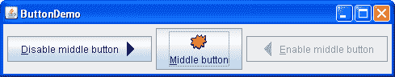
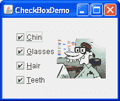
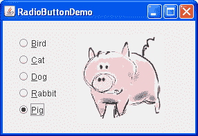

# 如何使用按钮、复选框和单选按钮

> 原文：[`docs.oracle.com/javase/tutorial/uiswing/components/button.html`](https://docs.oracle.com/javase/tutorial/uiswing/components/button.html)

要创建一个按钮，你可以实例化从[`AbstractButton`](https://docs.oracle.com/javase/8/docs/api/javax/swing/AbstractButton.html)类继承的许多类之一。下表显示了你可能想要使用的 Swing 定义的`AbstractButton`子类：

| 类 | 摘要 | 描述位置 |
| --- | --- | --- |
| [`JButton`](https://docs.oracle.com/javase/8/docs/api/javax/swing/JButton.html) | 一个常见的按钮。 | 如何使用通用按钮 API 和 如何使用 JButton 功能 |
| [`JCheckBox`](https://docs.oracle.com/javase/8/docs/api/javax/swing/JCheckBox.html) | 一个复选框按钮。 | 如何使用复选框 |
| [`JRadioButton`](https://docs.oracle.com/javase/8/docs/api/javax/swing/JRadioButton.html) | 一组单选按钮中的一个。 | 如何使用单选按钮 |
| [`JMenuItem`](https://docs.oracle.com/javase/8/docs/api/javax/swing/JMenuItem.html) | 菜单中的一个项目。 | 如何使用菜单 |
| [`JCheckBoxMenuItem`](https://docs.oracle.com/javase/8/docs/api/javax/swing/JCheckBoxMenuItem.html) | 具有复选框的菜单项。 | 如何使用菜单 和 如何使用复选框 |
| [`JRadioButtonMenuItem`](https://docs.oracle.com/javase/8/docs/api/javax/swing/JRadioButtonMenuItem.html) | 具有单选按钮的菜单项。 | 如何使用菜单 和 如何使用单选按钮 |
| [`JToggleButton`](https://docs.oracle.com/javase/8/docs/api/javax/swing/JToggleButton.html) | 实现`JCheckBox`和`JRadioButton`继承的切换功能。可以实例化或子类化以创建两状态按钮。 | 在一些示例中使用 |

* * *

**注意：** 如果你想将一组按钮收集到一行或一列中，那么你应该查看工具栏。

* * *

首先，本节解释了`AbstractButton`定义的基本按钮 API，因此所有 Swing 按钮都具有共同的特性。接下来，它描述了`JButton`添加到`AbstractButton`的少量 API。之后，本节将向您展示如何使用专门的 API 来实现复选框和单选按钮。

## 如何使用通用按钮 API

这里是一个显示三个按钮的应用程序的图片：



* * *

**试试这个：**

1.  点击“启动”按钮以使用[Java™ Web Start](http://www.oracle.com/technetwork/java/javase/javawebstart/index.html)运行按钮演示（[下载 JDK 7 或更高版本](http://www.oracle.com/technetwork/java/javase/downloads/index.html)）。或者，要自行编译和运行示例，请参考示例索引。

1.  点击左侧按钮。

    它禁用了中间按钮（以及自身，因为它不再有用），并启用了右侧按钮。

1.  点击右侧按钮。

    它启用了中间按钮和左侧按钮，并禁用了自身。

* * *

正如`ButtonDemo`示例所示，Swing 按钮可以同时显示文本和图像。在`ButtonDemo`中，每个按钮的文本相对于其图像有不同的位置。每个按钮文本中的下划线字母显示了*助记符* — 每个按钮的键盘替代键。在大多数外观中，用户可以通过按下 Alt 键和助记符来点击按钮。例如，Alt-M 将点击 ButtonDemo 中的 Middle 按钮。

当按钮被禁用时，外观会自动生成按钮的禁用外观。但是，您可以提供一个图像来替换正常图像。例如，您可以提供左侧和右侧按钮使用的图像的灰色版本。

如何实现事件处理取决于您使用的按钮类型以及如何使用它。通常，您会实现一个 action listener，每当用户点击按钮时都会通知它。对于复选框，通常会使用一个 item listener，当复选框被选中或取消选中时会通知它。

下面是`ButtonDemo.java`中创建上一个示例中按钮并响应按钮点击的代码。粗体代码是如果按钮没有图像时将保留的代码。

```java
*//In initialization code:*
    ImageIcon leftButtonIcon = createImageIcon("images/right.gif");
    ImageIcon middleButtonIcon = createImageIcon("images/middle.gif");
    ImageIcon rightButtonIcon = createImageIcon("images/left.gif");

    b1 = new JButton("Disable middle button", leftButtonIcon);
    b1.setVerticalTextPosition(AbstractButton.CENTER);
    b1.setHorizontalTextPosition(AbstractButton.LEADING); //aka LEFT, for left-to-right locales
    b1.setMnemonic(KeyEvent.VK_D);
    b1.setActionCommand("disable");

    b2 = new JButton("Middle button", middleButtonIcon);
    b2.setVerticalTextPosition(AbstractButton.BOTTOM);
    b2.setHorizontalTextPosition(AbstractButton.CENTER);
    b2.setMnemonic(KeyEvent.VK_M);

    b3 = new JButton("Enable middle button", rightButtonIcon);
    //Use the default text position of CENTER, TRAILING (RIGHT).
    b3.setMnemonic(KeyEvent.VK_E);
    b3.setActionCommand("enable");
    b3.setEnabled(false);

    //Listen for actions on buttons 1 and 3.
    b1.addActionListener(this);
    b3.addActionListener(this);

    b1.setToolTipText("Click this button to disable "
                      + "the middle button.");
    b2.setToolTipText("This middle button does nothing "
                      + "when you click it.");
    b3.setToolTipText("Click this button to enable the "
                      + "middle button.");
    ...
}

public void actionPerformed(ActionEvent e) {
    if ("disable".equals(e.getActionCommand())) {
        b2.setEnabled(false);
        b1.setEnabled(false);
        b3.setEnabled(true);
    } else {
        b2.setEnabled(true);
        b1.setEnabled(true);
        b3.setEnabled(false);
    }
} 

protected static ImageIcon createImageIcon(String path) {
    java.net.URL imgURL = ButtonDemo.class.getResource(path);
    *...//error handling omitted for clarity...*
    return new ImageIcon(imgURL);
}

```

## 如何使用 JButton 功能

普通按钮 — `JButton` 对象 — 比 `AbstractButton` 类提供的功能稍多一点：你可以将 `JButton` 设置为默认按钮。

一个顶级容器中最多只能有一个默认按钮。默认按钮通常具有突出的外观，并且当顶级容器具有键盘焦点并且用户按下 Return 或 Enter 键时会被点击。这里是一个对话框的图片，实现在 ListDialog 示例中，其中**设置**按钮是默认按钮：


您可以通过在顶层容器的根窗格上调用`setDefaultButton`方法来设置默认按钮。以下是为`ListDialog`示例设置默认按钮的代码：

```java
*//In the constructor for a JDialog subclass:*
getRootPane().setDefaultButton(setButton);

```

默认按钮功能的确切实现取决于外观。例如，在 Windows 外观中，默认按钮会更改为具有焦点的按钮，以便按 Enter 键单击具有焦点的按钮。当没有按钮具有焦点时，您最初指定为默认按钮的按钮再次成为默认按钮。

## 如何使用复选框

[`JCheckBox`](https://docs.oracle.com/javase/8/docs/api/javax/swing/JCheckBox.html)类提供了对复选框按钮的支持。您还可以使用[`JCheckBoxMenuItem`](https://docs.oracle.com/javase/8/docs/api/javax/swing/JCheckBoxMenuItem.html)类将复选框放入菜单中。因为`JCheckBox`和`JCheckBoxMenuItem`继承自`AbstractButton`，Swing 复选框具有本节前面讨论的所有常规按钮特性。例如，您可以指定要在复选框中使用的图像。

复选框类似于单选按钮，但它们的选择模型不同，按照惯例。一组复选框中的任意数量 — 可以选择零个、一些或全部。另一方面，一组单选按钮只能选择一个按钮。

这是一个使用四个复选框自定义卡通的应用程序的图片：



* * *

**试试这个：**

1.  单击启动按钮以使用[Java™ Web Start](http://www.oracle.com/technetwork/java/javase/javawebstart/index.html)运行 CheckBox Demo（[下载 JDK 7 或更高版本](http://www.oracle.com/technetwork/java/javase/downloads/index.html)）。或者，要自行编译和运行示例，请参考示例索引。

1.  单击**下巴**按钮或按下 Alt-c。

    **下巴**复选框变为未选中状态，下巴从图片中消失。其他复选框保持选中状态。此应用程序有一个项目侦听器，用于监听所有复选框。每次项目侦听器接收到事件时，应用程序会加载反映复选框当前状态的新图片。

* * *

每次单击复选框都会生成一个项目事件和一个操作事件。通常，您只监听项目事件，因为它们让您确定单击是选择还是取消选择复选框。以下是来自`CheckBoxDemo.java`的代码，用于创建上一个示例中的复选框并对单击做出反应。

```java
*//In initialization code:*
    chinButton = new JCheckBox("Chin");
    chinButton.setMnemonic(KeyEvent.VK_C); 
    chinButton.setSelected(true);

    glassesButton = new JCheckBox("Glasses");
    glassesButton.setMnemonic(KeyEvent.VK_G); 
    glassesButton.setSelected(true);

    hairButton = new JCheckBox("Hair");
    hairButton.setMnemonic(KeyEvent.VK_H); 
    hairButton.setSelected(true);

    teethButton = new JCheckBox("Teeth");
    teethButton.setMnemonic(KeyEvent.VK_T); 
    teethButton.setSelected(true);

    //Register a listener for the check boxes.
    chinButton.addItemListener(this);
    glassesButton.addItemListener(this);
    hairButton.addItemListener(this);
    teethButton.addItemListener(this);
...
public void itemStateChanged(ItemEvent e) {
    ...
    Object source = e.getItemSelectable();

    if (source == chinButton) {
        *//...make a note of it...*
    } else if (source == glassesButton) {
        *//...make a note of it...*
    } else if (source == hairButton) {
        *//...make a note of it...*
    } else if (source == teethButton) {
        *//...make a note of it...*
    }

    if (e.getStateChange() == ItemEvent.DESELECTED)
        *//...make a note of it...*
    ...
    updatePicture();
}

```

## 如何使用单选按钮

单选按钮是一组按钮，按照惯例，一次只能选择一个按钮。Swing 版本支持使用[`JRadioButton`](https://docs.oracle.com/javase/8/docs/api/javax/swing/JRadioButton.html)和[`ButtonGroup`](https://docs.oracle.com/javase/8/docs/api/javax/swing/ButtonGroup.html)类的单选按钮。要将单选按钮放入菜单中，请使用[`JRadioButtonMenuItem`](https://docs.oracle.com/javase/8/docs/api/javax/swing/JRadioButtonMenuItem.html)类。显示一组中的一个选择的其他方式包括组合框和列表。单选按钮看起来类似于复选框，但是按照惯例，复选框不限制同时选择的项目数量。

因为`JRadioButton`继承自`AbstractButton`，Swing 单选按钮具有所有通常的按钮特性，如本节前面讨论的。例如，您可以指定在单选按钮中显示的图像。

下面是一个应用程序的图片，使用五个单选按钮让您选择显示哪种宠物：



* * *

**试试这个：**

1.  点击启动按钮以使用[Java™ Web Start](http://www.oracle.com/technetwork/java/javase/javawebstart/index.html)运行 RadioButton Demo（[下载 JDK 7 或更高版本](http://www.oracle.com/technetwork/java/javase/downloads/index.html)）。或者，要自行编译和运行示例，请参考示例索引。

1.  点击**Dog**按钮或按下 Alt-d 键。

    **Dog**按钮被选中，使**Bird**按钮变为未选中。图片从鸟变为狗。这个应用程序有一个监听所有单选按钮的 action listener。每次 action listener 接收到事件时，应用程序会显示刚刚点击的单选按钮的图片。

* * *

每当用户点击单选按钮（即使它已经被选中），按钮都会触发一个 action event。还会发生一个或两个 item events — 一个来自刚刚被选中的按钮，另一个来自失去选择的按钮（如果有的话）。通常，你会使用一个 action listener 来处理单选按钮的点击。

下面是`RadioButtonDemo.java`中创建单选按钮并响应点击的代码，这是前面示例中的单选按钮。

```java
*//In initialization code:*
    //Create the radio buttons.
    JRadioButton birdButton = new JRadioButton(birdString);
    birdButton.setMnemonic(KeyEvent.VK_B);
    birdButton.setActionCommand(birdString);
    birdButton.setSelected(true);

    JRadioButton catButton = new JRadioButton(catString);
    catButton.setMnemonic(KeyEvent.VK_C);
    catButton.setActionCommand(catString);

    JRadioButton dogButton = new JRadioButton(dogString);
    dogButton.setMnemonic(KeyEvent.VK_D);
    dogButton.setActionCommand(dogString);

    JRadioButton rabbitButton = new JRadioButton(rabbitString);
    rabbitButton.setMnemonic(KeyEvent.VK_R);
    rabbitButton.setActionCommand(rabbitString);

    JRadioButton pigButton = new JRadioButton(pigString);
    pigButton.setMnemonic(KeyEvent.VK_P);
    pigButton.setActionCommand(pigString);

    //Group the radio buttons.
    ButtonGroup group = new ButtonGroup();
    group.add(birdButton);
    group.add(catButton);
    group.add(dogButton);
    group.add(rabbitButton);
    group.add(pigButton);

    //Register a listener for the radio buttons.
    birdButton.addActionListener(this);
    catButton.addActionListener(this);
    dogButton.addActionListener(this);
    rabbitButton.addActionListener(this);
    pigButton.addActionListener(this);
...
public void actionPerformed(ActionEvent e) {
    picture.setIcon(new ImageIcon("images/" 
                                  + e.getActionCommand() 
                                  + ".gif"));
}

```

对于每组单选按钮，您需要创建一个`ButtonGroup`实例，并将每个单选按钮添加到其中。`ButtonGroup`会在用户选择组中的另一个按钮时取消先前选中的按钮。

通常应该初始化一组单选按钮，以便其中一个被选中。但是，API 不强制执行此规则 — 一组单选按钮可以没有初始选择。一旦用户做出选择，从那时起将仅选择一个按钮。

## 按钮 API

以下表格列出了常用的与按钮相关的 API。您可能调用的其他方法，如 `setFont` 和 `setForeground`，在 JComponent 类的 API 表中 列出。

使用按钮的 API 分为以下几类：

+   设置或获取按钮的内容

+   微调按钮的外观

+   实现按钮的功能

+   复选框构造函数

+   单选按钮构造函数

+   切换按钮构造函数

+   常用的按钮组构造函数/方法

设置或获取按钮的内容

| 方法或构造函数 | 目的 |
| --- | --- |

| [JButton(Action)](https://docs.oracle.com/javase/8/docs/api/javax/swing/JButton.html#JButton-javax.swing.Action-) [JButton(String, Icon)](https://docs.oracle.com/javase/8/docs/api/javax/swing/JButton.html#JButton-java.lang.String-javax.swing.Icon-)

[JButton(String)](https://docs.oracle.com/javase/8/docs/api/javax/swing/JButton.html#JButton-java.lang.String-)

[JButton(Icon)](https://docs.oracle.com/javase/8/docs/api/javax/swing/JButton.html#JButton-javax.swing.Icon-)

[JButton()](https://docs.oracle.com/javase/8/docs/api/javax/swing/JButton.html#JButton--) | 创建一个 `JButton` 实例，并将其初始化为具有指定的文本/图像/操作。 |

| [void setAction(Action)](https://docs.oracle.com/javase/8/docs/api/javax/swing/AbstractButton.html#setAction-javax.swing.Action-) [Action getAction()](https://docs.oracle.com/javase/8/docs/api/javax/swing/AbstractButton.html#getAction--)

| 根据 `Action` 实例的值设置或获取按钮的属性。 |
| --- |

| [void setText(String)](https://docs.oracle.com/javase/8/docs/api/javax/swing/AbstractButton.html#setText-java.lang.String-) [String getText()](https://docs.oracle.com/javase/8/docs/api/javax/swing/AbstractButton.html#getText--)

| 设置或获取按钮显示的文本。您可以使用 HTML 格式，如 在 Swing 组件中使用 HTML 中所述。 |
| --- |

| [void setIcon(Icon)](https://docs.oracle.com/javase/8/docs/api/javax/swing/AbstractButton.html#setIcon-javax.swing.Icon-) [Icon getIcon()](https://docs.oracle.com/javase/8/docs/api/javax/swing/AbstractButton.html#getIcon--)

| 设置或获取按钮在未选中或按下时显示的图像。 |
| --- |

| [void setDisabledIcon(Icon)](https://docs.oracle.com/javase/8/docs/api/javax/swing/AbstractButton.html#setDisabledIcon-javax.swing.Icon-) [Icon getDisabledIcon()](https://docs.oracle.com/javase/8/docs/api/javax/swing/AbstractButton.html#getDisabledIcon--)

| 设置或获取按钮在禁用时显示的图像。如果您没有指定禁用图像，则外观和感觉会通过操作默认图像来创建一个。 |
| --- |

| [void setPressedIcon(Icon)](https://docs.oracle.com/javase/8/docs/api/javax/swing/AbstractButton.html#setPressedIcon-javax.swing.Icon-) [Icon getPressedIcon()](https://docs.oracle.com/javase/8/docs/api/javax/swing/AbstractButton.html#getPressedIcon--)

| 设置或获取按钮在被按下时显示的图像。 |
| --- |

| [void setSelectedIcon(Icon)](https://docs.oracle.com/javase/8/docs/api/javax/swing/AbstractButton.html#setSelectedIcon-javax.swing.Icon-) [Icon getSelectedIcon()](https://docs.oracle.com/javase/8/docs/api/javax/swing/AbstractButton.html#getSelectedIcon--)

[void setDisabledSelectedIcon(Icon)](https://docs.oracle.com/javase/8/docs/api/javax/swing/AbstractButton.html#setDisabledSelectedIcon-javax.swing.Icon-)

[Icon getDisabledSelectedIcon()](https://docs.oracle.com/javase/8/docs/api/javax/swing/AbstractButton.html#getDisabledSelectedIcon--)

| 设置或获取按钮在选定时显示的图像。如果您没有指定禁用选定图像，则外观和感觉会通过操作选定图像来创建一个。 |
| --- |

| [setRolloverEnabled(boolean)](https://docs.oracle.com/javase/8/docs/api/javax/swing/AbstractButton.html#setRolloverEnabled-boolean-) [boolean isRolloverEnabled()](https://docs.oracle.com/javase/8/docs/api/javax/swing/AbstractButton.html#isRolloverEnabled--)

[void setRolloverIcon(Icon)](https://docs.oracle.com/javase/8/docs/api/javax/swing/AbstractButton.html#setRolloverIcon-javax.swing.Icon-)

[Icon getRolloverIcon()](https://docs.oracle.com/javase/8/docs/api/javax/swing/AbstractButton.html#getRolloverIcon--)

[void setRolloverSelectedIcon(Icon)](https://docs.oracle.com/javase/8/docs/api/javax/swing/AbstractButton.html#setRolloverSelectedIcon-javax.swing.Icon-)

[Icon getRolloverSelectedIcon()](https://docs.oracle.com/javase/8/docs/api/javax/swing/AbstractButton.html#getRolloverSelectedIcon--)

| 使用`setRolloverIcon(someIcon)`使按钮在鼠标悬停在其上时显示指定图标。`setRolloverSelectedIcon`方法允许您在按钮选定时指定悬停图标，这对于两状态按钮（如切换按钮）非常有用。设置悬停图标会自动调用`setRollover(true)`，启用悬停效果。 |
| --- |

调整按钮外观

| 方法或构造函数 | 目的 |
| --- | --- |

| [void setHorizontalAlignment(int)](https://docs.oracle.com/javase/8/docs/api/javax/swing/AbstractButton.html#setHorizontalAlignment-int-) [void setVerticalAlignment(int)](https://docs.oracle.com/javase/8/docs/api/javax/swing/AbstractButton.html#setVerticalAlignment-int-)

[int getHorizontalAlignment()](https://docs.oracle.com/javase/8/docs/api/javax/swing/AbstractButton.html#getHorizontalAlignment--)

[int getVerticalAlignment()](https://docs.oracle.com/javase/8/docs/api/javax/swing/AbstractButton.html#getVerticalAlignment--) | 设置或获取按钮内容应该放置在按钮的何处。`AbstractButton` 类允许水平对齐的以下任一值：`RIGHT`、`LEFT`、`CENTER`（默认）、`LEADING` 和 `TRAILING`。对于垂直对齐：`TOP`、`CENTER`（默认）和 `BOTTOM`。 |

| [void setHorizontalTextPosition(int)](https://docs.oracle.com/javase/8/docs/api/javax/swing/AbstractButton.html#setHorizontalTextPosition-int-) [void setVerticalTextPosition(int)](https://docs.oracle.com/javase/8/docs/api/javax/swing/AbstractButton.html#setVerticalTextPosition-int-)

[int getHorizontalTextPosition()](https://docs.oracle.com/javase/8/docs/api/javax/swing/AbstractButton.html#getHorizontalTextPosition--)

[int getVerticalTextPosition()](https://docs.oracle.com/javase/8/docs/api/javax/swing/AbstractButton.html#getVerticalTextPosition--) | 设置或获取按钮文本应该放置在何处，相对于按钮的图像。`AbstractButton` 类允许水平位置的以下任一值：`LEFT`、`CENTER`、`RIGHT`、`LEADING` 和 `TRAILING`（默认）。对于垂直位置：`TOP`、`CENTER`（默认）和 `BOTTOM`。 |

| [void setMargin(Insets)](https://docs.oracle.com/javase/8/docs/api/javax/swing/AbstractButton.html#setMargin-java.awt.Insets-) [Insets getMargin()](https://docs.oracle.com/javase/8/docs/api/javax/swing/AbstractButton.html#getMargin--) | 设置或获取按钮边框与其内容之间的像素数。 |
| --- | --- |
| [void setFocusPainted(boolean)](https://docs.oracle.com/javase/8/docs/api/javax/swing/AbstractButton.html#setFocusPainted-boolean-) [boolean isFocusPainted()](https://docs.oracle.com/javase/8/docs/api/javax/swing/AbstractButton.html#isFocusPainted--) | 设置或获取按钮在获得焦点时是否应该呈现不同外观。 |
| [void setBorderPainted(boolean)](https://docs.oracle.com/javase/8/docs/api/javax/swing/AbstractButton.html#setBorderPainted-boolean-) [boolean isBorderPainted()](https://docs.oracle.com/javase/8/docs/api/javax/swing/AbstractButton.html#isBorderPainted--) | 设置或获取按钮边框是否应该被绘制。 |

| [void setIconTextGap(int)](https://docs.oracle.com/javase/8/docs/api/javax/swing/AbstractButton.html#setIconTextGap-int-) [int getIconTextGap()](https://docs.oracle.com/javase/8/docs/api/javax/swing/AbstractButton.html#getIconTextGap--)

| 设置或获取文本和此按钮中显示的图标之间的间距。 |
| --- |

实现按钮的功能

| 方法或构造函数 | 目的 |
| --- | --- |

| [void setMnemonic(int)](https://docs.oracle.com/javase/8/docs/api/javax/swing/AbstractButton.html#setMnemonic-int-) [char getMnemonic()](https://docs.oracle.com/javase/8/docs/api/javax/swing/AbstractButton.html#getMnemonic--)

| 设置或获取通过按下按钮的键盘替代方法。`setMnemonic`方法的一种形式接受一个字符参数；然而，Swing 团队建议您改用一个`int`参数，指定一个`KeyEvent.VK_*X*`常量。 |
| --- |

| [void setDisplayedMnemonicIndex(int)](https://docs.oracle.com/javase/8/docs/api/javax/swing/AbstractButton.html#setDisplayedMnemonicIndex-int-) [int getDisplayedMnemonicIndex()](https://docs.oracle.com/javase/8/docs/api/javax/swing/AbstractButton.html#getDisplayedMnemonicIndex--)

| 设置或获取文本中应该被装饰以表示助记符的字符的提示。请注意，并非所有外观和感觉都支持此功能。 |
| --- |

| [void setActionCommand(String)](https://docs.oracle.com/javase/8/docs/api/javax/swing/AbstractButton.html#setActionCommand-java.lang.String-) [String getActionCommand()](https://docs.oracle.com/javase/8/docs/api/javax/swing/AbstractButton.html#getActionCommand--)

| 设置或获取按钮执行的动作的名称。 |
| --- |

| [void addActionListener(ActionListener)](https://docs.oracle.com/javase/8/docs/api/javax/swing/AbstractButton.html#addActionListener-java.awt.event.ActionListener-) [ActionListener removeActionListener()](https://docs.oracle.com/javase/8/docs/api/javax/swing/AbstractButton.html#removeActionListener--)

| 添加或移除监听按钮触发的动作事件的对象。 |
| --- |

| [void addItemListener(ItemListener)](https://docs.oracle.com/javase/8/docs/api/javax/swing/AbstractButton.html#addItemListener-java.awt.event.ItemListener-) [ItemListener removeItemListener()](https://docs.oracle.com/javase/8/docs/api/javax/swing/AbstractButton.html#removeItemListener--)

| 添加或移除监听按钮触发的项目事件的对象。 |
| --- |

| [void setSelected(boolean)](https://docs.oracle.com/javase/8/docs/api/javax/swing/AbstractButton.html#setSelected-boolean-) [boolean isSelected()](https://docs.oracle.com/javase/8/docs/api/javax/swing/AbstractButton.html#isSelected--)

| 设置或获取按钮是否被选中。仅适用于具有开/关状态的按钮，如复选框。 |
| --- |

| [void doClick()](https://docs.oracle.com/javase/8/docs/api/javax/swing/AbstractButton.html#doClick--) [void doClick(int)](https://docs.oracle.com/javase/8/docs/api/javax/swing/AbstractButton.html#doClick-int-)

| 以编程方式执行“点击”操作。可选参数指定按钮看起来被按下的时间（以毫秒为单位）。 |
| --- |
| [void setMultiClickThreshhold(long)](https://docs.oracle.com/javase/8/docs/api/javax/swing/AbstractButton.html#setMultiClickThreshhold-long-) [long getMultiClickThreshhold()](https://docs.oracle.com/javase/8/docs/api/javax/swing/AbstractButton.html#getMultiClickThreshhold--) | 设置或获取鼠标按下事件之间所需的时间（以毫秒为单位），以便按钮生成相应的动作事件。 |

复选框构造函数

| 构造函数 | 目的 |
| --- | --- |

| [JCheckBox(操作)](https://docs.oracle.com/javase/8/docs/api/javax/swing/JCheckBox.html#JCheckBox-javax.swing.Action-) [JCheckBox(字符串)](https://docs.oracle.com/javase/8/docs/api/javax/swing/JCheckBox.html#JCheckBox-java.lang.String-) 

[JCheckBox(字符串, 布尔值)](https://docs.oracle.com/javase/8/docs/api/javax/swing/JCheckBox.html#JCheckBox-java.lang.String-boolean-) 

[JCheckBox(图标)](https://docs.oracle.com/javase/8/docs/api/javax/swing/JCheckBox.html#JCheckBox-javax.swing.Icon-) 

[JCheckBox(图标, 布尔值)](https://docs.oracle.com/javase/8/docs/api/javax/swing/JCheckBox.html#JCheckBox-javax.swing.Icon-boolean-) 

[JCheckBox(字符串, 图标)](https://docs.oracle.com/javase/8/docs/api/javax/swing/JCheckBox.html#JCheckBox-java.lang.String-javax.swing.Icon-) 

[JCheckBox(字符串, 图标, 布尔值)](https://docs.oracle.com/javase/8/docs/api/javax/swing/JCheckBox.html#JCheckBox-java.lang.String-javax.swing.Icon-boolean-) 

[JCheckBox()](https://docs.oracle.com/javase/8/docs/api/javax/swing/JCheckBox.html#JCheckBox--) | 创建一个`JCheckBox`实例。字符串参数指定复选框应显示的文本（如果有）。同样，`Icon`参数指定应使用的图像，而不是外观的默认复选框图像。将布尔参数指定为`true`会将复选框初始化为选中状态。如果省略布尔参数或为`false`，则复选框最初未选中。 |

| [JCheckBoxMenuItem(操作)](https://docs.oracle.com/javase/8/docs/api/javax/swing/JCheckBoxMenuItem.html#JCheckBoxMenuItem-javax.swing.Action-) [JCheckBoxMenuItem(字符串)](https://docs.oracle.com/javase/8/docs/api/javax/swing/JCheckBoxMenuItem.html#JCheckBoxMenuItem-java.lang.String-) 

[JCheckBoxMenuItem(字符串, 布尔值)](https://docs.oracle.com/javase/8/docs/api/javax/swing/JCheckBoxMenuItem.html#JCheckBoxMenuItem-java.lang.String-boolean-) 

[JCheckBoxMenuItem(图标)](https://docs.oracle.com/javase/8/docs/api/javax/swing/JCheckBoxMenuItem.html#JCheckBoxMenuItem-javax.swing.Icon-) 

[JCheckBoxMenuItem(字符串, 图标)](https://docs.oracle.com/javase/8/docs/api/javax/swing/JCheckBoxMenuItem.html#JCheckBoxMenuItem-java.lang.String-javax.swing.Icon-) 

[JCheckBoxMenuItem(字符串, 图标, 布尔值)](https://docs.oracle.com/javase/8/docs/api/javax/swing/JCheckBoxMenuItem.html#JCheckBoxMenuItem-java.lang.String-javax.swing.Icon-boolean-) 

[JCheckBoxMenuItem()](https://docs.oracle.com/javase/8/docs/api/javax/swing/JCheckBoxMenuItem.html#JCheckBoxMenuItem--) | 创建一个`JCheckBoxMenuItem`实例。参数的解释方式与`JCheckBox`构造函数的参数相同，只是任何指定的图标会显示在普通复选框图标的旁边。 |

单选按钮构造函数

| 构造函数 | 目的 |
| --- | --- |

| [JRadioButton(操作)](https://docs.oracle.com/javase/8/docs/api/javax/swing/JRadioButton.html#JRadioButton-javax.swing.Action-) [JRadioButton(字符串)](https://docs.oracle.com/javase/8/docs/api/javax/swing/JRadioButton.html#JRadioButton-java.lang.String-)

[JRadioButton(字符串, 布尔值)](https://docs.oracle.com/javase/8/docs/api/javax/swing/JRadioButton.html#JRadioButton-java.lang.String-boolean-)

[JRadioButton(图标)](https://docs.oracle.com/javase/8/docs/api/javax/swing/JRadioButton.html#JRadioButton-javax.swing.Icon-)

[JRadioButton(图标, 布尔值)](https://docs.oracle.com/javase/8/docs/api/javax/swing/JRadioButton.html#JRadioButton-javax.swing.Icon-boolean-)

[JRadioButton(字符串, 图标)](https://docs.oracle.com/javase/8/docs/api/javax/swing/JRadioButton.html#JRadioButton-java.lang.String-javax.swing.Icon-)

[JRadioButton(字符串, 图标, 布尔值)](https://docs.oracle.com/javase/8/docs/api/javax/swing/JRadioButton.html#JRadioButton-java.lang.String-javax.swing.Icon-boolean-)

[JRadioButton()](https://docs.oracle.com/javase/8/docs/api/javax/swing/JRadioButton.html#JRadioButton--) | 创建一个`JRadioButton`实例。字符串参数指定了单选按钮应显示的文本（如果有）。同样，`Icon`参数指定了应该使用的图像，而不是外观的默认单选按钮图像。将布尔参数指定为`true`会将单选按钮初始化为选中状态，取决于`ButtonGroup`对象的批准。如果布尔参数不存在或为`false`，则单选按钮最初未选中。 |

| [JRadioButtonMenuItem(操作)](https://docs.oracle.com/javase/8/docs/api/javax/swing/JRadioButtonMenuItem.html#JRadioButtonMenuItem-javax.swing.Action-) [JRadioButtonMenuItem(字符串)](https://docs.oracle.com/javase/8/docs/api/javax/swing/JRadioButtonMenuItem.html#JRadioButtonMenuItem-java.lang.String-)

[JRadioButtonMenuItem(图标)](https://docs.oracle.com/javase/8/docs/api/javax/swing/JRadioButtonMenuItem.html#JRadioButtonMenuItem-javax.swing.Icon-) 

[JRadioButtonMenuItem(字符串, 图标)](https://docs.oracle.com/javase/8/docs/api/javax/swing/JRadioButtonMenuItem.html#JRadioButtonMenuItem-java.lang.String-javax.swing.Icon-)

[JRadioButtonMenuItem()](https://docs.oracle.com/javase/8/docs/api/javax/swing/JRadioButtonMenuItem.html#JRadioButtonMenuItem--) | 创建一个`JRadioButtonMenuItem`实例。参数的解释方式与`JRadioButton`构造函数的参数相同，只是任何指定的图标会显示在普通单选按钮图标之外。 |

切换按钮构造函数

| 构造函数 | 目的 |
| --- | --- |

| [JToggleButton(操作)](https://docs.oracle.com/javase/8/docs/api/javax/swing/JToggleButton.html#JToggleButton-javax.swing.Action-) [JToggleButton(字符串)](https://docs.oracle.com/javase/8/docs/api/javax/swing/JToggleButton.html#JToggleButton-java.lang.String-)

[JToggleButton(String, boolean)](https://docs.oracle.com/javase/8/docs/api/javax/swing/JToggleButton.html#JToggleButton-java.lang.String-boolean-)

[JToggleButton(Icon)](https://docs.oracle.com/javase/8/docs/api/javax/swing/JToggleButton.html#JToggleButton-javax.swing.Icon-)

[JToggleButton(Icon, boolean)](https://docs.oracle.com/javase/8/docs/api/javax/swing/JToggleButton.html#JToggleButton-javax.swing.Icon-boolean-)

[JToggleButton(String, Icon)](https://docs.oracle.com/javase/8/docs/api/javax/swing/JToggleButton.html#JToggleButton-java.lang.String-javax.swing.Icon-)

[JToggleButton(String, Icon, boolean)](https://docs.oracle.com/javase/8/docs/api/javax/swing/JToggleButton.html#JToggleButton-java.lang.String-javax.swing.Icon-boolean-)

[JToggleButton()](https://docs.oracle.com/javase/8/docs/api/javax/swing/JToggleButton.html#JToggleButton--) | 创建一个 `JToggleButton` 实例，类似于 `JButton`，但具有两种状态。通常，您应该使用 `JRadioButton` 或 `JCheckBox` 而不是直接实例化 `JToggleButton`，但在您不希望出现典型的单选按钮或复选框外观时，`JToggleButton` 可能会有用。字符串参数指定切换按钮应显示的文本（如果有）。同样，`Icon` 参数指定应使用的图像。将布尔参数指定为 `true` 会将切换按钮初始化为选定状态。如果省略布尔参数或为 `false`，则切换按钮最初未选定。 |

常用的按钮组构造函数/方法

| 构造函数或方法 | 目的 |
| --- | --- |
| [ButtonGroup()](https://docs.oracle.com/javase/8/docs/api/javax/swing/ButtonGroup.html#ButtonGroup--) | 创建一个 `ButtonGroup` 实例。 |
| [void add(AbstractButton)](https://docs.oracle.com/javase/8/docs/api/javax/swing/ButtonGroup.html#add-javax.swing.AbstractButton-) [void remove(AbstractButton)](https://docs.oracle.com/javase/8/docs/api/javax/swing/ButtonGroup.html#remove-javax.swing.AbstractButton-) | 将按钮添加到组中，或从组中移除按钮。 |
| [public ButtonGroup getGroup()](https://docs.oracle.com/javase/8/docs/api/javax/swing/DefaultButtonModel.html#getGroup--) *(在 `DefaultButtonModel` 中)* | 获取控制按钮的 `ButtonGroup`（如果有）。例如：`ButtonGroup group = ((DefaultButtonModel)button.getModel()).getGroup();` |
| [公共 ButtonGroup clearSelection()](https://docs.oracle.com/javase/8/docs/api/javax/swing/ButtonGroup.html#ButtonGroup--) | 清除 ButtonGroup 中选定按钮的状态。ButtonGroup 中的按钮都不会被选中。 |

## 使用不同类型按钮的示例

以下示例使用按钮。另请参阅使用工具栏的示例，其中列出了将 `JButton` 对象添加到 `JToolBar` 中的程序。

| 示例 | 描述位置 | 备注 |
| --- | --- | --- |
| `ButtonDemo` | 如何使用常见按钮 API | 使用助记符和图标。指定按钮文本位置，相对于按钮图标。使用动作命令。 |
| `ButtonHtmlDemo` | 在 Swing 组件中使用 HTML | 一个使用 HTML 格式的 ButtonDemo 版本。 |
| `ListDialog` | 如何使用 JButton 功能 | 实现一个带有两个按钮的对话框，其中一个是默认按钮。 |
| `DialogDemo` | 如何制作对话框 | 具有与单选按钮状态相关联的“显示”按钮行为。使用匿名的内部类实现动作监听器。 |
| `ProgressBarDemo` | 如何监视进度 | 使用命名的内部类实现按钮的动作监听器。 |
| `CheckBoxDemo` | 如何使用复选框 | 使用复选框按钮确定应显示哪 16 幅图像。 |
| `ActionDemo` | 如何使用动作 | 使用复选框菜单项来设置程序的状态。 |
| `RadioButtonDemo` | 如何使用单选按钮 | 使用单选按钮确定应显示哪五幅图像。 |
| `DialogDemo` | 如何制作对话框 | 包含几组单选按钮，用于确定要弹出哪个对话框。 |
| `MenuDemo` | 如何使用菜单 | 包含单选按钮菜单项和复选框菜单项。 |
| `ColorChooserDemo2` | 如何使用颜色选择器 | `CrayonPanel` 中的蜡笔实现为切换按钮。 |
| `ScrollDemo` | 如何使用滚动窗格 | **cm** 按钮是一个切换按钮。 |

您可以从以下文档中了解更多关于 JavaFX 按钮组件的信息：

+   [使用 JavaFX UI 控件：按钮](https://docs.oracle.com/javase/8/javafx/user-interface-tutorial/button.htm)

+   [使用 JavaFX UI 控件：单选按钮](https://docs.oracle.com/javase/8/javafx/user-interface-tutorial/radio-button.htm)

+   [使用 JavaFX UI 控件：切换按钮](https://docs.oracle.com/javase/8/javafx/user-interface-tutorial/toggle-button.htm)

+   [使用 JavaFX UI 控件：复选框](https://docs.oracle.com/javase/8/javafx/user-interface-tutorial/checkbox.htm)
