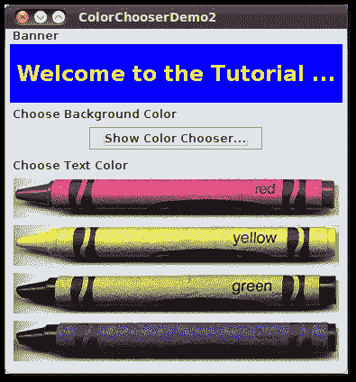

# 如何使用颜色选择器

> 原文：[`docs.oracle.com/javase/tutorial/uiswing/components/colorchooser.html`](https://docs.oracle.com/javase/tutorial/uiswing/components/colorchooser.html)

使用[`JColorChooser`](https://docs.oracle.com/javase/8/docs/api/javax/swing/JColorChooser.html)类使用户可以从调色板中选择颜色。颜色选择器是一个组件，您可以将其放置在程序 GUI 中的任何位置。`JColorChooser` API 还可以轻松地弹出包含颜色选择器的对话框（模态或非模态）。

这是一个使用颜色选择器设置横幅文本颜色的应用程序的图片：


* * *

**试试这个：**

+   单击“启动”按钮以使用[Java™ Web Start](http://www.oracle.com/technetwork/java/javase/javawebstart/index.html)运行 ColorChooser 演示（[下载 JDK](http://www.oracle.com/technetwork/java/javase/downloads/index.html)）。或者，要自行编译和运行示例，请参考示例索引。

* * *

该程序的源代码位于`ColorChooserDemo.java`中。

颜色选择器包括标有**选择文本颜色**的框内的所有内容。这是 Java 外观和感觉中标准颜色选择器的样子。它包含两部分，一个选项卡窗格和一个预览面板。选项卡窗格中的三个选项卡选择*选择器面板*。选项卡窗格下方的*预览面板*显示当前选定的颜色。

这是创建`JColorChooser`实例并将其添加到容器的示例代码：

```java
public class ColorChooserDemo extends JPanel ... {
    public ColorChooserDemo() {
        super(new BorderLayout());
        banner = new JLabel("Welcome to the Tutorial Zone!",
                            JLabel.CENTER);
        banner.setForeground(Color.yellow);
        . . .
        tcc = new JColorChooser(banner.getForeground());
        . . .
        add(tcc, BorderLayout.PAGE_END);
    }

```

在上一个代码片段中，`JColorChooser`构造函数接受一个`Color`参数，该参数指定了选择器的初始选定颜色。如果您没有指定初始颜色，则颜色选择器将显示`Color.white`。请查看[`Color` API 文档](https://docs.oracle.com/javase/8/docs/api/java/awt/Color.html)以获取可用的颜色常量列表。

颜色选择器使用[`ColorSelectionModel`](https://docs.oracle.com/javase/8/docs/api/javax/swing/colorchooser/ColorSelectionModel.html)的实例来包含和管理当前选择。颜色选择模型在用户更改颜色时触发更改事件。示例程序向颜色选择模型注册了更改侦听器，以便能够更新窗口顶部的横幅。以下代码注册并实现了更改侦听器：

```java
tcc.getSelectionModel().addChangeListener(this);
. . .
public void stateChanged(ChangeEvent e) {
    Color newColor = tcc.getColor();
    banner.setForeground(newColor);
}

```

有关更改侦听器和更改事件的一般信息，请参阅如何编写更改侦听器。

像示例程序中使用的基本颜色选择器对于许多程序来说已经足够了。然而，颜色选择器 API 允许您通过提供自己设计的预览面板、向其添加自定义选择器面板或移除颜色选择器中的现有选择器面板来自定义颜色选择器。此外，`JColorChooser`类提供了两个方法，使得在对话框中使用颜色选择器变得简单。

本节的其余部分讨论以下主题：

+   另一个示例：ColorChooserDemo2

+   在对话框中显示颜色选择器

+   移除或替换预览面板

+   创建自定义选择器面板

+   颜色选择器 API

+   使用颜色选择器的示例

## 另一个示例：ColorChooserDemo2

现在让我们转向 ColorChooserDemo2，这是前一个演示程序的修改版本，使用了更多的`JColorChooser`API。

* * *

**试试这个：**

+   点击启动按钮以使用[Java™ Web Start](http://www.oracle.com/technetwork/java/javase/javawebstart/index.html)运行 ColorChooser Demo（[下载 JDK](http://www.oracle.com/technetwork/java/javase/downloads/index.html)）。或者，要自己编译和运行示例，请参考示例索引。

* * *

这里是 ColorChooserDemo2 的图片：



该程序自定义了横幅文本颜色选择器的方式如下：

+   移除预览面板

+   移除所有默认的选择器面板

+   添加一个自定义选择器面板

移除或替换预览面板涵盖了第一个自定义。创建自定义选择器面板讨论了后两个。

该程序还添加了一个按钮，点击后会在对话框中打开一个颜色选择器，您可以用它来设置横幅的背景颜色。

## 在对话框中显示颜色选择器

`JColorChooser`类提供了两个类方法，使得在对话框中使用颜色选择器变得简单。ColorChooserDemo2 使用其中一个方法，`showDialog`，当用户点击**显示颜色选择器...**按钮时，会显示背景颜色选择器的对话框。以下是示例中用于在对话框中打开背景颜色选择器的单行代码：

```java
Color newColor = JColorChooser.showDialog(
                     ColorChooserDemo2.this,
                     "Choose Background Color",
                     banner.getBackground());

```

第一个参数是对话框的父级，第二个是对话框标题，第三个是初始选择的颜色。

对话框在三种情况下消失：用户选择颜色并点击**确定**按钮，用户使用**取消**按钮取消操作，或用户使用框架控件关闭对话框。如果用户选择了颜色，`showDialog` 方法将返回新颜色。如果用户取消操作或关闭窗口，则该方法返回 `null`。以下是根据 `showDialog` 返回值更新横幅背景颜色的示例代码：

```java
if (newColor != null) {
    banner.setBackground(newColor);
}

```

`showDialog` 创建的对话框是模态的。如果你想要一个非模态对话框，可以使用 `JColorChooser` 的 `createDialog` 方法来创建对话框。这个方法还允许你为对话框窗口中的**确定**和**取消**按钮指定动作监听器。使用 `JDialog` 的 `show` 方法来显示这个方法创建的对话框。有关使用此方法的示例，请参见指定其他编辑器中的如何使用表格部分。

## 移除或替换预览面板

默认情况下，颜色选择器显示一个预览面板。ColorChooserDemo2 使用以下代码移除文本颜色选择器的预览面板：

```java
tcc.setPreviewPanel(new JPanel());

```

这将有效地移除预览面板，因为普通的 `JPanel` 没有大小和默认视图。要将预览面板恢复为默认设置，请使用 `setPreviewPanel` 的参数为 `null`。

要提供自定义预览面板，还要使用 `setPreviewPanel`。你传递给该方法的组件应该继承自 `JComponent`，指定一个合理的大小，并提供当前颜色的自定义视图。要在用户更改颜色选择器中的颜色时收到通知，预览面板必须像之前描述的那样在颜色选择器的颜色选择模型上注册为更改监听器。

## 创建自定义选择器面板

默认颜色选择器提供五个选择器面板：

+   色板 — 用于从一组色板中选择颜色。

+   [HSV](http://en.wikipedia.org/wiki/HSL_and_HSV) — 用于使用色调-饱和度-亮度颜色表示选择颜色。在 JDK 7 之前，这被称为 HSB，代表色调-饱和度-亮度。

+   [HSL](http://en.wikipedia.org/wiki/HSL_and_HSV) — 用于使用色调-饱和度-亮度颜色表示选择颜色。这是 JDK 7 中的新功能。

+   [RGB](http://en.wikipedia.org/wiki/RGB_color_model) — 用于使用红-绿-蓝颜色模型选择颜色。

+   [CMYK](http://en.wikipedia.org/wiki/Cmyk) — 用于使用过程颜色或四色模型选择颜色。这是 JDK 7 中的新功能。

你可以通过使用 `addChooserPanel` 添加自己设计的选择器面板来扩展默认颜色选择器，或者通过使用 `removeChooserPanel` 删除选择器面板来限制它。

如果要删除所有默认的选择器面板并添加一个或多个自定义面板，可以通过单个调用`setChooserPanels`来实现。ColorChooserDemo2 使用此方法将默认选择器面板替换为`CrayonPanel`的实例，一个自定义选择器面板。以下是来自该示例的`setChooserPanels`调用：

```java
//Override the chooser panels with our own.
AbstractColorChooserPanel panels[] = { new CrayonPanel() };
tcc.setChooserPanels(panels);

```

代码很简单：它创建一个包含`CrayonPanel`的数组。接下来，代码调用`setChooserPanels`将数组的内容设置为颜色选择器的选择器面板。

`CrayonPanel`是[`AbstractColorChooserPanel`](https://docs.oracle.com/javase/8/docs/api/javax/swing/colorchooser/AbstractColorChooserPanel.html)的子类，并重写了其超类中定义的五个抽象方法：

**`void buildChooser()`**

创建包含选择器面板的 GUI。示例创建四个切换按钮 — 每个代表一个蜡笔 — 并将它们添加到选择器面板中。

**`void updateChooser()`**

每当显示选择器面板时，将调用此方法。此方法的实现选择代表当前选定颜色的切换按钮。

```java
public void updateChooser() {
    Color color = getColorFromModel();
    if (Color.red.equals(color)) {
        redCrayon.setSelected(true);
    } else if (Color.yellow.equals(color)) {
        yellowCrayon.setSelected(true);
    } else if (Color.green.equals(color)) {
        greenCrayon.setSelected(true);
    } else if (Color.blue.equals(color)) {
        blueCrayon.setSelected(true);
    }
}

```

**`String getDisplayName()`**

返回选择器面板的显示名称。该名称用于选择器面板的选项卡上。以下是示例`getDisplayName`方法：

```java
public String getDisplayName() {
    return "Crayons";
}

```

**`Icon getSmallDisplayIcon()`**

返回一个小图标来表示此选择器面板。目前未使用。将来的颜色选择器版本可能会使用此图标或大图标来表示此选择器面板在显示中的位置。此方法的示例实现返回`null`。

**`Icon getLargeDisplayIcon()`**

返回一个大图标来表示此选择器面板。目前未使用。将来的颜色选择器版本可能会使用此图标或小图标来表示此选择器面板在显示中的位置。此方法的示例实现返回`null`。

## 颜色选择器 API

以下表格列出了常用的`JColorChooser`构造函数和方法。您可能调用的其他方法在 The JComponent Class 的 API 表中列出。使用颜色选择器的 API 分为以下几类：

+   创建和显示颜色选择器

+   自定义颜色选择器 GUI

+   设置或获取当前颜色

创建和显示颜色选择器

| 方法或构造函数 | 目的 |
| --- | --- |

| [JColorChooser()](https://docs.oracle.com/javase/8/docs/api/javax/swing/JColorChooser.html#JColorChooser--) [JColorChooser(Color)](https://docs.oracle.com/javase/8/docs/api/javax/swing/JColorChooser.html#JColorChooser-java.awt.Color-)

[JColorChooser(ColorSelectionModel)](https://docs.oracle.com/javase/8/docs/api/javax/swing/JColorChooser.html#JColorChooser-javax.swing.colorchooser.ColorSelectionModel-) | 创建一个颜色选择器。默认构造函数创建一个初始颜色为`Color.white`的颜色选择器。使用第二个构造函数指定不同的初始颜色。当存在`ColorSelectionModel`参数时，为颜色选择器提供颜色选择模型。 |

| [Color showDialog(Component, String, Color)](https://docs.oracle.com/javase/8/docs/api/javax/swing/JColorChooser.html#showDialog-java.awt.Component-java.lang.String-java.awt.Color-) | 创建并显示一个颜色选择器在模态对话框中。`Component`参数是对话框的父级，`String`参数指定对话框标题，`Color`参数指定选择器的初始颜色。 |
| --- | --- |

| [JDialog createDialog(Component, String, boolean, JColorChooser, ActionListener,

ActionListener)](https://docs.oracle.com/javase/8/docs/api/javax/swing/JColorChooser.html#createDialog-java.awt.Component-java.lang.String-boolean-javax.swing.JColorChooser-java.awt.event.ActionListener-java.awt.event.ActionListener-) | 为指定的颜色选择器创建对话框。与`showDialog`一样，`Component`参数是对话框的父级，`String`参数指定对话框标题。其他参数如下：`boolean`指定对话框是否为模态，`JColorChooser`是要在对话框中显示的颜色选择器，第一个`ActionListener`是为**确定**按钮，第二个是为**取消**按钮。 |

自定义颜色选择器的 GUI

| 方法 | 目的 |
| --- | --- |
| [void setPreviewPanel(JComponent)](https://docs.oracle.com/javase/8/docs/api/javax/swing/JColorChooser.html#setPreviewPanel-javax.swing.JComponent-) [JComponent getPreviewPanel()](https://docs.oracle.com/javase/8/docs/api/javax/swing/JColorChooser.html#getPreviewPanel--) | 设置或获取用于预览颜色选择的组件。要移除预览面板，请使用`new JPanel()`作为参数。要指定默认预览面板，请使用`null`。 |
| [void setChooserPanels(AbstractColorChooserPanel[])](https://docs.oracle.com/javase/8/docs/api/javax/swing/JColorChooser.html#setChooserPanels-javax.swing.colorchooser.AbstractColorChooserPanel:A-) [AbstractColorChooserPanel[] getChooserPanels()](https://docs.oracle.com/javase/8/docs/api/javax/swing/JColorChooser.html#getChooserPanels--) | 设置或获取颜色选择器中的选择面板。 |
| [void addChooserPanel(AbstractColorChooserPanel)](https://docs.oracle.com/javase/8/docs/api/javax/swing/JColorChooser.html#addChooserPanel-javax.swing.colorchooser.AbstractColorChooserPanel-) [AbstractColorChooserPanel removeChooserPanel(AbstractColorChooserPanel)](https://docs.oracle.com/javase/8/docs/api/javax/swing/JColorChooser.html#removeChooserPanel-javax.swing.colorchooser.AbstractColorChooserPanel-) | 向颜色选择器添加选择器面板或从中移除选择器面板。 |
| [void setDragEnabled(boolean)](https://docs.oracle.com/javase/8/docs/api/javax/swing/JColorChooser.html#setDragEnabled-boolean-) [boolean getDragEnabled()](https://docs.oracle.com/javase/8/docs/api/javax/swing/JColorChooser.html#getDragEnabled--) | 设置或获取`dragEnabled`属性，该属性必须为 true 才能在此组件上启用拖放处理。默认值为 false。有关更多详细信息，请参阅拖放和数据传输。 |

设置或获取当前颜色

| 方法 | 目的 |
| --- | --- |

| [void setColor(Color)](https://docs.oracle.com/javase/8/docs/api/javax/swing/JColorChooser.html#setColor-java.awt.Color-) [void setColor(int, int, int)](https://docs.oracle.com/javase/8/docs/api/javax/swing/JColorChooser.html#setColor-int-int-int-)

[void setColor(int)](https://docs.oracle.com/javase/8/docs/api/javax/swing/JColorChooser.html#setColor-int-)

[Color getColor()](https://docs.oracle.com/javase/8/docs/api/javax/swing/JColorChooser.html#getColor--) | 设置或获取当前选择的颜色。`setColor`方法的三个整数版本将这三个整数一起解释为 RGB 颜色。`setColor`方法的单个整数版本将整数分成四个 8 位字节，并按以下方式解释整数为 RGB 颜色： |

| [void setSelectionModel(ColorSelectionModel)](https://docs.oracle.com/javase/8/docs/api/javax/swing/JColorChooser.html#setSelectionModel-javax.swing.colorchooser.ColorSelectionModel-) [ColorSelectionModel getSelectionModel()](https://docs.oracle.com/javase/8/docs/api/javax/swing/JColorChooser.html#getSelectionModel--) | 设置或获取颜色选择器的选择模型。该对象包含当前选择，并在选择更改时向注册的侦听器触发更改事件。 |
| --- | --- |

## 使用颜色选择器的示例

此表显示使用`JColorChooser`的示例以及这些示例的描述位置。

| 示例 | 描述位置 | 注意事项 |
| --- | --- | --- |
| ColorChooserDemo | 此部分 | 使用标准颜色选择器。 |
| ColorChooserDemo2 | 此部分 | 在使用`showDialog`创建的对话框中使用一个自定义颜色选择器和一个标准颜色选择器。 |
| TableDialogEditDemo | 如何使用表格 | 展示如何在表格中使用颜色选择器作为自定义单元格编辑器。该示例中使用的颜色选择器是通过`createDialog`创建的。 |
| BasicDnD | DnD 简介 | 使用不在对话框中的颜色选择器；演示了 Swing 组件的默认拖放功能，包括颜色选择器。 |
