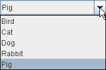
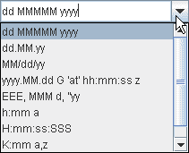
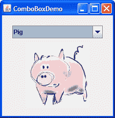
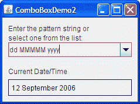
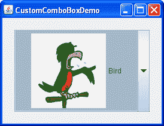

# 如何使用组合框

> 原文：[`docs.oracle.com/javase/tutorial/uiswing/components/combobox.html`](https://docs.oracle.com/javase/tutorial/uiswing/components/combobox.html)

一个[`JComboBox`](https://docs.oracle.com/javase/8/docs/api/javax/swing/JComboBox.html)，允许用户选择多个选择项之一，可以有两种非常不同的形式。默认形式是不可编辑的组合框，其中包含一个按钮和一个值的下拉列表。第二种形式称为可编辑的组合框，其中包含一个与之相邻的小按钮的文本字段。用户可以在文本字段中键入一个值或单击按钮以显示下拉列表。以下是 Java 外观中两种形式的组合框的样子：

|  |  |
| --- | --- |
|  |  |
| 不可编辑的组合框，在按钮被点击前（顶部）和之后 | 可编辑的组合框，在箭头按钮被点击前和之后 |

组合框需要很少的屏幕空间，它们的可编辑（文本字段）形式对于让用户快速选择一个值而不限制用户在显示的值上是有用的。其他可以显示多个选择项之一的组件包括单选按钮和列表组。单选按钮组通常是用户最容易理解的，但当空间有限或有多个选择项可用时，组合框可能更合适。列表并不是非常吸引人，但当项目数量较大（比如超过 20 个）或选择多个项目可能是有效的时，它们比组合框更合适。

由于可编辑和不可编辑的组合框非常不同，因此本节将它们分开处理。本节涵盖以下主题：

+   使用不可编辑的组合框

+   处理组合框上的事件

+   使用可编辑的组合框

+   提供自定义渲染器

+   组合框 API

+   使用组合框的示例

## 使用不可编辑的组合框

此处显示的应用程序使用不可编辑的组合框来选择宠物图片：



* * *

**试试这个：**

1.  单击“启动”按钮以使用[Java™ Web Start](http://www.oracle.com/technetwork/java/javase/javawebstart/index.html)运行 ComboBox Demo（[下载 JDK 7 或更高版本](http://www.oracle.com/technetwork/java/javase/downloads/index.html)）。或者，要自行编译和运行示例，请参考示例索引。

1.  从组合框中选择一个动物名称以查看其图片。

1.  将此程序的操作和 GUI 与使用单选按钮的程序进行比较：[运行 RadioButtonDemo](https://docs.oracle.com/javase/tutorialJWS/samples/uiswing/RadioButtonDemoProject/RadioButtonDemo.jnlp)（需要版本 6）。您可能还想比较源代码：`ComboBoxDemo.java` vs. `RadioButtonDemo.java`。

* * *

下面的代码取自`ComboBoxDemo.java`，创建一个不可编辑的组合框并设置它：

```java
String[] petStrings = { "Bird", "Cat", "Dog", "Rabbit", "Pig" };

//Create the combo box, select item at index 4.
//Indices start at 0, so 4 specifies the pig.
JComboBox petList = new JComboBox(petStrings);
petList.setSelectedIndex(4);
petList.addActionListener(this);

```

这个组合框包含一个字符串数组，但您也可以使用图标。要将其他内容放入组合框或自定义组合框中的项目外观，您需要编写自定义渲染器。可编辑的组合框还需要一个自定义编辑器。请参考提供自定义渲染器以获取信息和示例。

前面的代码在组合框上注册了一个动作监听器。要查看动作监听器的实现并了解组合框支持的其他类型的监听器，请参考处理组合框上的事件。

无论使用哪个构造函数，组合框都使用组合框模型来包含和管理其菜单中的项目。当您使用数组或向量初始化组合框时，组合框会为您创建一个默认的模型对象。与其他 Swing 组件一样，您可以通过实现自定义模型（实现[`ComboBoxModel`](https://docs.oracle.com/javase/8/docs/api/javax/swing/ComboBoxModel.html)接口的对象）来部分自定义组合框。

* * *

**注意：**

在为组合框实现自定义模型时要小心。`JComboBox`中更改组合框菜单中项目的方法，如`insertItemAt`，仅在数据模型实现[`MutableComboBoxModel`](https://docs.oracle.com/javase/8/docs/api/javax/swing/MutableComboBoxModel.html)接口（`ComboBoxModel`的子接口）时才有效。请参考 API 表以查看受影响的方法。

还要注意的另一件事是，即使对于不可编辑的组合框，也要确保您的自定义模型在组合框的数据或状态更改时触发 list data events。即使数据永远不会更改的不可变组合框模型，在选择更改时也必须触发列表数据事件（`CONTENTS_CHANGED`事件）。一个简单的方法是将您的组合框模型作为[`AbstractListModel`](https://docs.oracle.com/javase/8/docs/api/javax/swing/AbstractListModel.html)的子类，以获得列表数据事件触发代码。

* * *

## 处理组合框上的事件

这是在`ComboBoxDemo.java`中注册和实现组合框上动作监听器的代码：

```java
public class ComboBoxDemo ... implements ActionListener {
    . . .
        petList.addActionListener(this) {
    . . .
    public void actionPerformed(ActionEvent e) {
        JComboBox cb = (JComboBox)e.getSource();
        String petName = (String)cb.getSelectedItem();
        updateLabel(petName);
    }
    . . .
}

```

此动作侦听器从组合框中获取新选择的项目，使用它来计算图像文件的名称，并更新标签以显示图像。当用户从组合框菜单中选择项目时，组合框会触发一个动作事件。有关实现动作侦听器的一般信息，请参阅如何编写动作侦听器。

组合框还会生成项目事件，当任何项目的选择状态发生变化时会触发这些事件。在组合框中一次只能选择一个项目，因此当用户进行新选择时，先前选择的项目将取消选择。因此，每次用户从菜单中选择不同项目时都会触发两个项目事件。如果用户选择相同项目，则不会触发项目事件。使用`addItemListener`在组合框上注册项目侦听器。如何编写项目侦听器提供了有关实现项目侦听器的一般信息。

尽管`JComboBox`继承了用于注册低级事件的方法 — 例如焦点、键盘和鼠标事件 — 但我们建议不要在组合框上监听低级事件。原因在于：组合框是一个*复合组件* — 它由两个或更多其他组件组成。组合框本身会触发高级事件，如动作事件。其子组件会触发低级事件，如鼠标、键盘和焦点事件。低级事件和触发它们的子组件是与外观相关的。为了避免编写与外观相关的代码，您应该只在复合组件（如组合框）上监听高级事件。有关事件的信息，包括有关高级和低级事件的讨论，请参阅编写事件侦听器。

## 使用可编辑的组合框

这是一个演示应用程序的图片，该应用程序使用可编辑的组合框来输入用于格式化日期的模式。



* * *

**试试这个：**

1.  点击“启动”按钮以使用[Java™ Web Start](http://www.oracle.com/technetwork/java/javase/javawebstart/index.html)运行 ComboBox2 演示（[下载 JDK 7 或更高版本](http://www.oracle.com/technetwork/java/javase/downloads/index.html)）。或者，要自行编译和运行示例，请参考示例索引。

1.  通过从组合框菜单中选择一个新模式来输入新模式。程序会重新格式化当前日期和时间。

1.  通过键入一个新模式并按 Enter 来输入新模式。程序会再次重新格式化当前日期和时间。

* * *

以下代码取自`ComboBoxDemo2.java`，创建并设置了组合框：

```java
String[] patternExamples = {
         "dd MMMMM yyyy",
         "dd.MM.yy",
         "MM/dd/yy",
         "yyyy.MM.dd G 'at' hh:mm:ss z",
         "EEE, MMM d, ''yy",
         "h:mm a",
         "H:mm:ss:SSS",
         "K:mm a,z",
         "yyyy.MMMMM.dd GGG hh:mm aaa"
};
. . .
JComboBox patternList = new JComboBox(patternExamples);
patternList.setEditable(true);
patternList.addActionListener(this);

```

此代码与前一个示例非常相似，但需要解释几句。粗体代码明确打开编辑以允许用户输入值。这是必要的，因为默认情况下，组合框不可编辑。此特定示例允许在组合框上进行编辑，因为其菜单不提供所有可能的日期格式化模式，只提供常用模式的快捷方式。

可编辑的组合框在用户从菜单中选择项目和用户键入 Enter 时会触发动作事件。请注意，当用户在组合框中输入值时，菜单保持不变。如果需要，您可以轻松编写一个动作侦听器，每次用户键入唯一值时都向组合框的菜单添加一个新项目。

请参阅国际化以了解有关格式化日期和其他类型数据的更多信息。

## 提供自定义渲染器

组合框使用*渲染器*来显示其菜单中的每个项目。如果组合框不可编辑，则还使用渲染器来显示当前选定的项目。另一方面，可编辑的组合框使用*编辑器*来显示所选项目。组合框的渲染器必须实现[`ListCellRenderer`](https://docs.oracle.com/javase/8/docs/api/javax/swing/ListCellRenderer.html)接口。组合框的编辑器必须实现[`ComboBoxEditor`](https://docs.oracle.com/javase/8/docs/api/javax/swing/ComboBoxEditor.html)。本节展示了如何为不可编辑的组合框提供自定义渲染器。

默认渲染器知道如何渲染字符串和图标。如果您将其他对象放入组合框中， 默认渲染器将调用`toString`方法提供要显示的字符串。您可以通过实现自己的`ListCellRenderer`来自定义组合框及其项目的渲染方式。

这是一个使用具有自定义渲染器的组合框的应用程序的图片：



单击“启动”按钮以使用[Java™ Web Start](http://www.oracle.com/technetwork/java/javase/javawebstart/index.html)运行 CustomComboBox 演示（[下载 JDK 7 或更高版本](http://www.oracle.com/technetwork/java/javase/downloads/index.html)）。或者，要自行编译和运行示例，请参考示例索引。


此示例的完整源代码位于`CustomComboBoxDemo.java`中。要获取所需的图像文件，请参考示例索引。

示例中的以下语句创建了`ComboBoxRenderer`（一个自定义类）的实例，并将该实例设置为组合框的渲染器：

```java
JComboBox petList = new JComboBox(intArray);
. . .
ComboBoxRenderer renderer = new ComboBoxRenderer();
renderer.setPreferredSize(new Dimension(200, 130));
petList.setRenderer(renderer);
petList.setMaximumRowCount(3);

```

最后一行设置了组合框的最大行数，这决定了菜单显示时可见的项目数量。如果组合框中的项目数量大于其最大行数，则菜单会有滚动条。菜单中的图标对于一个菜单来说相当大，因此我们的代码将行数限制为 3。这是`ComboBoxRenderer`的实现，一个将图标和文本并排放置的渲染器：

```java
class ComboBoxRenderer extends JLabel
                       implements ListCellRenderer {
    . . .
    public ComboBoxRenderer() {
        setOpaque(true);
        setHorizontalAlignment(CENTER);
        setVerticalAlignment(CENTER);
    }

    /*
     * This method finds the image and text corresponding
     * to the selected value and returns the label, set up
     * to display the text and image.
     */
    public Component getListCellRendererComponent(
                                       JList list,
                                       Object value,
                                       int index,
                                       boolean isSelected,
                                       boolean cellHasFocus) {
        //Get the selected index. (The index parameter isn't
        //always valid, so just use the value.)
        int selectedIndex = ((Integer)value).intValue();

        if (isSelected) {
            setBackground(list.getSelectionBackground());
            setForeground(list.getSelectionForeground());
        } else {
            setBackground(list.getBackground());
            setForeground(list.getForeground());
        }

        //Set the icon and text.  If icon was null, say so.
        ImageIcon icon = images[selectedIndex];
        String pet = petStrings[selectedIndex];
        setIcon(icon);
        if (icon != null) {
            setText(pet);
            setFont(list.getFont());
        } else {
            setUhOhText(pet + " (no image available)",
                        list.getFont());
        }

        return this;
    }
    . . .
}

```

作为`ListCellRenderer`，`ComboBoxRenderer`实现了一个名为`getListCellRendererComponent`的方法，该方法返回一个组件，其`paintComponent`方法用于显示组合框及其每个项目。显示图像和图标的最简单方法是使用标签。因此，`ComboBoxRenderer`是标签的子类并返回自身。`getListCellRendererComponent`的实现配置了渲染器以显示当前选定的图标及其描述。

这些参数被传递给`getListCellRendererComponent`：

+   `JList list` — 用于在幕后显示项目的列表对象。示例使用此对象的颜色来设置前景色和背景色。

+   `Object value` — 要渲染的对象。在本例中是一个`Integer`。

+   `int index` — 要渲染的对象的索引。

+   `boolean isSelected` — 指示要渲染的对象是否被选中。示例使用它来确定使用哪些颜色。

+   `boolean cellHasFocus` — 指示要渲染的对象是否具有焦点。

请注意，组合框和列表使用相同类型的渲染器 — `ListCellRenderer`。如果对于您的程序有意义，您可以通过在组合框和列表之间共享渲染器来节省一些时间。

## 组合框 API

以下表列出了常用的`JComboBox`构造函数和方法。您最有可能在`JComboBox`对象上调用的其他方法是从其超类继承的方法，例如`setPreferredSize`。请参阅 The JComponent API 以查看常用继承方法的表格。

使用组合框的 API 分为两类：

+   设置或获取组合框菜单中的项目

+   自定义组合框的操作

设置或获取组合框菜单中的项目

| 方法 | 目的 |
| --- | --- |

| [JComboBox()](https://docs.oracle.com/javase/8/docs/api/javax/swing/JComboBox.html#JComboBox--) [JComboBox(ComboBoxModel)](https://docs.oracle.com/javase/8/docs/api/javax/swing/JComboBox.html#JComboBox-javax.swing.ComboBoxModel-)

[JComboBox(Object[])](https://docs.oracle.com/javase/8/docs/api/javax/swing/JComboBox.html#JComboBox-java.lang.Object:A-)

[JComboBox(Vector)](https://docs.oracle.com/javase/8/docs/api/javax/swing/JComboBox.html#JComboBox-java.util.Vector-) | 创建一个具有指定项目的组合框菜单。使用默认构造函数创建的组合框初始时没有项目在菜单中。其他每个构造函数都从其参数初始化菜单：一个模型对象，一个对象数组或一个`Vector`对象。

| [void addItem(Object)](https://docs.oracle.com/javase/8/docs/api/javax/swing/JComboBox.html#addItem-java.lang.Object-) [void insertItemAt(Object, int)](https://docs.oracle.com/javase/8/docs/api/javax/swing/JComboBox.html#insertItemAt-java.lang.Object-int-) | 将指定对象添加或插入到组合框菜单中。插入方法将指定对象*放在*指定索引处，因此在该索引处当前对象之前插入它。这些方法要求组合框的数据模型是`MutableComboBoxModel`的实例。 |
| --- | --- |
| [Object getItemAt(int)](https://docs.oracle.com/javase/8/docs/api/javax/swing/JComboBox.html#getItemAt-int-) [Object getSelectedItem()](https://docs.oracle.com/javase/8/docs/api/javax/swing/JComboBox.html#getSelectedItem--) | 从组合框菜单中获取一个项目。 |

| [void removeAllItems()](https://docs.oracle.com/javase/8/docs/api/javax/swing/JComboBox.html#removeAllItems--) [void removeItemAt(int)](https://docs.oracle.com/javase/8/docs/api/javax/swing/JComboBox.html#removeItemAt-int-)

[void removeItem(Object)](https://docs.oracle.com/javase/8/docs/api/javax/swing/JComboBox.html#removeItem-java.lang.Object-) | 从组合框菜单中移除一个或多个项目。这些方法要求组合框的数据模型是`MutableComboBoxModel`的实例。

| [int getItemCount()](https://docs.oracle.com/javase/8/docs/api/javax/swing/JComboBox.html#getItemCount--) | 获取组合框菜单中项目的数量。 |
| --- | --- |
| [void setModel(ComboBoxModel)](https://docs.oracle.com/javase/8/docs/api/javax/swing/JComboBox.html#setModel-javax.swing.ComboBoxModel-) [ComboBoxModel getModel()](https://docs.oracle.com/javase/8/docs/api/javax/swing/JComboBox.html#getModel--) | 设置或获取提供组合框菜单中项目的数据模型。 |
| [void setAction(Action)](https://docs.oracle.com/javase/8/docs/api/javax/swing/JComboBox.html#setAction-javax.swing.Action-) [Action getAction()](https://docs.oracle.com/javase/8/docs/api/javax/swing/JComboBox.html#getAction--) | 设置或获取与组合框关联的`Action`。有关更多信息，请参阅如何使用操作。 |

自定义组合框的操作

| 方法或构造函数 | 目的 |
| --- | --- |
| [void addActionListener(ActionListener)](https://docs.oracle.com/javase/8/docs/api/javax/swing/JComboBox.html#addActionListener-java.awt.event.ActionListener-) | 向组合框添加动作监听器。当用户从组合框菜单中选择项目时，或者在可编辑的组合框中，当用户按下 Enter 键时，将调用监听器的`actionPerformed`方法。 |
| [void addItemListener(ItemListener)](https://docs.oracle.com/javase/8/docs/api/javax/swing/JComboBox.html#addItemListener-java.awt.event.ItemListener-) | 向组合框添加项目监听器。当任何组合框项目的选择状态发生变化时，将调用监听器的`itemStateChanged`方法。 |
| [void setEditable(boolean)](https://docs.oracle.com/javase/8/docs/api/javax/swing/JComboBox.html#setEditable-boolean-) [boolean isEditable()](https://docs.oracle.com/javase/8/docs/api/javax/swing/JComboBox.html#isEditable--) | 设置或获取用户是否可以在组合框中输入。 |
| [void setRenderer(ListCellRenderer)](https://docs.oracle.com/javase/8/docs/api/javax/swing/JComboBox.html#setRenderer-javax.swing.ListCellRenderer-) [ListCellRenderer getRenderer()](https://docs.oracle.com/javase/8/docs/api/javax/swing/JComboBox.html#getRenderer--) | 设置或获取负责在组合框中绘制所选项目的对象。仅当组合框不可编辑时才使用渲染器。如果组合框是可编辑的，则编辑器用于绘制所选项目。 |
| [void setEditor(ComboBoxEditor)](https://docs.oracle.com/javase/8/docs/api/javax/swing/JComboBox.html#setEditor-javax.swing.ComboBoxEditor-) [ComboBoxEditor getEditor()](https://docs.oracle.com/javase/8/docs/api/javax/swing/JComboBox.html#getEditor--) | 设置或获取负责在组合框中绘制和编辑所选项目的对象。仅当组合框可编辑时才使用编辑器。如果组合框不可编辑，则使用渲染器来绘制所选项目。 |

## 使用组合框的示例

这个表格展示了使用`JComboBox`的示例以及这些示例的描述位置。

| 示例 | 描述位置 | 注释 |
| --- | --- | --- |
| `ComboBoxDemo` | 这一部分 | 使用不可编辑的组合框。 |
| `ComboBoxDemo2` | 这一部分 | 使用可编辑的组合框。 |
| `CustomComboBoxDemo` | 这一部分 | 为组合框提供自定义渲染器。 |
| `TableRenderDemo` | 如何使用表格（将组合框用作编辑器） | 展示了如何将组合框用作表格单元格编辑器。 |
