# 如何制作对话框

> 原文：[`docs.oracle.com/javase/tutorial/uiswing/components/dialog.html`](https://docs.oracle.com/javase/tutorial/uiswing/components/dialog.html)

对话框窗口是一个独立的子窗口，用于在主 Swing 应用程序窗口之外显示临时通知。大多数对话框向用户呈现错误消息或警告，但对话框也可以呈现图像、目录树或与管理它们的主要 Swing 应用程序兼容的任何内容。

为了方便起见，几个 Swing 组件类可以直接实例化和显示*对话框*。要创建简单的标准对话框，您可以使用 [`JOptionPane`](https://docs.oracle.com/javase/8/docs/api/javax/swing/JOptionPane.html) 类。`ProgressMonitor` 类可以显示操作的进度对话框。另外两个类，`JColorChooser` 和 `JFileChooser`，也提供标准对话框。要打开打印对话框，您可以使用打印 API。要创建自定义对话框，请直接使用 [`JDialog`](https://docs.oracle.com/javase/8/docs/api/javax/swing/JDialog.html) 类。

简单对话框的代码可以很简洁。例如，这是一个信息对话框：

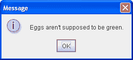

以下是创建和显示它的代码：

```java
JOptionPane.showMessageDialog(frame, "Eggs are not supposed to be green.");

```

本节的其余部分涵盖以下主题：

+   对话框概述

+   对话框示例

+   JOptionPane 功能

+   创建和显示简单对话框

+   自定义按钮文本

+   从对话框获取用户输入

+   停止自动关闭对话框

+   对话框 API

+   使用对话框的示例

## 对话框概述

每个对话框都依赖于一个 Frame 组件。当该 Frame 被销毁时，其依赖的对话框也会被销毁。当 Frame 最小化时，其依赖的对话框也会从屏幕上消失。当 Frame 最大化时，其依赖的对话框会重新显示在屏幕上。Swing 的 JDialog 类从 AWT 的 `Dialog` 类继承了这种行为。

对话框可以是*模态*的。当模态对话框可见时，它会阻止用户对程序中所有其他窗口的输入。JOptionPane 创建的 `JDialog` 是模态的。要创建非模态对话框，必须直接使用 `JDialog` 类。

从 JDK 7 开始，您可以使用新的 Modality API 修改对话框窗口的模态行为。详情请参阅[新的 Modality API](http://www.oracle.com/technetwork/articles/javase/modality-137604.html)。

`JDialog` 类是 AWT [`java.awt.Dialog`](https://docs.oracle.com/javase/8/docs/api/java/awt/Dialog.html) 类的子类。它为 `Dialog` 对象添加了一个根窗格容器和默认关闭操作的支持。这些都是 `JFrame` 具有的相同特性，直接使用 `JDialog` 非常类似于使用 `JFrame`。如果你要直接使用 `JDialog`，那么你应该了解 使用顶层容器 和 如何创建框架 中的内容，特别是 响应窗口关闭事件。

即使你使用 `JOptionPane` 实现对话框，背后仍然使用 `JDialog`。原因是 `JOptionPane` 只是一个容器，可以自动创建一个 `JDialog` 并将自身添加到 `JDialog` 的内容窗格中。

## DialogDemo 示例

这是一个显示对话框的应用程序的图片。

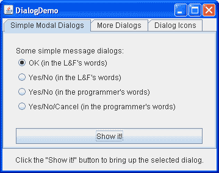

* * *

**试试这个：**

1.  点击启动按钮以使用 [Java™ Web Start](http://www.oracle.com/technetwork/java/javase/javawebstart/index.html) 运行 Dialog Demo（[下载 JDK 7 或更高版本](http://www.oracle.com/technetwork/java/javase/downloads/index.html)）。或者，要自行编译和运行示例，请参考 示例索引。

1.  点击 Show it! 按钮。

    一个模态对话框将出现。在关闭它之前，应用程序将无响应，尽管如果需要会重绘自身。你可以通过在对话框中点击按钮或显式关闭，例如使用对话框窗口装饰，来关闭对话框。

1.  在更多对话框面板中，点击底部的单选按钮，然后点击 Show it! 按钮。

    一个非模态对话框将出现。请注意，当非模态对话框出现时，DialogDemo 窗口仍然完全可用。

1.  当非模态对话框显示时，将 DialogDemo 窗口最小化。

    对话框将从屏幕上消失，直到你将 DialogDemo 窗口还原。

* * *

## JOptionPane 特性

使用 `JOptionPane`，你可以快速创建和自定义几种不同类型的对话框。`JOptionPane` 提供了支持布局标准对话框、提供图标、指定对话框标题和文本以及自定义按钮文本的功能。其他功能允许你自定义对话框显示的组件，并指定对话框应该出现在屏幕的位置。你甚至可以指定选项对话框将自己放入一个内部框架 (`JInternalFrame`) 而不是一个 `JDialog`。

当你创建一个 `JOptionPane` 时，与外观相关的代码会向 `JOptionPane` 添加组件并确定这些组件的布局。

`JOptionPane`的图标支持让您可以轻松指定对话框显示的图标。您可以使用自定义图标，没有图标，或者四种标准`JOptionPane`图标之一（问题，信息，警告和错误）。每种外观和感觉都有其自己版本的这四个标准图标。下图显示了 Java（和 Windows）外观和感觉中使用的图标。

**JOptionPane 使用的图标**

| 图标描述 | Java 外观和感觉 | Windows 外观和感觉 |
| --- | --- | --- |
| 问题 |  |  |
| 信息 |  |  |
| 警告 |  |  |
| 错误 |  |  |

## 创建和显示简单对话框

对于大多数简单的模态对话框，您可以使用`JOptionPane`的`show*Xxx*Dialog`方法创建和显示对话框。如果您的对话框应该是一个内部框架，那么在`show`后面添加`Internal`，例如，`showMessageDialog`变为`showInternalMessageDialog`。如果您需要控制对话框的窗口关闭行为，或者不希望对话框是模态的，那么您应该直接实例化`JOptionPane`并将其添加到`JDialog`实例中。然后在`JDialog`上调用`setVisible(true)`使其显示。

最有用的两个`show*Xxx*Dialog`方法是`showMessageDialog`和`showOptionDialog`。`showMessageDialog`方法显示一个简单的单按钮对话框。`showOptionDialog`方法显示一个自定义对话框，可以显示各种带有自定义按钮文本的按钮，并且可以包含标准文本消息或一组组件。

另外两个`show*Xxx*Dialog`方法使用较少。`showConfirmDialog`方法要求用户确认某事，但呈现标准按钮文本（例如 Yes/No 或本地化等效文本），而不是根据用户情况定制的按钮文本（例如 Start/Cancel）。第四个方法`showInputDialog`旨在显示一个模态对话框，从用户那里获取一个字符串，可以使用文本字段，不可编辑的组合框或列表。

以下是一些示例，取自`DialogDemo.java`，演示了如何使用`showMessageDialog`、`showOptionDialog`和`JOptionPane`构造函数。有关更多示例代码，请参见`DialogDemo.java`和使用对话框的示例中列出的其他程序。

**`showMessageDialog`**

显示一个带有一个按钮的模态对话框，按钮标记为“确定”（或本地化等效）。您可以轻松指定对话框显示的消息、图标和标题。以下是使用`showMessageDialog`的一些示例：

|  |
| --- |

```java
//default title and icon
JOptionPane.showMessageDialog(frame,
    "Eggs are not supposed to be green.");

```

|

| 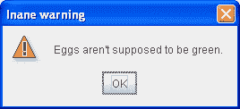 |
| --- |

```java
//custom title, warning icon
JOptionPane.showMessageDialog(frame,
    "Eggs are not supposed to be green.",
    "Inane warning",
    JOptionPane.WARNING_MESSAGE);

```

|

| 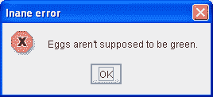 |
| --- |

```java
//custom title, error icon
JOptionPane.showMessageDialog(frame,
    "Eggs are not supposed to be green.",
    "Inane error",
    JOptionPane.ERROR_MESSAGE);

```

|

| 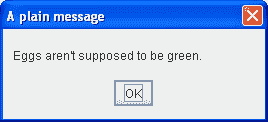 |
| --- |

```java
//custom title, no icon
JOptionPane.showMessageDialog(frame,
    "Eggs are not supposed to be green.",
    "A plain message",
    JOptionPane.PLAIN_MESSAGE);

```

|

| 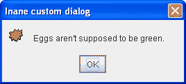 |
| --- |

```java
//custom title, custom icon
JOptionPane.showMessageDialog(frame,
    "Eggs are not supposed to be green.",
    "Inane custom dialog",
    JOptionPane.INFORMATION_MESSAGE,
    icon);

```

|

**`showOptionDialog`**

显示一个带有指定按钮、图标、消息、标题等的模态对话框。使用此方法，您可以更改标准对话框上按钮上显示的文本。您还可以执行许多其他类型的自定义。

| 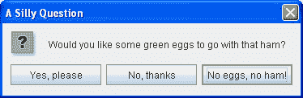 |
| --- |

|

```java
//Custom button text
Object[] options = {"Yes, please",
                    "No, thanks",
                    "No eggs, no ham!"};
int n = JOptionPane.showOptionDialog(frame,
    "Would you like some green eggs to go "
    + "with that ham?",
    "A Silly Question",
    JOptionPane.YES_NO_CANCEL_OPTION,
    JOptionPane.QUESTION_MESSAGE,
    null,
    options,
    options[2]);

```

|

**`JOptionPane`（构造函数）**

创建一个带有指定按钮、图标、消息、标题等的`JOptionPane`。然后您必须将选项窗格添加到`JDialog`，在选项窗格上注册属性更改侦听器，并显示对话框。有关详细信息，请参见停止自动对话框关闭。

| 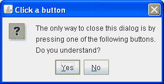 |
| --- |

|

```java
final JOptionPane optionPane = new JOptionPane(
    "The only way to close this dialog is by\n"
    + "pressing one of the following buttons.\n"
    + "Do you understand?",
    JOptionPane.QUESTION_MESSAGE,
    JOptionPane.YES_NO_OPTION);

```

|

所有`show*Xxx*Dialog`方法和`JOptionPane`构造函数的参数都是标准化的，尽管每种方法和构造函数的参数数量不同。以下列表描述了每个参数。要查看特定方法的确切参数列表，请参见对话框 API。

`Component *parentComponent*`

每个`show*Xxx*Dialog`方法的第一个参数始终是父组件，它必须是一个 Frame、Frame 内的组件或 null。如果指定了 Frame 或 Dialog，则对话框将出现在 Frame 的中心，并遵循该 Frame 的焦点行为。如果指定了 Frame 内的组件，则对话框将出现在该组件的中心，并遵循该组件的 Frame 的焦点行为。如果指定为 *null*，则外观和感觉将选择对话框的适当位置——通常是屏幕的中心——对话框不一定遵循任何可见 Frame 或 Dialog 的焦点行为。

`JOptionPane`构造函数不包括此参数。相反，您在创建包含`JOptionPane`的`JDialog`时指定父框架，并使用`JDialog`的`setLocationRelativeTo`方法设置对话框位置。

`Object *message*`

此必需参数指定对话框在主区域中应显示的内容。通常，您会指定一个字符串，这将导致对话框显示具有指定文本的标签。您可以通过在消息字符串中放置换行符（`\n`）来将消息分成多行。例如：

```java
"Complete the sentence:\n \"Green eggs and...\""

```

`String *title*`

对话框的标题。

`int *optionType*`

指定出现在对话框底部的按钮集。从以下标准集之一中选择：`DEFAULT_OPTION`，`YES_NO_OPTION`，`YES_NO_CANCEL_OPTION`，`OK_CANCEL_OPTION`。

`int *messageType*`

此参数确定对话框中显示的图标。从以下值中选择一个：`PLAIN_MESSAGE`（无图标），`ERROR_MESSAGE`，`INFORMATION_MESSAGE`，`WARNING_MESSAGE`，`QUESTION_MESSAGE`。

`Icon *icon*`

要在对话框中显示的图标。

`Object[] *options*`

通常用于指定对话框底部每个按钮显示的字符串。有关更多信息，请参阅在标准对话框中自定义按钮文本。也可用于指定要由按钮显示的图标或要添加到按钮行的非按钮组件。

`Object *initialValue*`

指定要选择的默认值。

您可以让选项窗格显示其默认图标，也可以使用消息类型或图标参数指定图标。默认情况下，使用`showMessageDialog`创建的选项窗格显示信息图标，使用`showConfirmDialog`或`showInputDialog`创建的选项窗格显示问题图标，使用`JOptionPane`构造函数创建的选项窗格不显示图标。要指定对话框显示标准图标或不显示图标，请指定与所需图标对应的消息类型。要指定自定义图标，请使用图标参数。只要图标参数具有非空值，图标参数就优先于消息类型；对话框将显示指定的图标。

## 自定义按钮文本

当您使用`JOptionPane`创建对话框时，您可以使用标准按钮文本（可能会因外观和语言环境而异）或指定不同的文本。默认情况下，选项窗格类型确定出现多少个按钮。例如，`YES_NO_OPTION`对话框有两个按钮，而`YES_NO_CANCEL_OPTION`对话框有三个按钮。

下面的代码取自`DialogDemo.java`，创建了两个 Yes/No 对话框。第一个对话框是使用`showConfirmDialog`实现的，该对话框使用外观词汇来表示两个按钮。第二个对话框使用`showOptionDialog`以便自定义词汇。除了词汇变化外，对话框是相同的。

| ![一个是/否对话框，用那些话来说[但也许被翻译]](../Images/6b161896a71ad68ce23a964338488f03.png) |
| --- |

```java
//default icon, custom title
int n = JOptionPane.showConfirmDialog(
    frame,
    "Would you like green eggs and ham?",
    "An Inane Question",
    JOptionPane.YES_NO_OPTION);

```

|

| 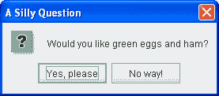 |
| --- |

```java
Object[] options = {"Yes, please",
                    "No way!"};
int n = JOptionPane.showOptionDialog(frame,
    "Would you like green eggs and ham?",
    "A Silly Question",
    JOptionPane.YES_NO_OPTION,
    JOptionPane.QUESTION_MESSAGE,
    null,     //do not use a custom Icon
    options,  //the titles of buttons
    options[0]); //default button title

```

|

正如前面的代码片段所示，`showMessageDialog`、`showConfirmDialog`和`showOptionDialog`方法返回一个指示用户选择的整数。这个整数的值是`YES_OPTION`、`NO_OPTION`、`CANCEL_OPTION`、`OK_OPTION`和`CLOSED_OPTION`。除了`CLOSED_OPTION`，每个选项对应用户按下的按钮。当返回`CLOSED_OPTION`时，表示用户显式关闭了对话框窗口，而不是通过选择选项窗格内的按钮。

即使更改标准对话框按钮显示的字符串，返回值仍然是预定义整数之一。例如，`YES_NO_OPTION`对话框始终返回以下值之一：`YES_OPTION`、`NO_OPTION`或`CLOSED_OPTION`。

## 从对话框获取用户输入

唯一不返回整数的`show*Xxx*Dialog`形式是`showInputDialog`，它返回一个`Object`。这个`Object`通常是反映用户选择的`String`。以下是使用`showInputDialog`创建一个对话框，让用户选择三个字符串的示例：

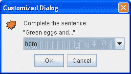

```java
Object[] possibilities = {"ham", "spam", "yam"};
String s = (String)JOptionPane.showInputDialog(
                    frame,
                    "Complete the sentence:\n"
                    + "\"Green eggs and...\"",
                    "Customized Dialog",
                    JOptionPane.PLAIN_MESSAGE,
                    icon,
                    possibilities,
                    "ham");

//If a string was returned, say so.
if ((s != null) && (s.length() > 0)) {
    setLabel("Green eggs and... " + s + "!");
    return;
}

//If you're here, the return value was null/empty.
setLabel("Come on, finish the sentence!");

```

如果您不在乎限制用户的选择，可以使用少量参数的`showInputDialog`方法形式之一，或者为对象数组指定`null`。在 Java 外观中，将`null`替换为`possibilities`会导致对话框具有文本字段并且看起来像这样：

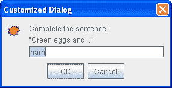

因为用户可以在文本字段中输入任何内容，您可能希望检查返回的值，并在无效时要求用户重试。另一种方法是创建一个自定义对话框，在返回之前验证用户输入的数据。查看`CustomDialog.java`以查看验证数据的示例。

如果您正在设计自定义对话框，您需要设计对话框的 API，以便查询对话框用户选择了什么。例如，`CustomDialog`有一个`getValidatedText`方法，返回用户输入的文本。

## 停止自动对话框关闭

默认情况下，当用户单击由`JOptionPane`创建的按钮时，对话框会关闭。但是如果您希望在关闭对话框之前检查用户的答案怎么办？在这种情况下，您必须实现自己的属性更改侦听器，以便当用户单击按钮时，对话框不会自动关闭。

`DialogDemo`包含两个对话框，实现了属性更改监听器。其中一个对话框是一个自定义模态对话框，实现在`CustomDialog`中，它使用`JOptionPane`来获取标准图标和布局辅助。另一个对话框，其代码如下，使用了标准的 Yes/No `JOptionPane`。虽然这个对话框写得相当无用，但其代码足够简单，可以用作更复杂对话框的模板。

除了设置属性更改监听器外，以下代码还调用了`JDialog`的`setDefaultCloseOperation`方法，并实现了一个窗口监听器，以正确处理窗口关闭尝试。如果您不在意用户显式关闭窗口时收到通知，则忽略粗体代码。

```java
final JOptionPane optionPane = new JOptionPane(
                "The only way to close this dialog is by\n"
                + "pressing one of the following buttons.\n"
                + "Do you understand?",
                JOptionPane.QUESTION_MESSAGE,
                JOptionPane.YES_NO_OPTION);

final JDialog dialog = new JDialog(frame, 
                             "Click a button",
                             true);
dialog.setContentPane(optionPane);
dialog.setDefaultCloseOperation(
    JDialog.DO_NOTHING_ON_CLOSE);
dialog.addWindowListener(new WindowAdapter() {
    public void windowClosing(WindowEvent we) {
        setLabel("Thwarted user attempt to close window.");
    }
});
optionPane.addPropertyChangeListener(
    new PropertyChangeListener() {
        public void propertyChange(PropertyChangeEvent e) {
            String prop = e.getPropertyName();

            if (dialog.isVisible() 
             && (e.getSource() == optionPane)
             && (prop.equals(JOptionPane.VALUE_PROPERTY))) {
                //If you were going to check something
                //before closing the window, you'd do
                //it here.
                dialog.setVisible(false);
            }
        }
    });
dialog.pack();
dialog.setVisible(true);

int value = ((Integer)optionPane.getValue()).intValue();
if (value == JOptionPane.YES_OPTION) {
    setLabel("Good.");
} else if (value == JOptionPane.NO_OPTION) {
    setLabel("Try using the window decorations "
             + "to close the non-auto-closing dialog. "
             + "You can't!");
}

```

## 对话框 API

以下表格列出了常用的`JOptionPane`和`JDialog`构造函数和方法。您可能会调用的其他方法由[`Dialog`](https://docs.oracle.com/javase/8/docs/api/java/awt/Dialog.html)、[`Window`](https://docs.oracle.com/javase/8/docs/api/java/awt/Window.html)和[`Component`](https://docs.oracle.com/javase/8/docs/api/java/awt/Component.html)类定义，并包括`pack`、`setSize`和`setVisible`。

API 如下列出：

+   显示标准模态对话框（使用`JOptionPane`类方法）

+   直接使用`JOptionPane`的方法

+   常用的`JDialog`构造函数和方法

显示标准模态对话框（使用`JOptionPane`类方法）

| 方法 | 目的 |
| --- | --- |

| [静态 void showMessageDialog(Component, Object)](https://docs.oracle.com/javase/8/docs/api/javax/swing/JOptionPane.html#showMessageDialog-java.awt.Component-java.lang.Object-) [静态 void showMessageDialog(Component, Object, String, int)](https://docs.oracle.com/javase/8/docs/api/javax/swing/JOptionPane.html#showMessageDialog-java.awt.Component-java.lang.Object-java.lang.String-int-)

[静态 void showMessageDialog(Component, Object, String, int, Icon)](https://docs.oracle.com/javase/8/docs/api/javax/swing/JOptionPane.html#showMessageDialog-java.awt.Component-java.lang.Object-java.lang.String-int-javax.swing.Icon-) | 显示一个单按钮的模态对话框，向用户提供一些信息。参数按顺序指定了父组件、消息、标题、消息类型和对话框的图标。参见创建和显示简单对话框以讨论参数及其效果。 |

| [静态 int showOptionDialog(Component, Object, String, int, int, Icon, Object[], Object)](https://docs.oracle.com/javase/8/docs/api/javax/swing/JOptionPane.html#showOptionDialog-java.awt.Component-java.lang.Object-java.lang.String-int-int-javax.swing.Icon-java.lang.Object:A-java.lang.Object-) | 显示一个自定义的模态对话框。参数按顺序指定父组件、消息、标题、选项类型、消息类型、图标、选项和对话框的初始值。有关参数及其效果的讨论，请参见创建和显示简单对话框。 |
| --- | --- |

| [静态 int showConfirmDialog(Component, Object)](https://docs.oracle.com/javase/8/docs/api/javax/swing/JOptionPane.html#showConfirmDialog-java.awt.Component-java.lang.Object-) [静态 int showConfirmDialog(Component, Object, String, int)](https://docs.oracle.com/javase/8/docs/api/javax/swing/JOptionPane.html#showConfirmDialog-java.awt.Component-java.lang.Object-java.lang.String-int-)

[静态 int showConfirmDialog(Component, Object, String, int, int)](https://docs.oracle.com/javase/8/docs/api/javax/swing/JOptionPane.html#showConfirmDialog-java.awt.Component-java.lang.Object-java.lang.String-int-int-)

[静态 int showConfirmDialog(Component, Object, String, int, int, Icon)](https://docs.oracle.com/javase/8/docs/api/javax/swing/JOptionPane.html#showConfirmDialog-java.awt.Component-java.lang.Object-java.lang.String-int-int-javax.swing.Icon-) | 显示一个询问用户问题的模态对话框。参数按顺序指定父组件、消息、标题、选项类型、消息类型和对话框的图标。有关参数及其效果的讨论，请参见创建和显示简单对话框。 |

| [静态 String showInputDialog(Object)](https://docs.oracle.com/javase/8/docs/api/javax/swing/JOptionPane.html#showInputDialog-java.lang.Object-) [静态 String showInputDialog(Component, Object)](https://docs.oracle.com/javase/8/docs/api/javax/swing/JOptionPane.html#showInputDialog-java.awt.Component-java.lang.Object-)

[静态 String showInputDialog(Component, Object, String, int)](https://docs.oracle.com/javase/8/docs/api/javax/swing/JOptionPane.html#showInputDialog-java.awt.Component-java.lang.Object-java.lang.String-int-)

[静态 String showInputDialog(Component, Object, String, int, Icon, Object[], Object)](https://docs.oracle.com/javase/8/docs/api/javax/swing/JOptionPane.html#showInputDialog-java.awt.Component-java.lang.Object-java.lang.String-int-javax.swing.Icon-java.lang.Object:A-java.lang.Object-) | 显示一个提示用户输入的模态对话框。单参数版本仅指定消息，父组件假定为 null。其他版本的参数按顺序指定父组件、消息、标题、消息类型、图标、选项和对话框的初始值。有关参数及其效果的讨论，请参见创建和显示简单对话框。 |

| [static void showInternalMessageDialog(...)](https://docs.oracle.com/javase/8/docs/api/javax/swing/JOptionPane.html#showInternalMessageDialog-java.awt.Component-java.lang.Object-) [static void showInternalOptionDialog(...)](https://docs.oracle.com/javase/8/docs/api/javax/swing/JOptionPane.html#showInternalOptionDialog-java.awt.Component-java.lang.Object-java.lang.String-int-int-javax.swing.Icon-java.lang.Object:A-java.lang.Object-)

[static void showInternalConfirmDialog(...)](https://docs.oracle.com/javase/8/docs/api/javax/swing/JOptionPane.html#showInternalConfirmDialog-java.awt.Component-java.lang.Object-)

[static String showInternalInputDialog(...)](https://docs.oracle.com/javase/8/docs/api/javax/swing/JOptionPane.html#showInternalInputDialog-java.awt.Component-java.lang.Object-) | 实现一个标准对话框作为内部框架。请参阅[`JOptionPane` API 文档](https://docs.oracle.com/javase/8/docs/api/javax/swing/JOptionPane.html)以获取确切的参数列表。

直接使用`JOptionPane`的方法

| 方法或构造函数 | 目的 |
| --- | --- |

| [JOptionPane()](https://docs.oracle.com/javase/8/docs/api/javax/swing/JOptionPane.html#JOptionPane--) [JOptionPane(Object)](https://docs.oracle.com/javase/8/docs/api/javax/swing/JOptionPane.html#JOptionPane-java.lang.Object-)

[JOptionPane(Object, int)](https://docs.oracle.com/javase/8/docs/api/javax/swing/JOptionPane.html#JOptionPane-java.lang.Object-int-)的目的是实现一个标准对话框作为内部框架。

[JOptionPane(Object, int, int)](https://docs.oracle.com/javase/8/docs/api/javax/swing/JOptionPane.html#JOptionPane-java.lang.Object-int-int-)的目的是创建一个`JOptionPane`实例。请参阅创建和显示简单对话框以讨论参数及其效果。

[JOptionPane(Object, int, int, Icon)](https://docs.oracle.com/javase/8/docs/api/javax/swing/JOptionPane.html#JOptionPane-java.lang.Object-int-int-javax.swing.Icon-)

[JOptionPane(Object, int, int, Icon, Object[])](https://docs.oracle.com/javase/8/docs/api/javax/swing/JOptionPane.html#JOptionPane-java.lang.Object-int-int-javax.swing.Icon-java.lang.Object:A-)的目的是创建一个`JOptionPane`实例。请参阅创建和显示简单对话框以讨论参数及其效果。

[JOptionPane(Object, int, int, Icon, Object[], Object)](https://docs.oracle.com/javase/8/docs/api/javax/swing/JOptionPane.html#JOptionPane-java.lang.Object-int-int-javax.swing.Icon-java.lang.Object:A-java.lang.Object-)的目的是创建一个`JOptionPane`实例。请参阅创建和显示简单对话框以讨论参数及其效果。

| [static Frame getFrameForComponent(Component)](https://docs.oracle.com/javase/8/docs/api/javax/swing/JOptionPane.html#getFrameForComponent-java.awt.Component-) [static JDesktopPane getDesktopPaneForComponent(Component)](https://docs.oracle.com/javase/8/docs/api/javax/swing/JOptionPane.html#getDesktopPaneForComponent-java.awt.Component-) | 便捷的`JOptionPane`类方法，用于找到指定组件所在的框架或桌面窗格。 |
| --- | --- |

| [int getMaxCharactersPerLineCount()](https://docs.oracle.com/javase/8/docs/api/javax/swing/JOptionPane.html#getMaxCharactersPerLineCount--) | 确定选项面板文本中将自动插入换行符的位置。（默认值为`Integer.MAX_VALUE`。）要使用此方法，必须创建一个`JOptionPane`子类。例如，以下代码会导致一个选项面板，每行一个单词，因为字符串中的每个单词都是 5 个字符或更少：

```java
JOptionPane op = new JOptionPane("This is the text.") {
    public int getMaxCharactersPerLineCount() {
        return 5;
    }
};

```

|

经常使用的`JDialog`构造函数和方法

| 方法或构造函数 | 目的 |
| --- | --- |

| [JDialog()](https://docs.oracle.com/javase/8/docs/api/javax/swing/JDialog.html#JDialog--) [JDialog(Dialog)](https://docs.oracle.com/javase/8/docs/api/javax/swing/JDialog.html#JDialog-java.awt.Dialog-)

[JDialog(Dialog, boolean)](https://docs.oracle.com/javase/8/docs/api/javax/swing/JDialog.html#JDialog-java.awt.Dialog-boolean-)

[JDialog(Dialog, String)](https://docs.oracle.com/javase/8/docs/api/javax/swing/JDialog.html#JDialog-java.awt.Dialog-java.lang.String-)

[JDialog(Dialog, String, boolean)](https://docs.oracle.com/javase/8/docs/api/javax/swing/JDialog.html#JDialog-java.awt.Dialog-java.lang.String-boolean-)

[JDialog(Dialog, String, boolean, GraphicsConfiguration)](https://docs.oracle.com/javase/8/docs/api/javax/swing/JDialog.html#JDialog-java.awt.Dialog-java.lang.String-boolean-java.awt.GraphicsConfiguration-)

[JDialog(Frame)](https://docs.oracle.com/javase/8/docs/api/javax/swing/JDialog.html#JDialog-java.awt.Frame-)

[JDialog(Frame, boolean)](https://docs.oracle.com/javase/8/docs/api/javax/swing/JDialog.html#JDialog-java.awt.Frame-boolean-)

[JDialog(Frame, String)](https://docs.oracle.com/javase/8/docs/api/javax/swing/JDialog.html#JDialog-java.awt.Frame-java.lang.String-)

[JDialog(Frame, String, boolean)](https://docs.oracle.com/javase/8/docs/api/javax/swing/JDialog.html#JDialog-java.awt.Frame-java.lang.String-boolean-)

[JDialog(Frame, String, boolean, GraphicsConfiguration)](https://docs.oracle.com/javase/8/docs/api/javax/swing/JDialog.html#JDialog-java.awt.Frame-java.lang.String-boolean-java.awt.GraphicsConfiguration-)

[JDialog(Window owner)](https://docs.oracle.com/javase/8/docs/api/javax/swing/JDialog.html#JDialog-java.awt.Frame-java.lang.String-boolean-java.awt.GraphicsConfiguration-)

[JDialog(Window owner, Dialog.ModalityType modalityType)](https://docs.oracle.com/javase/8/docs/api/javax/swing/JDialog.html#JDialog-java.awt.Window-java.awt.Dialog.ModalityType-)

[JDialog(Window owner, String title)](https://docs.oracle.com/javase/8/docs/api/javax/swing/JDialog.html#JDialog-java.awt.Window-java.lang.String-)

[JDialog(Window owner, String title, Dialog.ModalityType modalityType)](https://docs.oracle.com/javase/8/docs/api/javax/swing/JDialog.html#JDialog-java.awt.Window-java.lang.String-java.awt.Dialog.ModalityType-)

[JDialog(Window owner, String title, Dialog.ModalityType modalityType, GraphicsConfiguration gc)](https://docs.oracle.com/javase/8/docs/api/javax/swing/JDialog.html#JDialog-java.awt.Window-java.lang.String-java.awt.Dialog.ModalityType-java.awt.GraphicsConfiguration-) | 创建一个`JDialog`实例。如果有`Frame`参数，那么它是对话框依赖的框架（通常是一个`JFrame`对象）。将布尔参数设为`true`以指定模态对话框，设为`false`或者省略以指定非模态对话框。还可以使用字符串参数指定对话框的标题。 |

| [void setContentPane(Container)](https://docs.oracle.com/javase/8/docs/api/javax/swing/JDialog.html#setContentPane-java.awt.Container-) [Container getContentPane()](https://docs.oracle.com/javase/8/docs/api/javax/swing/JDialog.html#getContentPane--) | 获取和设置内容面板，通常是对话框所有组件的容器。查看使用顶层容器获取更多信息。 |
| --- | --- |
| [void setDefaultCloseOperation(int)](https://docs.oracle.com/javase/8/docs/api/javax/swing/JDialog.html#setDefaultCloseOperation-int-) [int getDefaultCloseOperation()](https://docs.oracle.com/javase/8/docs/api/javax/swing/JDialog.html#getDefaultCloseOperation--) | 获取和设置用户尝试关闭对话框时的操作。可能的值：`DISPOSE_ON_CLOSE`、`DO_NOTHING_ON_CLOSE`、`HIDE_ON_CLOSE`（默认）。查看响应窗口关闭事件获取更多信息。 |
| [void setLocationRelativeTo(Component)](https://docs.oracle.com/javase/8/docs/api/javax/swing/JDialog.html#setLocationRelativeTo-java.awt.Component-) | 将对话框居中于指定组件。 |
| [static void setDefaultLookAndFeelDecorated(boolean)](https://docs.oracle.com/javase/8/docs/api/javax/swing/JDialog.html#setDefaultLookAndFeelDecorated-boolean-) [static boolean isDefaultLookAndFeelDecorated()](https://docs.oracle.com/javase/8/docs/api/javax/swing/JDialog.html#isDefaultLookAndFeelDecorated--) | 设置或获取提示，指示对话框的窗口装饰（如边框或关闭窗口的小部件）是否应由当前外观提供。否则，对话框的装饰将由当前窗口管理器提供。查看指定窗口装饰获取更多信息。 |

## 使用对话框的示例

这个表列出了使用`JOptionPane`或`JDialog`的示例。要查找其他使用对话框的示例，请参阅进度条、颜色选择器和文件选择器的示例列表。

| 示例 | 描述位置 | 注意事项 |
| --- | --- | --- |
| `DialogDemo`, `CustomDialog` | 本节 | 创建多种类型的对话框，使用`JOptionPane`和`JDialog`。 |
| `框架` | — | 当用户选择退出菜单项时，弹出确认对话框。 |
| `列表对话框` | 如何使用 BoxLayout | 实现一个包含滚动列表和两个按钮的模态对话框。除了实用方法 `getFrameForComponent` 外，不使用 `JOptionPane`。 |
